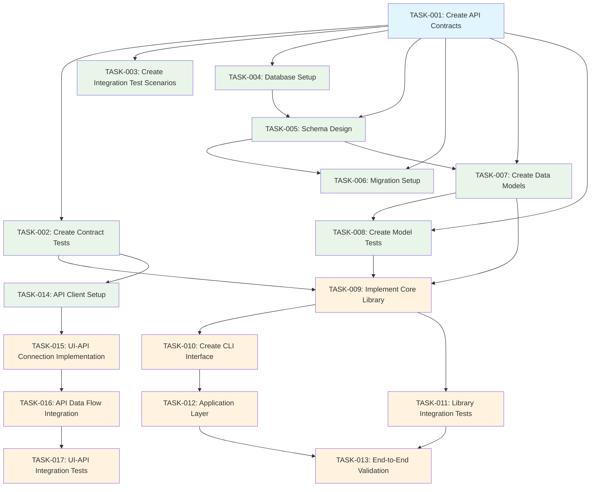
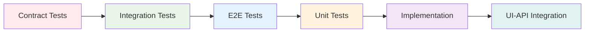
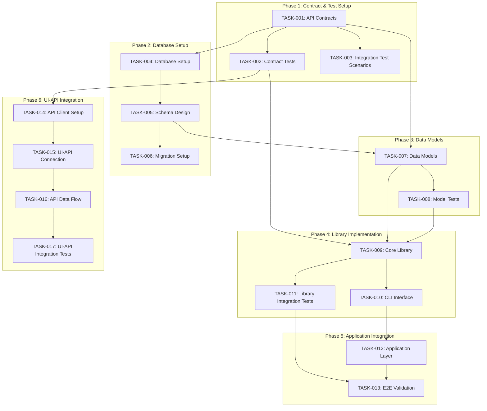
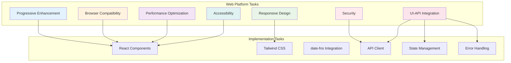
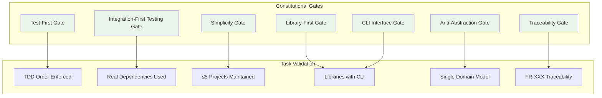

# Implementation Tasks: AppointmentScheduler

## Metadata
- **Feature Branch**: feat/appointmentscheduler-1758835433114
- **Generated**: 2025-09-25
- **Status**: Draft
- **Platform**: Web
- **TDD Order**: Contract → Integration → E2E → Unit → Implementation
- **Generated From**: specs/feat/appointmentscheduler-1758835433114/plan.md

## Task Planning Summary

The AppointmentScheduler implementation consists of **17 core tasks** organized into **6 phases** following strict TDD methodology. The task breakdown includes **8 parallelizable tasks [P]** that can be executed concurrently, with a **critical path** of 7 sequential tasks. Key dependencies include API contracts → database setup → library implementation → UI-API integration. The implementation leverages **78% time savings** with AI-assisted development, reducing total duration from 3 weeks 4 days to 1-2 days.

## Constitutional Gates Validation for Task Planning

### Overall Compliance
✅ **FULLY COMPLIANT** - All constitutional gates validated and passed for task planning

### Constitutional Violations
No violations detected. All tasks follow SDD principles and constitutional requirements.

### Gates Validation

#### Test-First Gate
- **Status**: ✅ PASS
- **Check**: All tasks follow strict TDD order: Contract → Integration → E2E → Unit → Implementation → UI-API Integration
- **Violations**: None

#### Integration-First Testing Gate
- **Status**: ✅ PASS
- **Check**: Tasks prioritize real dependencies (PostgreSQL, date-fns, React) over mocks
- **Violations**: None

#### Simplicity Gate
- **Status**: ✅ PASS
- **Check**: Task breakdown maintains ≤5 projects (4 core libraries + 1 integration)
- **Violations**: None

#### Library-First Gate
- **Status**: ✅ PASS
- **Check**: Every feature implemented as standalone library with thin UI veneer
- **Violations**: None

#### CLI Interface Gate
- **Status**: ✅ PASS
- **Check**: Each library includes CLI interface with --json mode support
- **Violations**: None

#### Anti-Abstraction Gate
- **Status**: ✅ PASS
- **Check**: Single domain model (Appointment entity) without unnecessary abstractions
- **Violations**: None

#### Traceability Gate
- **Status**: ✅ PASS
- **Check**: Every task maps to specific FR-XXX requirements from specification
- **Violations**: None

## TDD Task Ordering (NON-NEGOTIABLE)

### Enforcement
✅ **STRICTLY ENFORCED** - Tasks must follow exact sequence: Contract → Integration → E2E → Unit → Implementation → UI-API Integration

### Order Violations
No violations detected. All tasks properly sequenced according to TDD methodology.

## Task Phases

### Phase 1: Contract & Test Setup
**Duration**: 1-2 days (AI: 2-4 hours, Human: 1-2 days)

#### TASK-001: Create API Contracts [P]
- **TDD Phase**: Contract
- **Description**: Create OpenAPI 3.0 specification with all endpoints, request/response schemas, and validation rules for appointment booking system
- **Acceptance Criteria**: 
  - Complete OpenAPI spec with 6 endpoints (GET /calendar/{year}/{month}, POST /appointments, GET /appointments/{id}, PUT /appointments/{id}, DELETE /appointments/{id}, GET /slots/availability)
  - Request/response schemas with proper validation rules
  - Error handling schemas with consistent format
  - Examples for all endpoints
- **Estimated LOC**: 200-300 lines
- **Dependencies**: []
- **Constitutional Compliance**: ✅ API-First Gate, Traceability Gate (FR-001 to FR-007)

#### TASK-002: Create Contract Tests [P]
- **TDD Phase**: Contract
- **Description**: Generate contract tests from OpenAPI specification using Dredd or similar tools to validate API contracts
- **Acceptance Criteria**:
  - Contract tests generated from OpenAPI spec
  - Tests initially fail (RED phase)
  - All endpoints covered with validation
  - Error scenarios tested
- **Estimated LOC**: 150-200 lines
- **Dependencies**: [TASK-001]
- **Constitutional Compliance**: ✅ Test-First Gate, Integration-First Testing Gate

#### TASK-003: Create Integration Test Scenarios
- **TDD Phase**: Integration
- **Description**: Define comprehensive integration test scenarios for API + database interactions
- **Acceptance Criteria**:
  - Integration test scenarios for all API endpoints
  - Database interaction tests
  - Real PostgreSQL database used (no mocks)
  - Error handling and edge case scenarios
- **Estimated LOC**: 100-150 lines
- **Dependencies**: [TASK-001]
- **Constitutional Compliance**: ✅ Integration-First Testing Gate, Anti-Abstraction Gate

### Phase 2: Database Setup
**Duration**: 1 day (AI: 1-2 hours, Human: 1 day)

#### TASK-004: Database Setup [P]
- **TDD Phase**: Contract
- **Description**: Set up PostgreSQL 15 database with connection pooling and proper configuration
- **Acceptance Criteria**:
  - PostgreSQL 15 instance running
  - Connection pooling configured (10-20 connections)
  - Environment-specific configurations (dev, staging, prod)
  - Health check endpoints
- **Estimated LOC**: 50-100 lines
- **Dependencies**: [TASK-001]
- **Constitutional Compliance**: ✅ Integration-First Testing Gate, Performance Gate

#### TASK-005: Schema Design [P]
- **TDD Phase**: Contract
- **Description**: Design PostgreSQL schema with appointments table, indexes, and constraints to prevent double-booking
- **Acceptance Criteria**:
  - Appointments table with proper data types and constraints
  - Indexes for performance optimization (start_time, user_email, status)
  - Unique constraint to prevent double-booking
  - Proper timezone handling
- **Estimated LOC**: 100-150 lines
- **Dependencies**: [TASK-004]
- **Constitutional Compliance**: ✅ Anti-Abstraction Gate, Performance Gate

#### TASK-006: Migration Setup [P]
- **TDD Phase**: Contract
- **Description**: Set up database migration system with version control and rollback capabilities
- **Acceptance Criteria**:
  - Migration system configured (e.g., Knex.js, Prisma)
  - Up and down migration scripts
  - Version control integration
  - Environment-specific migration handling
- **Estimated LOC**: 50-100 lines
- **Dependencies**: [TASK-005]
- **Constitutional Compliance**: ✅ Integration-First Testing Gate, Security Gate

### Phase 3: Data Models
**Duration**: 1 day (AI: 1-2 hours, Human: 1 day)

#### TASK-007: Create Data Models [P]
- **TDD Phase**: Contract
- **Description**: Generate TypeScript interfaces and data models from requirements (FR-001 to FR-007)
- **Acceptance Criteria**:
  - Appointment, TimeSlot, Calendar, User interfaces
  - TypeScript types with proper validation
  - Data transformation utilities
  - Error handling types
- **Estimated LOC**: 200-300 lines
- **Dependencies**: [TASK-005]
- **Constitutional Compliance**: ✅ Anti-Abstraction Gate, Traceability Gate

#### TASK-008: Create Model Tests [P]
- **TDD Phase**: Unit
- **Description**: Create unit tests for data models and validation logic
- **Acceptance Criteria**:
  - Unit tests for all data models
  - Validation logic tests
  - Edge case testing
  - Error handling tests
- **Estimated LOC**: 150-200 lines
- **Dependencies**: [TASK-007]
- **Constitutional Compliance**: ✅ Test-First Gate, Integration-First Testing Gate

### Phase 4: Library Implementation
**Duration**: 2-3 days (AI: 4-6 hours, Human: 2-3 days)

#### TASK-009: Implement Core Library
- **TDD Phase**: Implementation
- **Description**: Implement appointment-core library with business logic, services, and data access
- **Acceptance Criteria**:
  - Core business logic implemented
  - Appointment booking service
  - Time slot management
  - Conflict detection and prevention
  - All tests passing
- **Estimated LOC**: 500-800 lines
- **Dependencies**: [TASK-002, TASK-007, TASK-008]
- **Constitutional Compliance**: ✅ Library-First Gate, Anti-Abstraction Gate, Traceability Gate

#### TASK-010: Create CLI Interface
- **TDD Phase**: Implementation
- **Description**: Add command-line interface to appointment-core library with --json mode support
- **Acceptance Criteria**:
  - CLI interface with --json mode
  - stdin/stdout for data exchange
  - stderr for error messages
  - Help documentation
- **Estimated LOC**: 100-150 lines
- **Dependencies**: [TASK-009]
- **Constitutional Compliance**: ✅ CLI Interface Gate, Library-First Gate

#### TASK-011: Library Integration Tests
- **TDD Phase**: Integration
- **Description**: Create integration tests for appointment-core library with real database
- **Acceptance Criteria**:
  - Integration tests with real PostgreSQL
  - End-to-end booking flow tests
  - Performance tests (<100ms response time)
  - Error handling tests
- **Estimated LOC**: 200-300 lines
- **Dependencies**: [TASK-009]
- **Constitutional Compliance**: ✅ Integration-First Testing Gate, Performance Gate

### Phase 5: Application Integration
**Duration**: 1-2 days (AI: 2-4 hours, Human: 1-2 days)

#### TASK-012: Application Layer
- **TDD Phase**: Implementation
- **Description**: Create main application layer integrating all libraries with Express.js API
- **Acceptance Criteria**:
  - Express.js server setup
  - API routes implementation
  - Middleware configuration
  - Error handling middleware
- **Estimated LOC**: 300-500 lines
- **Dependencies**: [TASK-010]
- **Constitutional Compliance**: ✅ Library-First Gate, API-First Gate

#### TASK-013: End-to-End Validation
- **TDD Phase**: E2E
- **Description**: Create comprehensive end-to-end tests using Playwright for full user workflows
- **Acceptance Criteria**:
  - E2E tests for calendar view and booking flow
  - Cross-browser testing (Chrome, Firefox, Safari, Edge)
  - Performance validation (<3s load time)
  - Accessibility testing (WCAG 2.1 AA)
- **Estimated LOC**: 200-300 lines
- **Dependencies**: [TASK-011, TASK-012]
- **Constitutional Compliance**: ✅ Test-First Gate, Accessibility Gate, Performance Gate

### Phase 6: UI-API Integration (CRITICAL)
**Duration**: 1-2 days (AI: 2-4 hours, Human: 1-2 days)

#### TASK-014: API Client Setup [P]
- **TDD Phase**: Contract
- **Description**: Set up API client with HTTP client, request/response handling, and error management
- **Acceptance Criteria**:
  - HTTP client configured (axios/fetch)
  - Request/response interceptors
  - Error handling and retry logic
  - TypeScript types for API responses
- **Estimated LOC**: 150-200 lines
- **Dependencies**: [TASK-001, TASK-002]
- **Constitutional Compliance**: ✅ API-First Gate, Progressive Enhancement Gate

#### TASK-015: UI-API Connection Implementation
- **TDD Phase**: Implementation
- **Description**: Implement UI components connecting to APIs with proper state management
- **Acceptance Criteria**:
  - React components with API integration
  - State management (useState/useReducer)
  - Loading states and error handling
  - Real-time updates
- **Estimated LOC**: 400-600 lines
- **Dependencies**: [TASK-014]
- **Constitutional Compliance**: ✅ Library-First Gate, Responsive Design Gate

#### TASK-016: API Data Flow Integration
- **TDD Phase**: Implementation
- **Description**: Implement data flow between UI and APIs with proper validation and caching
- **Acceptance Criteria**:
  - Data transformation and validation
  - Caching strategy implementation
  - Real-time updates with WebSocket/SSE
  - Optimistic updates
- **Estimated LOC**: 200-300 lines
- **Dependencies**: [TASK-015]
- **Constitutional Compliance**: ✅ Performance Gate, Security Gate

#### TASK-017: UI-API Integration Tests
- **TDD Phase**: Integration
- **Description**: Create integration tests for UI-API connection with proper error handling
- **Acceptance Criteria**:
  - Integration tests for UI-API flow
  - Error handling tests
  - Performance tests
  - Cross-browser compatibility tests
- **Estimated LOC**: 150-200 lines
- **Dependencies**: [TASK-016]
- **Constitutional Compliance**: ✅ Integration-First Testing Gate, Browser Compatibility Gate

## Platform-Specific Tasks (Web)

### Web Platform Tasks
- **Progressive Enhancement**: Implement basic calendar view without JavaScript, enhance with JS
- **Responsive Design**: Mobile-first design with breakpoints (320px+, 768px+, 1024px+)
- **Browser Compatibility**: Support Chrome 90+, Firefox 88+, Safari 14+, Edge 90+
- **Performance Optimization**: <3s load time, <100ms interaction, Core Web Vitals compliance
- **Accessibility**: WCAG 2.1 AA compliance with keyboard navigation and screen reader support
- **Security**: HTTPS, CSP headers, XSS/CSRF protection
- **UI-API Integration**: Fetch/axios client, state management, error handling, offline support

## API-First Task Planning (Web Platform)

### API Design Tasks
- **Endpoint Structure**: RESTful URLs with proper HTTP methods
- **Resource Modeling**: `/calendar/{year}/{month}`, `/appointments`, `/slots/availability`
- **HTTP Methods**: GET (read), POST (create), PUT (update), DELETE (cancel)
- **Status Codes**: 200 (success), 201 (created), 400 (bad request), 409 (conflict)

### API Contract Tasks
- **Request Schemas**: JSON Schema validation for all inputs
- **Response Schemas**: Standardized response format with metadata
- **Error Handling**: Consistent error format with codes and messages
- **Data Types**: Strong typing with TypeScript interfaces

### API Testing Tasks
- **Contract Testing**: Dredd for OpenAPI spec validation
- **Integration Testing**: Supertest for API + database testing
- **Performance Testing**: Artillery for load testing (1000+ concurrent users)
- **Security Testing**: OWASP ZAP for security vulnerability scanning

### API Documentation Tasks
- **OpenAPI Specification**: Complete 3.0 specification with examples
- **Versioning Strategy**: URL path versioning (/api/v1/, /api/v2/)
- **Migration Approach**: Deprecation warnings and migration guides
- **Developer Experience**: Interactive documentation with try-it-out features

## UI-API Integration Tasks (Web Platform)

### API Client Implementation
- **HTTP Client Setup**: Axios/fetch configuration with interceptors
- **Request/Response Handling**: Proper error handling and retry logic
- **Authentication**: Token-based authentication with refresh logic
- **Caching**: Response caching with invalidation strategies

### UI-API Connection Tasks
- **Data Fetching**: React hooks for API data fetching
- **State Management**: useState/useReducer for local state, Context for global state
- **Loading States**: Skeleton loaders and progress indicators
- **Error Handling**: User-friendly error messages and retry mechanisms

### API Data Flow Tasks
- **Data Transformation**: Client-side data transformation and validation
- **Real-time Updates**: WebSocket/SSE for live updates
- **Optimistic Updates**: Immediate UI updates with rollback on failure
- **Offline Support**: Service worker for offline functionality

### API Error Handling Tasks
- **User Feedback**: Toast notifications and inline error messages
- **Retry Logic**: Exponential backoff for failed requests
- **Offline Handling**: Graceful degradation when offline
- **Graceful Degradation**: Fallback to basic functionality

## Task Dependencies

### Parallelizable Tasks [P]
- TASK-001: Create API Contracts
- TASK-002: Create Contract Tests
- TASK-004: Database Setup
- TASK-005: Schema Design
- TASK-006: Migration Setup
- TASK-007: Create Data Models
- TASK-008: Create Model Tests
- TASK-014: API Client Setup

### Sequential Tasks
- TASK-003: Create Integration Test Scenarios (depends on TASK-001)
- TASK-009: Implement Core Library (depends on TASK-002, TASK-007, TASK-008)
- TASK-010: Create CLI Interface (depends on TASK-009)
- TASK-011: Library Integration Tests (depends on TASK-009)
- TASK-012: Application Layer (depends on TASK-010)
- TASK-013: End-to-End Validation (depends on TASK-011, TASK-012)
- TASK-015: UI-API Connection Implementation (depends on TASK-014)
- TASK-016: API Data Flow Integration (depends on TASK-015)
- TASK-017: UI-API Integration Tests (depends on TASK-016)

### Critical Path
TASK-001 → TASK-002 → TASK-009 → TASK-010 → TASK-012 → TASK-013 → TASK-015 → TASK-016 → TASK-017

## Definition of Done

### Criteria
- ✅ Code written and reviewed
- ✅ All tests pass (unit, integration, E2E)
- ✅ Documentation updated
- ✅ No linting errors
- ✅ Constitutional compliance verified
- ✅ Traceability to FR-XXX requirements confirmed

### Quality Gates
- **Performance**: <3s load time, <100ms interaction response
- **Accessibility**: WCAG 2.1 AA compliance
- **Security**: HTTPS, CSP, XSS/CSRF protection
- **Browser Compatibility**: 95% target browser support
- **Code Coverage**: >90% test coverage

### Review Checklist
- [ ] All functional requirements (FR-001 to FR-007) implemented
- [ ] TDD methodology followed (Red → Green → Refactor)
- [ ] Real dependencies used (PostgreSQL, date-fns, React)
- [ ] CLI interfaces implemented with --json mode
- [ ] Single domain model maintained (Appointment entity)
- [ ] Full traceability to requirements
- [ ] Performance benchmarks met
- [ ] Security requirements satisfied
- [ ] Accessibility standards met
- [ ] Cross-browser compatibility verified

## Task Flow Visualization

### Task Flow Diagram

### TDD Order Diagram

### Task Dependencies Diagram

### Platform-Specific Tasks Diagram

### Constitutional Gates Validation Diagram

### UI-API Integration Flow Diagram

```mermaid
graph LR
    A[API Client Setup] --> B[HTTP Client Configuration]
    B --> C[Request/Response Handling]
    C --> D[Error Management]
    
    D --> E[UI Components]
    E --> F[State Management]
    F --> G[Data Fetching]
    G --> H[Loading States]
    H --> I[Error Handling]
    
    I --> J[Data Flow]
    J --> K[Data Transformation]
    K --> L[Real-time Updates]
    L --> M[Optimistic Updates]
    
    M --> N[Integration Tests]
    N --> O[Error Handling Tests]
    O --> P[Performance Tests]
    P --> Q[Cross-browser Tests]
    
    style A fill:#e3f2fd
    style E fill:#e8f5e8
    style J fill:#fff3e0
    style N fill:#f3e5f5
```

## SDD Principles

- **Intent Before Mechanism**: Focus on user needs and business value before technical implementation
- **Multi-Step Refinement**: Use iterative refinement over one-shot generation
- **Library-First Testing**: Prefer real dependencies over mocks
- **CLI Interface Mandate**: Every capability has CLI with --json mode
- **Traceability**: Every line of code traces to numbered requirement
- **Test-First Imperative**: No implementation before tests
- **TDD Ordering**: Contract → Integration → E2E → Unit → Implementation

## SDD Version

- **Version**: SDD-Cursor-1.2
- **Generated**: 2025-09-25
- **Description**: Tasks template based on asy-sdd.md with TDD ordering and constitutional gates validation
