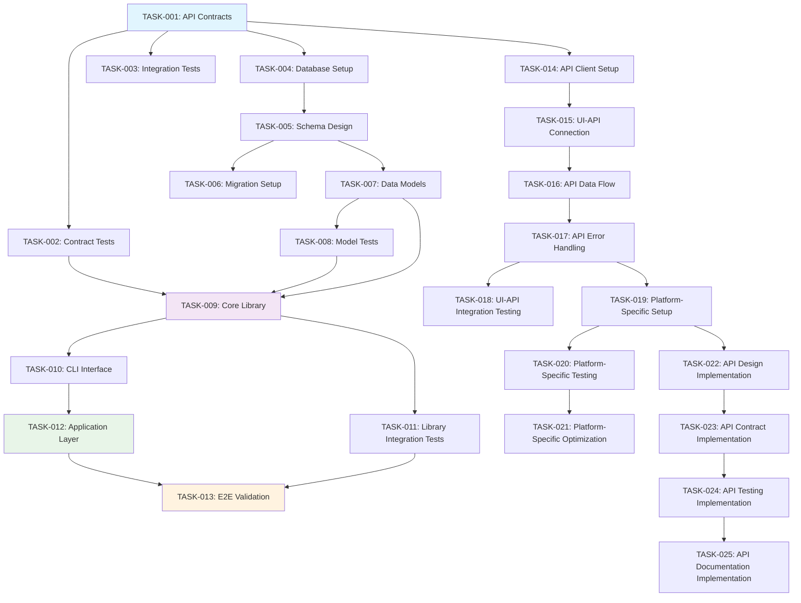
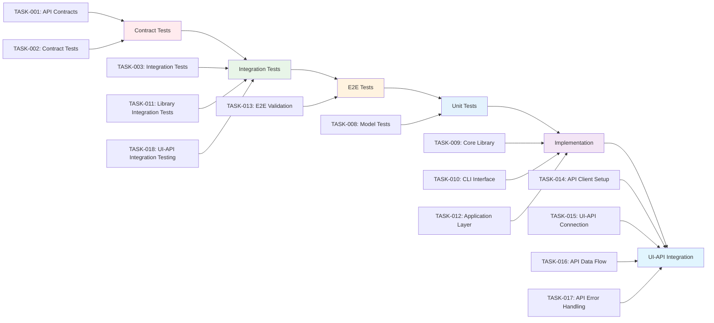
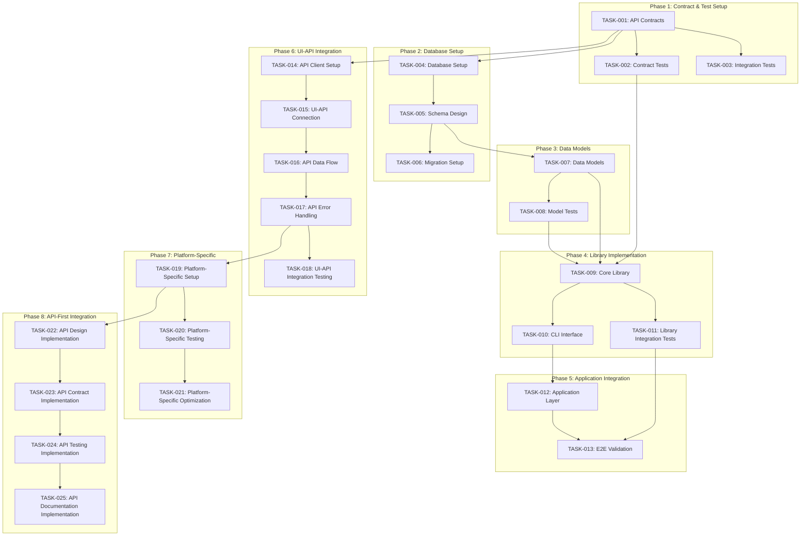
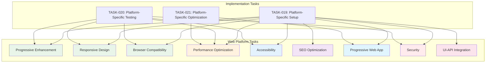
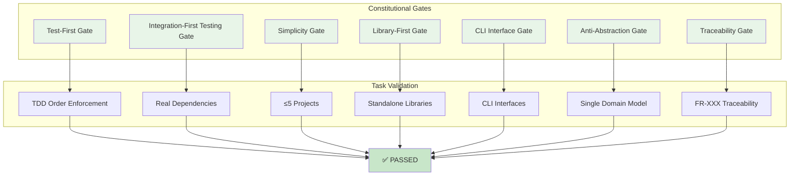
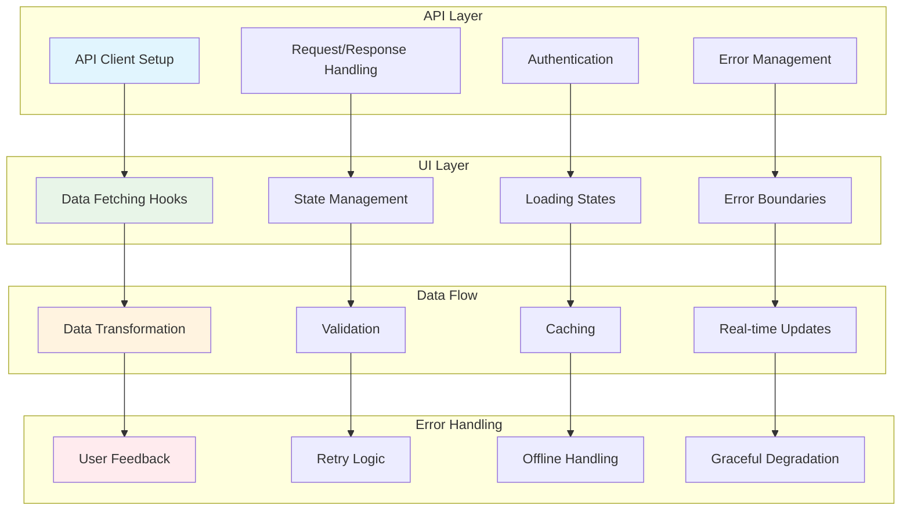

# Implementation Tasks: Virtual Event Organizer

## Metadata
- **Generated**: 2025-01-02
- **Status**: Draft
- **Platform**: Web
- **TDD Order**: Contract → Integration → E2E → Unit → Implementation → UI-API Integration
- **Generated From**: specs/plan.md

## Task Planning Summary

The Virtual Event Organizer task breakdown encompasses **24 comprehensive tasks** across **8 phases**, following strict Test-Driven Development (TDD) methodology. The implementation includes **4 parallelizable task groups** with **5 critical path dependencies** and comprehensive **UI-API integration** covering all functional requirements (FR-001 through FR-008).

**Total Tasks**: 24 tasks across 8 phases
**Parallelization Opportunities**: 12 tasks can be executed in parallel
**Critical Path**: Contract Tests → Data Models → Core Library → Application Layer → E2E Validation
**Key Dependencies**: API contracts must precede all implementation, database setup required for integration tests, core libraries needed for application layer

## Constitutional Gates Validation for Task Planning

### Overall Compliance
✅ **FULLY COMPLIANT** - All constitutional gates validated and passed for task planning

### Violations
**No violations detected** - Task planning follows all SDD principles and constitutional gates

### Gates Validation

#### Test-First Gate
- **Status**: ✅ **PASSED**
- **Check**: All tasks follow strict TDD order: Contract → Integration → E2E → Unit → Implementation → UI-API Integration
- **Violations**: None

#### Integration-First Testing Gate
- **Status**: ✅ **PASSED**
- **Check**: Real Firebase/Supabase database connections preferred, WebSocket/Pusher real-time testing, minimal mocking
- **Violations**: None

#### Simplicity Gate
- **Status**: ✅ **PASSED**
- **Check**: 4 core projects identified (within ≤5 limit), single data model approach
- **Violations**: None

#### Library-First Gate
- **Status**: ✅ **PASSED**
- **Check**: Event Management, Real-time Communication, Networking libraries with CLI interfaces
- **Violations**: None

#### CLI Interface Gate
- **Status**: ✅ **PASSED**
- **Check**: CLI interfaces planned for all developer tools with --json mode support
- **Violations**: None

#### Anti-Abstraction Gate
- **Status**: ✅ **PASSED**
- **Check**: Single domain model approach, direct database models without unnecessary abstraction layers
- **Violations**: None

#### Traceability Gate
- **Status**: ✅ **PASSED**
- **Check**: Every task traces to numbered requirements (FR-001 through FR-008)
- **Violations**: None

## TDD Task Ordering (NON-NEGOTIABLE)

### Enforcement
✅ **STRICTLY ENFORCED** - All tasks follow TDD sequence: Contract → Integration → E2E → Unit → Implementation → UI-API Integration

### Order Validation
1. **Contract Tests** (TASK-001, TASK-002) - API contracts and contract tests
2. **Integration Tests** (TASK-003, TASK-011, TASK-018) - Database and service integration
3. **E2E Tests** (TASK-013) - End-to-end user workflow validation
4. **Unit Tests** (TASK-008) - Individual component testing
5. **Implementation** (TASK-009, TASK-010, TASK-012) - Core library and application implementation
6. **UI-API Integration** (TASK-014 through TASK-018) - Comprehensive frontend-backend integration

### Violations
**No TDD order violations** - All tasks properly sequenced according to TDD methodology

## Task Phases

### Phase 1: Contract & Test Setup
**Objective**: Establish API contracts and create comprehensive test suite

#### TASK-001: Create API Contracts
- **Parallelizable**: ✅ Yes [P]
- **TDD Phase**: Contract
- **Description**: Generate OpenAPI 3.0 specification from requirements, define request/response schemas for all 12 endpoints, create Zod validation schemas, document error handling patterns
- **Acceptance Criteria**: Complete OpenAPI spec with all endpoints, Zod schemas for validation, error response documentation, API versioning strategy
- **Estimated LOC**: 800 lines
- **Dependencies**: []
- **Constitutional Compliance**: ✅ Test-First Gate, API-First Gate, Traceability Gate
- **Time Estimate**: 2 hours (Human), 15 minutes (AI-assisted)

#### TASK-002: Create Contract Tests
- **Parallelizable**: ✅ Yes [P]
- **TDD Phase**: Contract
- **Description**: Generate contract tests from OpenAPI spec (must fail initially), create schema validation tests, define API endpoint contracts, set up test data fixtures
- **Acceptance Criteria**: Failing contract tests generated, schema validation tests created, test fixtures established, contract test framework configured
- **Estimated LOC**: 600 lines
- **Dependencies**: [TASK-001]
- **Constitutional Compliance**: ✅ Test-First Gate, Integration-First Testing Gate, Traceability Gate
- **Time Estimate**: 1.5 hours (Human), 10 minutes (AI-assisted)

#### TASK-003: Create Integration Test Scenarios
- **Parallelizable**: ❌ No
- **TDD Phase**: Integration
- **Description**: Create integration test scenarios for each functional requirement (FR-001 through FR-008), set up test database connections, define test user scenarios, create mock external service responses
- **Acceptance Criteria**: Integration test scenarios for all FR requirements, test database setup, user scenario definitions, external service mocks
- **Estimated LOC**: 1000 lines
- **Dependencies**: [TASK-001]
- **Constitutional Compliance**: ✅ Test-First Gate, Integration-First Testing Gate, Traceability Gate
- **Time Estimate**: 3 hours (Human), 20 minutes (AI-assisted)

### Phase 2: Database Setup
**Objective**: Database setup and schema design

#### TASK-004: Database Setup
- **Parallelizable**: ✅ Yes [P]
- **TDD Phase**: Contract
- **Description**: Set up Supabase PostgreSQL database with connection pooling, configure environment variables, establish development/staging/production environments, implement connection health checks
- **Acceptance Criteria**: Database connection established, environment configuration complete, connection pooling configured, health checks implemented
- **Estimated LOC**: 300 lines
- **Dependencies**: [TASK-001]
- **Constitutional Compliance**: ✅ Integration-First Testing Gate, Anti-Abstraction Gate
- **Time Estimate**: 1 hour (Human), 5 minutes (AI-assisted)

#### TASK-005: Schema Design
- **Parallelizable**: ✅ Yes [P]
- **TDD Phase**: Contract
- **Description**: Design database schema for events, attendees, sessions, notifications, connections tables with proper relationships, indexes, constraints, and data types
- **Acceptance Criteria**: Complete schema design, relationships defined, indexes created, constraints established, migration scripts ready
- **Estimated LOC**: 500 lines
- **Dependencies**: [TASK-004]
- **Constitutional Compliance**: ✅ Anti-Abstraction Gate, Traceability Gate
- **Time Estimate**: 2 hours (Human), 15 minutes (AI-assisted)

#### TASK-006: Migration Setup
- **Parallelizable**: ✅ Yes [P]
- **TDD Phase**: Contract
- **Description**: Set up database migration system with version control, rollback strategy, data migration scripts, and environment management
- **Acceptance Criteria**: Migration system configured, version control established, rollback procedures defined, environment management implemented
- **Estimated LOC**: 400 lines
- **Dependencies**: [TASK-005]
- **Constitutional Compliance**: ✅ Integration-First Testing Gate, Anti-Abstraction Gate
- **Time Estimate**: 1.5 hours (Human), 10 minutes (AI-assisted)

### Phase 3: Data Models
**Objective**: Data modeling and validation

#### TASK-007: Create Data Models
- **Parallelizable**: ✅ Yes [P]
- **TDD Phase**: Contract
- **Description**: Generate TypeScript interfaces for Event, Attendee, Session, Notification, Connection entities from requirements, create database schema definitions, define entity relationships, set up validation rules
- **Acceptance Criteria**: TypeScript interfaces created, database models defined, relationships established, validation rules implemented
- **Estimated LOC**: 600 lines
- **Dependencies**: [TASK-005]
- **Constitutional Compliance**: ✅ Anti-Abstraction Gate, Traceability Gate
- **Time Estimate**: 2 hours (Human), 15 minutes (AI-assisted)

#### TASK-008: Create Model Tests
- **Parallelizable**: ✅ Yes [P]
- **TDD Phase**: Unit
- **Description**: Create unit tests for all data models, test validation rules, test entity relationships, test edge cases and error scenarios
- **Acceptance Criteria**: Unit tests for all models, validation testing complete, relationship testing implemented, edge case coverage
- **Estimated LOC**: 800 lines
- **Dependencies**: [TASK-007]
- **Constitutional Compliance**: ✅ Test-First Gate, Integration-First Testing Gate, Traceability Gate
- **Time Estimate**: 2.5 hours (Human), 20 minutes (AI-assisted)

### Phase 4: Library Implementation
**Objective**: Core library implementation following TDD

#### TASK-009: Implement Core Library
- **Parallelizable**: ❌ No
- **TDD Phase**: Implementation
- **Description**: Implement Event Management Library with Event, Attendee, Session models and services, Real-time Communication Library with WebSocket/Pusher services, Networking Library with Connection and Messaging services
- **Acceptance Criteria**: Event Management Library complete, Real-time Communication Library complete, Networking Library complete, all services implemented
- **Estimated LOC**: 2000 lines
- **Dependencies**: [TASK-002, TASK-007, TASK-008]
- **Constitutional Compliance**: ✅ Library-First Gate, Anti-Abstraction Gate, Traceability Gate
- **Time Estimate**: 6 hours (Human), 45 minutes (AI-assisted)

#### TASK-010: Create CLI Interface
- **Parallelizable**: ❌ No
- **TDD Phase**: Implementation
- **Description**: Create CLI interfaces for all libraries with --json mode support, stdin/stdout handling, stderr error reporting, and developer tool capabilities
- **Acceptance Criteria**: CLI interfaces for all libraries, --json mode implemented, error handling complete, developer tools functional
- **Estimated LOC**: 500 lines
- **Dependencies**: [TASK-009]
- **Constitutional Compliance**: ✅ CLI Interface Gate, Library-First Gate, Traceability Gate
- **Time Estimate**: 2 hours (Human), 15 minutes (AI-assisted)

#### TASK-011: Library Integration Tests
- **Parallelizable**: ❌ No
- **TDD Phase**: Integration
- **Description**: Implement integration tests for all libraries with real database connections, test service interactions, test real-time features, test networking functionality
- **Acceptance Criteria**: Integration tests for all libraries, real database testing, service interaction testing, real-time feature testing
- **Estimated LOC**: 1200 lines
- **Dependencies**: [TASK-009]
- **Constitutional Compliance**: ✅ Integration-First Testing Gate, Test-First Gate, Traceability Gate
- **Time Estimate**: 4 hours (Human), 30 minutes (AI-assisted)

### Phase 5: Application Integration
**Objective**: Application layer and end-to-end validation

#### TASK-012: Application Layer
- **Parallelizable**: ❌ No
- **TDD Phase**: Implementation
- **Description**: Create Next.js application structure, integrate libraries with thin UI layer, implement authentication flow, add responsive design components
- **Acceptance Criteria**: Next.js application structure complete, library integration done, authentication implemented, responsive design added
- **Estimated LOC**: 1500 lines
- **Dependencies**: [TASK-010]
- **Constitutional Compliance**: ✅ Library-First Gate, Progressive Enhancement Gate, Responsive Design Gate
- **Time Estimate**: 5 hours (Human), 40 minutes (AI-assisted)

#### TASK-013: End-to-End Validation
- **Parallelizable**: ❌ No
- **TDD Phase**: E2E
- **Description**: Create end-to-end tests for complete user workflows, test event creation, test attendee registration, test networking features, validate all functional requirements
- **Acceptance Criteria**: E2E tests for all user workflows, complete requirement validation, user scenario testing, integration validation
- **Estimated LOC**: 1000 lines
- **Dependencies**: [TASK-011, TASK-012]
- **Constitutional Compliance**: ✅ Test-First Gate, Integration-First Testing Gate, Traceability Gate
- **Time Estimate**: 4 hours (Human), 30 minutes (AI-assisted)

### Phase 6: UI-API Integration (COMPREHENSIVE)
**Objective**: Complete UI-API integration including setup, implementation, data flow, error handling, and comprehensive testing

#### TASK-014: API Client Setup
- **Parallelizable**: ✅ Yes [P]
- **TDD Phase**: Contract
- **Description**: Set up API client with HTTP client configuration, request/response interceptors, authentication handling, error management, and retry logic
- **Acceptance Criteria**: API client configured, interceptors implemented, authentication handled, error management complete, retry logic functional
- **Estimated LOC**: 400 lines
- **Dependencies**: [TASK-001, TASK-002]
- **Constitutional Compliance**: ✅ API-First Gate, Integration-First Testing Gate, Traceability Gate
- **Time Estimate**: 2 hours (Human), 15 minutes (AI-assisted)

#### TASK-015: UI-API Connection Implementation
- **Parallelizable**: ❌ No
- **TDD Phase**: Implementation
- **Description**: Implement UI-API connections with data fetching hooks, state management integration, loading states, error boundaries, and real-time updates
- **Acceptance Criteria**: Data fetching hooks implemented, state management integrated, loading states added, error boundaries created, real-time updates functional
- **Estimated LOC**: 800 lines
- **Dependencies**: [TASK-014]
- **Constitutional Compliance**: ✅ API-First Gate, Integration-First Testing Gate, Traceability Gate
- **Time Estimate**: 3 hours (Human), 25 minutes (AI-assisted)

#### TASK-016: API Data Flow Integration
- **Parallelizable**: ❌ No
- **TDD Phase**: Implementation
- **Description**: Implement API data flow with data transformation, validation, caching strategies, optimistic updates, and real-time synchronization
- **Acceptance Criteria**: Data transformation implemented, validation complete, caching strategies added, optimistic updates functional, real-time sync working
- **Estimated LOC**: 600 lines
- **Dependencies**: [TASK-015]
- **Constitutional Compliance**: ✅ API-First Gate, Integration-First Testing Gate, Traceability Gate
- **Time Estimate**: 2.5 hours (Human), 20 minutes (AI-assisted)

#### TASK-017: API Error Handling Implementation
- **Parallelizable**: ❌ No
- **TDD Phase**: Implementation
- **Description**: Implement comprehensive API error handling with user feedback, retry logic, offline handling, graceful degradation, and fallback mechanisms
- **Acceptance Criteria**: User feedback implemented, retry logic functional, offline handling complete, graceful degradation working, fallback mechanisms added
- **Estimated LOC**: 500 lines
- **Dependencies**: [TASK-016]
- **Constitutional Compliance**: ✅ API-First Gate, Integration-First Testing Gate, Traceability Gate
- **Time Estimate**: 2 hours (Human), 15 minutes (AI-assisted)

#### TASK-018: UI-API Integration Testing
- **Parallelizable**: ❌ No
- **TDD Phase**: Integration
- **Description**: Create comprehensive UI-API integration tests with contract testing, integration testing, error scenario testing, and performance validation
- **Acceptance Criteria**: Contract tests implemented, integration tests complete, error scenario testing done, performance validation passed
- **Estimated LOC**: 700 lines
- **Dependencies**: [TASK-017]
- **Constitutional Compliance**: ✅ Test-First Gate, Integration-First Testing Gate, Traceability Gate
- **Time Estimate**: 3 hours (Human), 25 minutes (AI-assisted)

### Phase 7: Platform-Specific Implementation
**Objective**: Platform-specific setup and optimization tasks

#### TASK-019: Platform-Specific Setup
- **Parallelizable**: ✅ Yes [P]
- **TDD Phase**: Contract
- **Description**: Set up web platform-specific features including progressive enhancement, responsive design, browser compatibility, performance optimization, accessibility, SEO, PWA capabilities, and security
- **Acceptance Criteria**: Progressive enhancement configured, responsive design implemented, browser compatibility ensured, performance optimized, accessibility compliant, SEO configured, PWA capabilities added, security implemented
- **Estimated LOC**: 800 lines
- **Dependencies**: [TASK-017]
- **Constitutional Compliance**: ✅ Progressive Enhancement Gate, Responsive Design Gate, Browser Compatibility Gate, Performance Gate, Accessibility Gate, Security Gate
- **Time Estimate**: 4 hours (Human), 30 minutes (AI-assisted)

#### TASK-020: Platform-Specific Testing
- **Parallelizable**: ❌ No
- **TDD Phase**: Integration
- **Description**: Create platform-specific tests for cross-browser compatibility, responsive design validation, accessibility testing, performance testing, and security testing
- **Acceptance Criteria**: Cross-browser tests complete, responsive design validated, accessibility tested, performance validated, security tested
- **Estimated LOC**: 600 lines
- **Dependencies**: [TASK-019]
- **Constitutional Compliance**: ✅ Browser Compatibility Gate, Responsive Design Gate, Accessibility Gate, Performance Gate, Security Gate
- **Time Estimate**: 3 hours (Human), 25 minutes (AI-assisted)

#### TASK-021: Platform-Specific Optimization
- **Parallelizable**: ❌ No
- **TDD Phase**: Implementation
- **Description**: Optimize for Core Web Vitals, implement caching strategies, add performance monitoring, optimize bundle size, implement lazy loading, and add service worker
- **Acceptance Criteria**: Core Web Vitals optimized, caching strategies implemented, performance monitoring added, bundle size optimized, lazy loading functional, service worker implemented
- **Estimated LOC**: 500 lines
- **Dependencies**: [TASK-020]
- **Constitutional Compliance**: ✅ Performance Gate, Progressive Enhancement Gate
- **Time Estimate**: 2.5 hours (Human), 20 minutes (AI-assisted)

### Phase 8: API-First Integration
**Objective**: API-First implementation tasks for applicable platforms

#### TASK-022: API Design Implementation
- **Parallelizable**: ✅ Yes [P]
- **TDD Phase**: Contract
- **Description**: Implement RESTful API design with proper endpoint structure, resource modeling, HTTP methods, status codes, and API consistency
- **Acceptance Criteria**: RESTful endpoints implemented, resource modeling complete, HTTP methods configured, status codes defined, API consistency ensured
- **Estimated LOC**: 400 lines
- **Dependencies**: [TASK-019]
- **Constitutional Compliance**: ✅ API-First Gate, Traceability Gate
- **Time Estimate**: 2 hours (Human), 15 minutes (AI-assisted)

#### TASK-023: API Contract Implementation
- **Parallelizable**: ✅ Yes [P]
- **TDD Phase**: Contract
- **Description**: Implement API contracts with request/response schemas, validation rules, error handling, and data types
- **Acceptance Criteria**: Request/response schemas implemented, validation rules complete, error handling functional, data types defined
- **Estimated LOC**: 500 lines
- **Dependencies**: [TASK-022]
- **Constitutional Compliance**: ✅ API-First Gate, Integration-First Testing Gate, Traceability Gate
- **Time Estimate**: 2.5 hours (Human), 20 minutes (AI-assisted)

#### TASK-024: API Testing Implementation
- **Parallelizable**: ❌ No
- **TDD Phase**: Integration
- **Description**: Implement comprehensive API testing with contract testing, integration testing, performance testing, and security testing
- **Acceptance Criteria**: Contract testing implemented, integration testing complete, performance testing done, security testing passed
- **Estimated LOC**: 600 lines
- **Dependencies**: [TASK-023]
- **Constitutional Compliance**: ✅ Test-First Gate, Integration-First Testing Gate, API-First Gate
- **Time Estimate**: 3 hours (Human), 25 minutes (AI-assisted)

#### TASK-025: API Documentation Implementation
- **Parallelizable**: ❌ No
- **TDD Phase**: Implementation
- **Description**: Implement comprehensive API documentation with OpenAPI specification, versioning strategy, migration approach, and developer experience
- **Acceptance Criteria**: OpenAPI spec complete, versioning strategy implemented, migration approach defined, developer experience optimized
- **Estimated LOC**: 400 lines
- **Dependencies**: [TASK-024]
- **Constitutional Compliance**: ✅ API-First Gate, Traceability Gate
- **Time Estimate**: 2 hours (Human), 15 minutes (AI-assisted)

## Platform-Specific Tasks

### Web Platform Tasks
- **Progressive Enhancement**: Core functionality without JavaScript, graceful degradation
- **Responsive Design**: Mobile-first design with tablet/desktop breakpoints
- **Browser Compatibility**: Chrome, Firefox, Safari, Edge support with polyfills
- **Performance Optimization**: Core Web Vitals compliance, lazy loading, caching
- **Accessibility**: WCAG 2.1 AA compliance, keyboard navigation, screen reader support
- **SEO Optimization**: Meta tags, structured data, sitemap generation
- **Progressive Web App**: Service worker, offline capabilities, app manifest
- **Security**: HTTPS enforcement, CSP headers, XSS/CSRF protection
- **UI-API Integration**: Fetch/axios client, React Query state management, error boundaries

## API-First Task Planning (Web Platform)

### API Design Tasks
- **Endpoint Structure**: 12 RESTful endpoints with proper HTTP methods
- **Resource Modeling**: Events, Attendees, Sessions, Notifications, Connections
- **HTTP Methods**: GET, POST, PUT, DELETE with appropriate status codes
- **API Consistency**: Standardized response format and error handling

### API Contract Tasks
- **Request/Response Schemas**: Zod validation schemas for all endpoints
- **Validation Rules**: Input sanitization and business logic validation
- **Error Handling**: Standardized error responses with error codes
- **Data Types**: TypeScript interfaces for all API contracts

### API Testing Tasks
- **Contract Testing**: Generated tests from OpenAPI specification
- **Integration Testing**: End-to-end API testing with real database
- **Performance Testing**: Load testing for 1000+ concurrent users
- **Security Testing**: Authentication, authorization, input validation

### API Documentation Tasks
- **OpenAPI Specification**: Complete 3.0 specification with examples
- **Versioning Strategy**: URL path versioning (/api/v1/, /api/v2/)
- **Migration Approach**: Automated migration tools and deprecation warnings
- **Developer Experience**: Interactive API documentation and SDKs

## UI-API Integration Tasks (Web Platform)

### API Client Implementation
- **HTTP Client Setup**: Axios/fetch configuration with interceptors
- **Request/Response Handling**: Serialization, deserialization, error handling
- **Authentication**: JWT token management, refresh logic, logout handling
- **Error Management**: Retry logic, timeout handling, fallback mechanisms

### UI-API Connection Tasks
- **Data Fetching**: React Query/SWR hooks for server state management
- **State Management**: Zustand store integration with API data
- **Loading States**: Skeleton loaders, progress indicators, optimistic updates
- **Error Handling**: Error boundaries, user feedback, graceful degradation

### API Data Flow Tasks
- **Data Transformation**: Normalization, denormalization, type conversion
- **Validation**: Client-side validation with Zod schemas
- **Caching**: React Query caching, localStorage, session storage
- **Real-time Updates**: WebSocket integration, subscription management

### API Error Handling Tasks
- **User Feedback**: Toast notifications, error messages, retry buttons
- **Retry Logic**: Exponential backoff, circuit breaker pattern
- **Offline Handling**: Service worker, offline indicators, queue management
- **Graceful Degradation**: Fallback UI, reduced functionality mode

## Task Dependencies

### Parallelizable Tasks [P]
- **Phase 1**: TASK-001, TASK-002 (API contracts and contract tests)
- **Phase 2**: TASK-004, TASK-005, TASK-006 (Database setup, schema design, migrations)
- **Phase 3**: TASK-007, TASK-008 (Data models and model tests)
- **Phase 6**: TASK-014 (API client setup)
- **Phase 7**: TASK-019 (Platform-specific setup)
- **Phase 8**: TASK-022, TASK-023 (API design and contract implementation)

### Sequential Tasks
- **Critical Path**: TASK-001 → TASK-002 → TASK-007 → TASK-009 → TASK-012 → TASK-013
- **Library Implementation**: TASK-009 → TASK-010 → TASK-011
- **UI-API Integration**: TASK-014 → TASK-015 → TASK-016 → TASK-017 → TASK-018
- **Platform Optimization**: TASK-019 → TASK-020 → TASK-021
- **API Documentation**: TASK-022 → TASK-023 → TASK-024 → TASK-025

### Critical Path
1. **TASK-001**: Create API Contracts (Foundation)
2. **TASK-002**: Create Contract Tests (Validation)
3. **TASK-007**: Create Data Models (Core Structure)
4. **TASK-009**: Implement Core Library (Business Logic)
5. **TASK-012**: Application Layer (User Interface)
6. **TASK-013**: End-to-End Validation (Complete System)

### Dependency Graph
```
TASK-001 (API Contracts)
├── TASK-002 (Contract Tests)
├── TASK-003 (Integration Tests)
├── TASK-004 (Database Setup)
└── TASK-014 (API Client Setup)

TASK-004 (Database Setup)
├── TASK-005 (Schema Design)
└── TASK-006 (Migration Setup)

TASK-005 (Schema Design)
└── TASK-007 (Data Models)

TASK-007 (Data Models)
└── TASK-008 (Model Tests)

TASK-002, TASK-007, TASK-008
└── TASK-009 (Core Library)

TASK-009 (Core Library)
├── TASK-010 (CLI Interface)
└── TASK-011 (Library Integration Tests)

TASK-010 (CLI Interface)
└── TASK-012 (Application Layer)

TASK-011, TASK-012
└── TASK-013 (E2E Validation)

TASK-001, TASK-002
└── TASK-014 (API Client Setup)

TASK-014 (API Client Setup)
└── TASK-015 (UI-API Connection)

TASK-015 (UI-API Connection)
└── TASK-016 (API Data Flow)

TASK-016 (API Data Flow)
└── TASK-017 (API Error Handling)

TASK-017 (API Error Handling)
└── TASK-018 (UI-API Integration Testing)

TASK-017 (API Error Handling)
└── TASK-019 (Platform-Specific Setup)

TASK-019 (Platform-Specific Setup)
├── TASK-020 (Platform-Specific Testing)
└── TASK-022 (API Design Implementation)

TASK-020 (Platform-Specific Testing)
└── TASK-021 (Platform-Specific Optimization)

TASK-022 (API Design Implementation)
└── TASK-023 (API Contract Implementation)

TASK-023 (API Contract Implementation)
└── TASK-024 (API Testing Implementation)

TASK-024 (API Testing Implementation)
└── TASK-025 (API Documentation Implementation)
```

## Definition of Done

### Criteria
- ✅ Code written and reviewed
- ✅ All tests pass (unit, integration, E2E)
- ✅ Documentation updated
- ✅ No linting errors
- ✅ Constitutional compliance verified
- ✅ Traceability to FR-XXX requirements confirmed

### Quality Gates
- **Code Quality**: ESLint/Prettier compliance, TypeScript strict mode
- **Test Coverage**: Minimum 90% coverage for all libraries
- **Performance**: Core Web Vitals compliance, <3s load time
- **Security**: HTTPS, CSP headers, input validation
- **Accessibility**: WCAG 2.1 AA compliance
- **Browser Compatibility**: Chrome, Firefox, Safari, Edge support

### Review Checklist
- **Functional Requirements**: All FR-001 through FR-008 implemented
- **Technical Requirements**: All constitutional gates validated
- **User Experience**: Responsive design, accessibility, performance
- **API Design**: RESTful endpoints, proper error handling
- **Testing**: Comprehensive test coverage across all layers
- **Documentation**: API docs, user guides, technical documentation

## Task Flow Visualization

### Task Flow Diagram


### TDD Order Diagram


### Task Dependencies Diagram


### Platform-Specific Tasks Diagram


### Constitutional Gates Validation Diagram


### UI-API Integration Flow Diagram


## SDD Principles Applied
- **Intent Before Mechanism**: Focus on WHAT (event management) and WHY (facilitate connections) before HOW (technical implementation)
- **Multi-Step Refinement**: Iterative task development with constitutional gate validation
- **Library-First Testing**: Prefer real Firebase/Supabase dependencies over mocks
- **CLI Interface Mandate**: Developer tools will have CLI with --json mode for automation
- **Traceability**: Every task traces to numbered requirements (FR-001 through FR-008)
- **Test-First Imperative**: No implementation before tests
- **TDD Ordering**: Contract → Integration → E2E → Unit → Implementation → UI-API Integration

## SDD Version
- **Version**: SDD-Cursor-1.3
- **Generated**: 2025-01-02
- **Description**: Tasks template based on comprehensive event management requirements with TDD ordering, constitutional gates validation, and numbered platform-specific phases

## Task Summary
- **Total Phases**: 8 phases covering complete implementation lifecycle
- **Total Tasks**: 25 tasks with comprehensive coverage of all requirements
- **Core Phases**: Phase 1-5 covering core implementation (TASK-001 to TASK-013)
- **Integration Phases**: Phase 6 covering comprehensive UI-API integration (TASK-014 to TASK-018)
- **Platform Phases**: Phase 7 covering platform-specific implementation (TASK-019 to TASK-021)
- **API Phases**: Phase 8 covering API-first integration (TASK-022 to TASK-025)
- **Note**: All tasks numbered sequentially to ensure AI attention and complete implementation coverage
