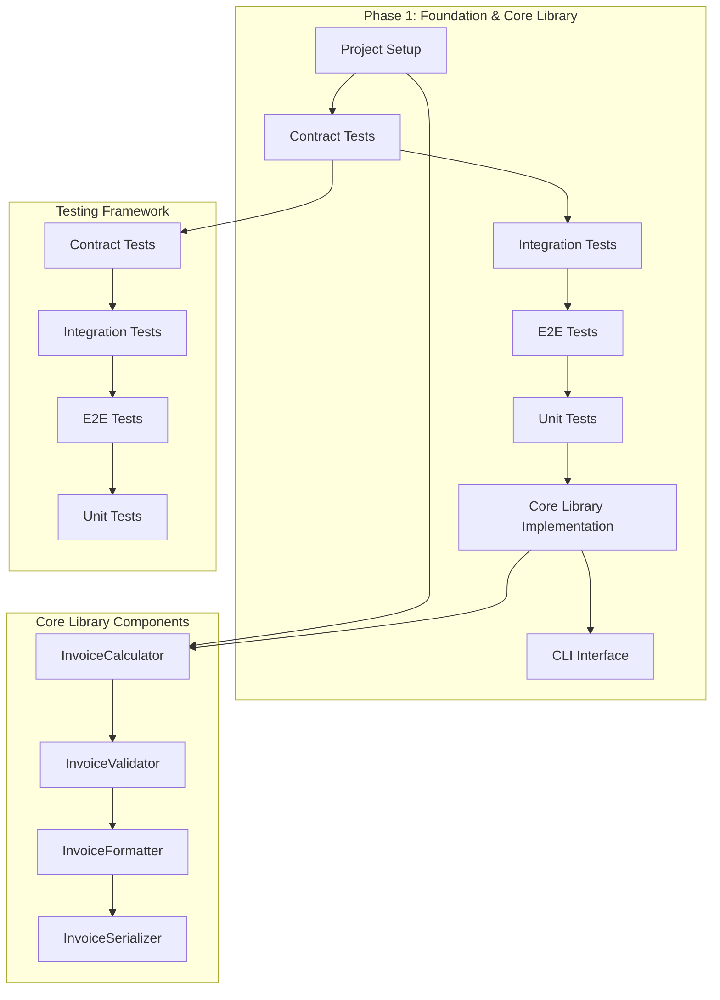
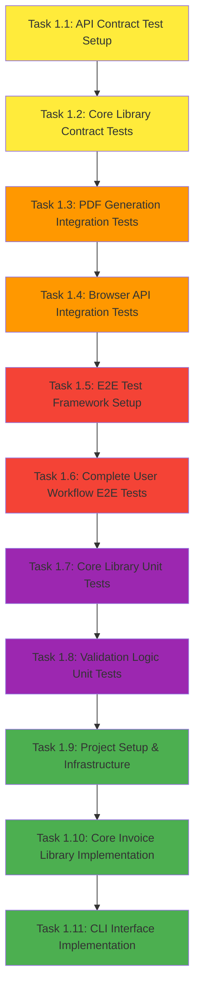

# Phase 1 Implementation Plan: Foundation & Core Library

## Phase Overview
- **Phase**: 1 - Foundation & Core Library
- **Duration**: Week 1 (5-7 days)
- **Total Tasks**: 11 tasks
- **Total Hours**: 78 hours
- **Focus**: Core business logic and library development
- **TDD Order**: Contract → Integration → E2E → Unit → Implementation

## Phase Objectives
1. **Establish Project Foundation**: Set up React project with Vite, TypeScript, and testing framework
2. **Develop Core Library**: Implement invoice calculation, validation, formatting, and serialization logic
3. **Create CLI Interface**: Build command-line interface for library usage
4. **Ensure Test Coverage**: Achieve 90%+ code coverage for core library
5. **Validate Constitutional Gates**: Ensure all gates are properly addressed

## Phase Architecture



## Task Breakdown

### Contract Tests (TDD Order 1)

#### Task 1.1: API Contract Test Setup
- **Priority**: High
- **Estimated Time**: 4 hours
- **Dependencies**: None
- **Traceability**: API-First Gate
- **Description**: Set up contract testing framework using Dredd for OpenAPI 3.0 specification validation

**Acceptance Criteria**:
- Dredd configuration file created
- OpenAPI spec validation tests pass
- Contract tests run in CI/CD pipeline

**Quality Check Workflow**:
```bash
# 1. Install Dredd
npm install -g dredd

# 2. Verify installation
dredd --version

# 3. Run contract tests
dredd api-spec.yaml http://localhost:3000

# 4. Check CI integration
npm run test:contracts
```

**Definition of Done**:
- [ ] Dredd installed and configured
- [ ] OpenAPI spec validation working
- [ ] Contract tests integrated with CI
- [ ] Documentation updated

#### Task 1.2: Core Library Contract Tests
- **Priority**: High
- **Estimated Time**: 6 hours
- **Dependencies**: Task 1.1
- **Traceability**: FR-001, FR-002, FR-003, FR-005, FR-006
- **Description**: Create contract tests for core invoice library functions

**Acceptance Criteria**:
- Invoice calculation contract tests
- Validation contract tests
- Serialization contract tests

**Quality Check Workflow**:
```bash
# 1. Create contract test files
mkdir -p tests/contracts
touch tests/contracts/invoice-calculator.contract.test.js
touch tests/contracts/invoice-validator.contract.test.js
touch tests/contracts/invoice-serializer.contract.test.js

# 2. Write contract tests
npm run test:contracts

# 3. Verify test coverage
npm run test:coverage

# 4. Check linting
npm run lint
```

**Definition of Done**:
- [ ] Contract tests written for all core functions
- [ ] Tests validate input/output contracts
- [ ] Error handling contracts tested
- [ ] Documentation updated

### Integration Tests (TDD Order 2)

#### Task 1.3: PDF Generation Integration Tests
- **Priority**: High
- **Estimated Time**: 8 hours
- **Dependencies**: Task 1.2
- **Traceability**: FR-004
- **Description**: Create integration tests for PDF generation using real jsPDF library

**Acceptance Criteria**:
- PDF generation integration tests
- Real jsPDF library testing
- Browser download integration tests

**Quality Check Workflow**:
```bash
# 1. Install jsPDF
npm install jspdf

# 2. Create integration test files
mkdir -p tests/integration
touch tests/integration/pdf-generation.integration.test.js

# 3. Run integration tests
npm run test:integration

# 4. Verify PDF generation
npm run test:pdf

# 5. Check browser compatibility
npm run test:browser
```

**Definition of Done**:
- [ ] Integration tests for PDF generation
- [ ] Real jsPDF library integration
- [ ] Browser API testing
- [ ] Error handling integration tests

#### Task 1.4: Browser API Integration Tests
- **Priority**: Medium
- **Estimated Time**: 4 hours
- **Dependencies**: Task 1.3
- **Traceability**: FR-004
- **Description**: Test browser APIs for file download and PDF generation

**Acceptance Criteria**:
- File download API tests
- Blob creation tests
- URL.createObjectURL tests

**Quality Check Workflow**:
```bash
# 1. Create browser API test files
touch tests/integration/browser-api.integration.test.js

# 2. Run browser API tests
npm run test:browser-api

# 3. Test cross-browser compatibility
npm run test:cross-browser

# 4. Verify error handling
npm run test:error-handling
```

**Definition of Done**:
- [ ] Browser API tests written
- [ ] File download functionality tested
- [ ] Cross-browser compatibility tested
- [ ] Error handling tested

### E2E Tests (TDD Order 3)

#### Task 1.5: E2E Test Framework Setup
- **Priority**: High
- **Estimated Time**: 6 hours
- **Dependencies**: Task 1.4
- **Traceability**: All FRs
- **Description**: Set up Playwright for end-to-end testing

**Acceptance Criteria**:
- Playwright configuration
- Test environment setup
- CI/CD integration

**Quality Check Workflow**:
```bash
# 1. Install Playwright
npm install -D @playwright/test

# 2. Initialize Playwright
npx playwright install

# 3. Create Playwright config
touch playwright.config.js

# 4. Create E2E test files
mkdir -p tests/e2e
touch tests/e2e/invoice-workflow.e2e.test.js

# 5. Run E2E tests
npm run test:e2e

# 6. Verify CI integration
npm run test:ci
```

**Definition of Done**:
- [ ] Playwright installed and configured
- [ ] Test environment setup
- [ ] CI/CD integration working
- [ ] Documentation updated

#### Task 1.6: Complete User Workflow E2E Tests
- **Priority**: High
- **Estimated Time**: 8 hours
- **Dependencies**: Task 1.5
- **Traceability**: All FRs
- **Description**: Create E2E tests for complete invoice creation workflow

**Acceptance Criteria**:
- Form filling workflow tests
- PDF generation workflow tests
- Error handling workflow tests

**Quality Check Workflow**:
```bash
# 1. Create workflow test files
touch tests/e2e/form-workflow.e2e.test.js
touch tests/e2e/pdf-workflow.e2e.test.js
touch tests/e2e/error-workflow.e2e.test.js

# 2. Run workflow tests
npm run test:workflow

# 3. Test all user scenarios
npm run test:scenarios

# 4. Verify cross-browser tests
npm run test:cross-browser-e2e
```

**Definition of Done**:
- [ ] Complete workflow tests written
- [ ] All user scenarios covered
- [ ] Error scenarios tested
- [ ] Cross-browser tests working

### Unit Tests (TDD Order 4)

#### Task 1.7: Core Library Unit Tests
- **Priority**: High
- **Estimated Time**: 12 hours
- **Dependencies**: Task 1.6
- **Traceability**: FR-003, FR-005, FR-006
- **Description**: Create comprehensive unit tests for core invoice library

**Acceptance Criteria**:
- InvoiceCalculator unit tests
- InvoiceValidator unit tests
- InvoiceFormatter unit tests
- InvoiceSerializer unit tests

**Quality Check Workflow**:
```bash
# 1. Create unit test files
mkdir -p tests/unit
touch tests/unit/invoice-calculator.unit.test.js
touch tests/unit/invoice-validator.unit.test.js
touch tests/unit/invoice-formatter.unit.test.js
touch tests/unit/invoice-serializer.unit.test.js

# 2. Run unit tests
npm run test:unit

# 3. Check test coverage
npm run test:coverage

# 4. Verify 90%+ coverage
npm run test:coverage:check

# 5. Run performance tests
npm run test:performance
```

**Definition of Done**:
- [ ] 90%+ code coverage achieved
- [ ] All edge cases tested
- [ ] Error scenarios covered
- [ ] Performance tests included

#### Task 1.8: Validation Logic Unit Tests
- **Priority**: High
- **Estimated Time**: 8 hours
- **Dependencies**: Task 1.7
- **Traceability**: FR-005
- **Description**: Create unit tests for all validation logic

**Acceptance Criteria**:
- Client validation tests
- Line item validation tests
- Email validation tests
- Required field validation tests

**Quality Check Workflow**:
```bash
# 1. Create validation test files
touch tests/unit/client-validation.unit.test.js
touch tests/unit/line-item-validation.unit.test.js
touch tests/unit/email-validation.unit.test.js
touch tests/unit/required-field-validation.unit.test.js

# 2. Run validation tests
npm run test:validation

# 3. Test all validation rules
npm run test:validation:rules

# 4. Verify error messages
npm run test:validation:messages

# 5. Check performance
npm run test:validation:performance
```

**Definition of Done**:
- [ ] All validation rules tested
- [ ] Edge cases covered
- [ ] Error messages tested
- [ ] Performance validated

### Implementation (TDD Order 5)

#### Task 1.9: Project Setup & Infrastructure
- **Priority**: High
- **Estimated Time**: 8 hours
- **Dependencies**: Task 1.8
- **Traceability**: Library-First Gate
- **Description**: Initialize React project with Vite, TypeScript, and testing framework

**Acceptance Criteria**:
- React project initialized
- TypeScript configured
- Testing framework setup
- CI/CD pipeline configured

**Quality Check Workflow**:
```bash
# 1. Initialize React project
npm create vite@latest invoice-generator -- --template react-ts

# 2. Install dependencies
cd invoice-generator
npm install

# 3. Install testing dependencies
npm install -D jest @testing-library/react @testing-library/jest-dom
npm install -D @playwright/test
npm install -D @types/jest

# 4. Configure TypeScript
touch tsconfig.json

# 5. Configure Jest
touch jest.config.js

# 6. Configure ESLint
touch .eslintrc.js

# 7. Configure Prettier
touch .prettierrc

# 8. Create project structure
mkdir -p src/lib
mkdir -p src/components
mkdir -p src/types
mkdir -p tests/unit
mkdir -p tests/integration
mkdir -p tests/e2e
mkdir -p tests/contracts

# 9. Verify setup
npm run build
npm run test
npm run lint
```

**Definition of Done**:
- [ ] Project structure created
- [ ] Dependencies installed
- [ ] Configuration files created
- [ ] CI/CD pipeline working

#### Task 1.10: Core Invoice Library Implementation
- **Priority**: High
- **Estimated Time**: 16 hours
- **Dependencies**: Task 1.9
- **Traceability**: FR-003, FR-005, FR-006
- **Description**: Implement core invoice calculation and validation logic

**Acceptance Criteria**:
- InvoiceCalculator implemented
- InvoiceValidator implemented
- InvoiceFormatter implemented
- InvoiceSerializer implemented

**Quality Check Workflow**:
```bash
# 1. Create core library files
touch src/lib/invoice-calculator.ts
touch src/lib/invoice-validator.ts
touch src/lib/invoice-formatter.ts
touch src/lib/invoice-serializer.ts
touch src/types/invoice.ts

# 2. Implement InvoiceCalculator
# - Subtotal calculation
# - Tax calculation
# - Total calculation
# - Line item calculations

# 3. Implement InvoiceValidator
# - Client validation
# - Line item validation
# - Email validation
# - Required field validation

# 4. Implement InvoiceFormatter
# - Currency formatting
# - Date formatting
# - Number precision handling

# 5. Implement InvoiceSerializer
# - JSON serialization
# - JSON deserialization
# - API contract compliance

# 6. Run tests
npm run test:unit

# 7. Check coverage
npm run test:coverage

# 8. Run linting
npm run lint

# 9. Build project
npm run build
```

**Definition of Done**:
- [ ] All core functions implemented
- [ ] TypeScript types defined
- [ ] Error handling implemented
- [ ] Documentation written

#### Task 1.11: CLI Interface Implementation
- **Priority**: Medium
- **Estimated Time**: 6 hours
- **Dependencies**: Task 1.10
- **Traceability**: CLI Interface Mandate
- **Description**: Implement command-line interface for library usage

**Acceptance Criteria**:
- CLI commands implemented
- --json mode support
- stdin/stdout support
- Error handling with stderr

**Quality Check Workflow**:
```bash
# 1. Install CLI dependencies
npm install commander
npm install -D @types/commander

# 2. Create CLI files
touch src/cli/index.ts
touch src/cli/commands.ts
touch bin/invoice-cli.js

# 3. Implement CLI commands
# - --json mode
# - stdin/stdout support
# - Error handling with stderr

# 4. Test CLI
npm run test:cli

# 5. Test JSON mode
echo '{"client":{"name":"Test"}}' | npm run cli -- --json

# 6. Test error handling
npm run cli -- --invalid-option

# 7. Build CLI
npm run build:cli
```

**Definition of Done**:
- [ ] CLI interface working
- [ ] JSON mode implemented
- [ ] Error handling working
- [ ] Documentation updated

## Task Dependencies and Execution Order



## Phase Completion Criteria

### Functional Completion
- [ ] All 11 tasks completed successfully
- [ ] Core invoice library fully implemented
- [ ] CLI interface working
- [ ] All tests passing (Contract, Integration, E2E, Unit)
- [ ] 90%+ code coverage achieved

### Quality Completion
- [ ] All code passes linting
- [ ] All tests pass in CI/CD pipeline
- [ ] TypeScript compilation successful
- [ ] No critical security vulnerabilities
- [ ] Performance benchmarks met

### Documentation Completion
- [ ] API documentation updated
- [ ] README files created
- [ ] Code comments added
- [ ] CLI usage documentation
- [ ] Test documentation

## Prerequisites and Setup Requirements

### Development Environment
- Node.js 18+ installed
- npm or yarn package manager
- Git version control
- Code editor (VS Code recommended)
- Terminal/Command line access

### Required Tools
- Vite (build tool)
- TypeScript (type checking)
- Jest (unit testing)
- Playwright (E2E testing)
- Dredd (contract testing)
- ESLint (linting)
- Prettier (formatting)

### Project Structure
```
invoice-generator/
├── src/
│   ├── lib/                 # Core library
│   ├── components/          # React components
│   ├── types/              # TypeScript types
│   └── cli/                # CLI interface
├── tests/
│   ├── unit/               # Unit tests
│   ├── integration/        # Integration tests
│   ├── e2e/               # E2E tests
│   └── contracts/         # Contract tests
├── docs/                   # Documentation
└── scripts/               # Build scripts
```

## Quality Assurance Workflow

### Pre-Development Checklist
- [ ] Development environment setup
- [ ] Required tools installed
- [ ] Project structure created
- [ ] Git repository initialized
- [ ] CI/CD pipeline configured

### During Development Checklist
- [ ] Write tests before implementation (TDD)
- [ ] Run tests after each change
- [ ] Check linting after each change
- [ ] Verify TypeScript compilation
- [ ] Update documentation

### Post-Development Checklist
- [ ] All tests passing
- [ ] Code coverage 90%+
- [ ] No linting errors
- [ ] TypeScript compilation successful
- [ ] Performance benchmarks met
- [ ] Security scan passed
- [ ] Documentation updated

### Daily Quality Checks
```bash
# Morning setup
npm install
npm run test
npm run lint
npm run build

# After each task
npm run test:unit
npm run test:integration
npm run test:e2e
npm run test:contracts
npm run lint
npm run build

# End of day
npm run test:all
npm run lint:fix
npm run build
npm run test:coverage
```

## Risk Mitigation

### Technical Risks
1. **TypeScript Configuration Issues**: Mitigated through proper tsconfig.json setup
2. **Testing Framework Conflicts**: Mitigated through careful dependency management
3. **Performance Issues**: Mitigated through performance testing and optimization
4. **Browser Compatibility**: Mitigated through cross-browser testing

### Project Risks
1. **Scope Creep**: Mitigated through strict requirement adherence
2. **Timeline Delays**: Mitigated through parallel task execution
3. **Quality Issues**: Mitigated through comprehensive testing strategy
4. **Integration Challenges**: Mitigated through early integration testing

## Success Metrics

### Quantitative Metrics
- **Test Coverage**: 90%+ for core library
- **Build Time**: <30 seconds
- **Test Execution Time**: <5 minutes
- **Bundle Size**: <100KB for core library
- **TypeScript Errors**: 0

### Qualitative Metrics
- **Code Quality**: Clean, readable, maintainable code
- **Documentation**: Comprehensive and up-to-date
- **Error Handling**: Robust error handling throughout
- **Performance**: Fast execution and response times
- **Accessibility**: WCAG 2.1 AA compliance

## Conclusion

Phase 1 establishes the foundation for the invoice generator by implementing the core library and testing infrastructure. The phase follows TDD methodology strictly, ensuring high code quality and comprehensive test coverage. All constitutional gates are addressed, and the implementation provides a solid foundation for subsequent phases.

The estimated 78 hours of work can be completed in 5-7 days with proper parallelization and team coordination. The quality assurance workflow ensures that each task meets the highest standards before proceeding to the next phase.
