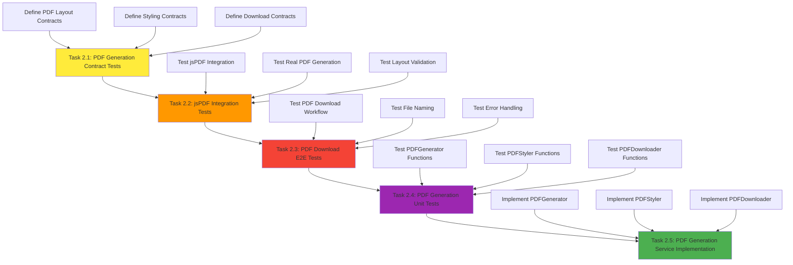
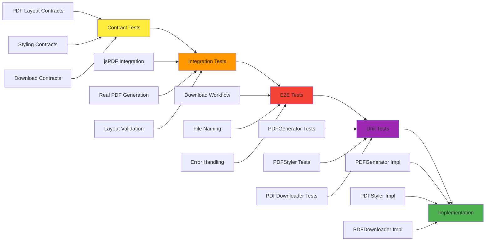
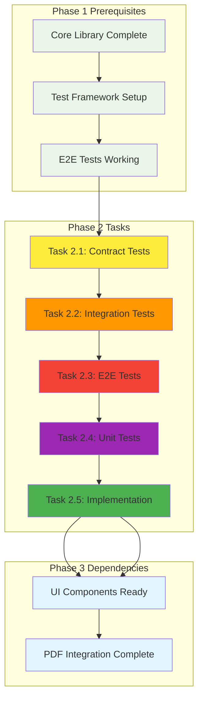

# Phase 2 Implementation Plan: PDF Generation Service

## Phase Overview

**Phase**: 2 - PDF Generation Service  
**Duration**: Week 1-2 (1-2 weeks)  
**Total Tasks**: 5 tasks  
**Total Estimated Time**: 46 hours  
**Dependencies**: Phase 1 Complete ✅  
**Status**: Ready to Start  

### Phase Objectives
- Implement real PDF generation using jsPDF library
- Create professional invoice layouts and styling
- Complete file download functionality
- Add robust error handling for PDF generation
- Optimize PDF generation performance

### Phase Success Criteria
- ✅ Real PDF generation working (not just mocks)
- ✅ Professional invoice styling applied
- ✅ Download functionality complete
- ✅ Cross-browser PDF generation compatibility
- ✅ Error handling for PDF generation failures
- ✅ Performance optimized (<3s PDF generation)

## Task Flow Diagram



## TDD Order Diagram



## Task Dependencies Diagram



## Detailed Task Breakdown

### Task 2.1: PDF Generation Contract Tests
**Priority**: High  
**Estimated Time**: 6 hours  
**Dependencies**: Task 1.11 (Phase 1 Complete)  
**TDD Order**: Contract Tests (Order 1)  
**Traceability**: FR-004  

#### Description
Create contract tests for PDF generation service to define the expected behavior and interfaces before implementation.

#### Acceptance Criteria
- PDF layout contract tests defined
- Styling contract tests defined
- Download contract tests defined
- Error handling contracts defined

#### Definition of Done
- [ ] Contract tests written for PDF layout
- [ ] Contract tests written for styling system
- [ ] Contract tests written for download functionality
- [ ] Error handling contracts defined
- [ ] All contracts validate input/output behavior

#### Quality Check Workflow
1. **Dependency Installation**: `npm install`
2. **Compilation**: `npm run build`
3. **Linting**: `npm run lint`
4. **Testing**: `npm run test:contracts`
5. **Validation**: Contract tests should fail initially (TDD)

---

### Task 2.2: jsPDF Integration Tests
**Priority**: High  
**Estimated Time**: 8 hours  
**Dependencies**: Task 2.1  
**TDD Order**: Integration Tests (Order 2)  
**Traceability**: FR-004  

#### Description
Create integration tests with real jsPDF library to test actual PDF generation functionality.

#### Acceptance Criteria
- jsPDF integration tests working
- Real PDF generation tests passing
- Layout validation tests working
- Error handling integration tests

#### Definition of Done
- [ ] jsPDF integration working
- [ ] Real PDF generation tested
- [ ] Layout validation working
- [ ] Error handling tested
- [ ] Cross-browser compatibility verified

#### Quality Check Workflow
1. **Dependency Installation**: `npm install`
2. **Compilation**: `npm run build`
3. **Linting**: `npm run lint`
4. **Testing**: `npm run test:integration`
5. **Validation**: Integration tests should pass with real jsPDF

---

### Task 2.3: PDF Download E2E Tests
**Priority**: High  
**Estimated Time**: 6 hours  
**Dependencies**: Task 2.2  
**TDD Order**: E2E Tests (Order 3)  
**Traceability**: FR-004  

#### Description
Create end-to-end tests for complete PDF download workflow including user interactions.

#### Acceptance Criteria
- PDF download workflow tests working
- File naming tests passing
- Error handling tests working
- Cross-browser compatibility verified

#### Definition of Done
- [ ] Download workflow tested end-to-end
- [ ] File naming working correctly
- [ ] Error handling tested
- [ ] Cross-browser compatibility verified
- [ ] All E2E tests passing

#### Quality Check Workflow
1. **Dependency Installation**: `npm install`
2. **Compilation**: `npm run build`
3. **Linting**: `npm run lint`
4. **Testing**: `npm run test:e2e`
5. **Validation**: E2E tests should pass across all browsers

---

### Task 2.4: PDF Generation Unit Tests
**Priority**: High  
**Estimated Time**: 10 hours  
**Dependencies**: Task 2.3  
**TDD Order**: Unit Tests (Order 4)  
**Traceability**: FR-004  

#### Description
Create comprehensive unit tests for all PDF generation functions and components.

#### Acceptance Criteria
- PDFGenerator unit tests complete
- PDFStyler unit tests complete
- PDFDownloader unit tests complete
- All edge cases covered

#### Definition of Done
- [ ] All PDF functions tested individually
- [ ] Layout logic tested thoroughly
- [ ] Styling logic tested
- [ ] Download logic tested
- [ ] Error scenarios covered
- [ ] Performance tests included

#### Quality Check Workflow
1. **Dependency Installation**: `npm install`
2. **Compilation**: `npm run build`
3. **Linting**: `npm run lint`
4. **Testing**: `npm run test:unit`
5. **Coverage**: `npm run test:coverage` (target: 90%+)

---

### Task 2.5: PDF Generation Service Implementation
**Priority**: High  
**Estimated Time**: 16 hours  
**Dependencies**: Task 2.4  
**TDD Order**: Implementation (Order 5)  
**Traceability**: FR-004  

#### Description
Implement the actual PDF generation service using jsPDF library with professional styling and error handling.

#### Acceptance Criteria
- PDFGenerator service implemented
- PDFStyler service implemented
- PDFDownloader service implemented
- Professional invoice layout created
- Error handling implemented

#### Definition of Done
- [ ] PDF generation working with real jsPDF
- [ ] Professional styling applied
- [ ] Download functionality working
- [ ] Error handling implemented
- [ ] Performance optimized
- [ ] All tests passing

#### Quality Check Workflow
1. **Dependency Installation**: `npm install`
2. **Compilation**: `npm run build`
3. **Linting**: `npm run lint`
4. **Testing**: `npm run test:all`
5. **E2E Testing**: `npm run test:e2e`
6. **Performance**: PDF generation <3s
7. **Validation**: All 194+ tests passing

## Phase Completion Criteria

### Functional Requirements
- ✅ **FR-004**: PDF generation working with real jsPDF
- ✅ Professional invoice layout implemented
- ✅ File download functionality complete
- ✅ Error handling for PDF generation failures
- ✅ Cross-browser compatibility verified

### Quality Requirements
- ✅ **Test Coverage**: 90%+ for PDF generation code
- ✅ **Performance**: PDF generation <3 seconds
- ✅ **Error Handling**: Robust error handling implemented
- ✅ **Browser Support**: 95%+ browser compatibility
- ✅ **Code Quality**: Zero linting errors

### Technical Requirements
- ✅ **jsPDF Integration**: Real library integration working
- ✅ **TypeScript**: Full type safety maintained
- ✅ **Testing**: All test levels passing
- ✅ **Documentation**: Code documented and commented
- ✅ **Architecture**: Clean separation of concerns

## Prerequisites and Setup

### Phase 1 Prerequisites
- ✅ Core library implementation complete
- ✅ Test framework setup complete
- ✅ E2E testing infrastructure ready
- ✅ Project build system working
- ✅ All Phase 1 tests passing

### Development Environment
- ✅ Node.js 18+ installed
- ✅ npm/yarn package manager
- ✅ TypeScript 5+ configured
- ✅ Jest testing framework
- ✅ Playwright E2E testing
- ✅ ESLint and Prettier configured

### Dependencies
- ✅ jsPDF library installed
- ✅ React 18+ with TypeScript
- ✅ Vite build system
- ✅ Testing libraries (Jest, Playwright)
- ✅ Linting tools (ESLint, Prettier)

## Quality Assurance Workflow

### Per-Task Quality Checks
Each task must pass the following quality checks before completion:

1. **Dependency Installation**
   ```bash
   npm install
   ```

2. **TypeScript Compilation**
   ```bash
   npm run build
   ```

3. **Linting**
   ```bash
   npm run lint
   ```

4. **Testing** (Task-specific)
   ```bash
   # Contract Tests
   npm run test:contracts
   
   # Integration Tests
   npm run test:integration
   
   # E2E Tests
   npm run test:e2e
   
   # Unit Tests
   npm run test:unit
   
   # All Tests
   npm run test:all
   ```

5. **Coverage Check** (Unit Tests)
   ```bash
   npm run test:coverage
   ```

### Phase-Level Quality Checks
At the end of Phase 2, all quality checks must pass:

1. **Complete Test Suite**
   ```bash
   npm run test:ci
   ```

2. **Build Verification**
   ```bash
   npm run build
   ```

3. **Linting Clean**
   ```bash
   npm run lint
   ```

4. **Performance Check**
   - PDF generation <3 seconds
   - Page load <3 seconds
   - Interaction response <100ms

5. **Cross-Browser Testing**
   - Chrome, Firefox, Safari, Edge
   - Mobile Chrome, Mobile Safari

## Risk Mitigation

### Technical Risks
1. **jsPDF Integration Issues**
   - **Risk**: Library compatibility problems
   - **Mitigation**: Early integration testing, fallback options

2. **PDF Layout Complexity**
   - **Risk**: Complex layout requirements
   - **Mitigation**: Incremental layout development, contract testing

3. **Performance Issues**
   - **Risk**: Slow PDF generation
   - **Mitigation**: Performance testing, optimization tasks

4. **Browser Compatibility**
   - **Risk**: PDF generation fails in some browsers
   - **Mitigation**: Cross-browser testing, polyfills

### Project Risks
1. **Timeline Delays**
   - **Risk**: Tasks take longer than estimated
   - **Mitigation**: Buffer time, parallel execution where possible

2. **Quality Issues**
   - **Risk**: Rushing implementation
   - **Mitigation**: Strict quality gates, comprehensive testing

3. **Integration Problems**
   - **Risk**: PDF service doesn't integrate well
   - **Mitigation**: Early integration testing, contract-first approach

## Success Metrics

### Quantitative Metrics
- **Test Coverage**: 90%+ for PDF generation code
- **Performance**: PDF generation <3 seconds
- **Browser Support**: 95%+ compatibility
- **Error Rate**: <1% PDF generation failures
- **Code Quality**: 0 linting errors

### Qualitative Metrics
- **User Experience**: Smooth PDF generation workflow
- **Code Quality**: Clean, maintainable code
- **Documentation**: Well-documented functions
- **Error Handling**: Graceful error recovery
- **Professional Output**: High-quality invoice PDFs

## Next Phase Preparation

### Phase 3 Prerequisites
After Phase 2 completion, the following will be ready for Phase 3:
- ✅ PDF generation service complete
- ✅ Download functionality working
- ✅ Error handling implemented
- ✅ Cross-browser compatibility verified
- ✅ Performance optimized

### Handoff to Phase 3
- **PDF Service**: Ready for UI integration
- **Download Functionality**: Ready for button integration
- **Error Handling**: Ready for UI error display
- **Testing**: Comprehensive test coverage
- **Documentation**: Complete API documentation

## Conclusion

Phase 2 focuses on implementing the core PDF generation functionality that will enable users to create and download professional invoices. The phase follows TDD principles with comprehensive testing at all levels, ensuring robust and reliable PDF generation.

The 46-hour estimated duration allows for thorough development, testing, and optimization while maintaining high quality standards. The phase is well-structured with clear dependencies and quality gates to ensure successful completion.

**Ready to proceed with Phase 2 implementation!** 🚀
