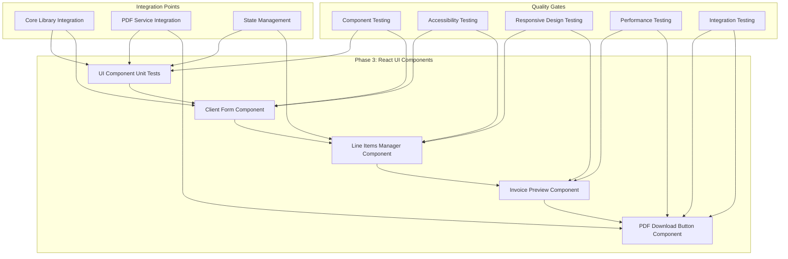
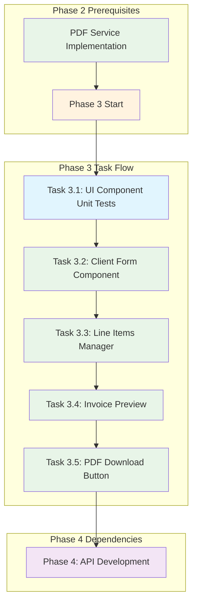

# Phase 3 Implementation Plan: React UI Components

## Phase Overview

**Phase 3: React UI Components** focuses on building the user interface layer of the Invoice Generator application. This phase implements all React components that users will interact with to create, edit, and manage invoices.

### Phase Objectives
- Build responsive, accessible React components
- Implement real-time form validation and calculations
- Create an intuitive user interface for invoice management
- Ensure mobile-first responsive design
- Integrate with the core library and PDF service

### Phase Duration
- **Estimated Time**: 36 hours (5 tasks)
- **Timeline**: Week 2 of development
- **Team Size**: 2-3 frontend developers

## Phase Architecture



## Task Breakdown

### Task 3.1: UI Component Unit Tests
**Priority**: High | **Duration**: 12 hours | **Dependencies**: Task 2.5 (PDF Service Implementation)

#### Objectives
- Create comprehensive unit tests for all React components
- Test user interactions and state management
- Validate props and error handling
- Ensure component isolation and testability

#### Detailed Requirements
- **ClientForm Unit Tests**:
  - Form field rendering tests
  - Input validation tests
  - Error message display tests
  - Accessibility attribute tests
- **LineItemsManager Unit Tests**:
  - Add/remove item functionality tests
  - Edit item details tests
  - Real-time calculation tests
  - Drag-and-drop interaction tests
- **InvoicePreview Unit Tests**:
  - Live preview update tests
  - Responsive layout tests
  - Print styling tests
  - Mobile optimization tests
- **PDFDownloadButton Unit Tests**:
  - Download trigger tests
  - Loading state tests
  - Success/error feedback tests
  - Accessibility support tests

#### Quality Check Workflow
```bash
# 1. Install dependencies
npm install

# 2. Compile TypeScript
npm run build

# 3. Run linting
npm run lint

# 4. Run unit tests
npm run test:unit -- tests/unit/components

# 5. Check test coverage
npm run test:coverage -- tests/unit/components
```

#### Acceptance Criteria
- [ ] All components have 90%+ test coverage
- [ ] User interactions are fully tested
- [ ] Props validation is tested
- [ ] Error states are covered
- [ ] Accessibility features are tested

---

### Task 3.2: Client Form Component Implementation
**Priority**: High | **Duration**: 10 hours | **Dependencies**: Task 3.1

#### Objectives
- Implement client details form component
- Provide real-time validation
- Display clear error messages
- Ensure accessibility compliance

#### Detailed Requirements
- **Form Fields**:
  - Client name (required, text input)
  - Address (required, textarea)
  - Email (required, email validation)
  - Phone (optional, phone format validation)
- **Validation Features**:
  - Real-time field validation
  - Email format validation
  - Required field validation
  - Clear error messaging
- **Accessibility Features**:
  - ARIA labels and descriptions
  - Keyboard navigation support
  - Screen reader compatibility
  - Focus management

#### Component Structure
```typescript
interface ClientFormProps {
  client: Client;
  onChange: (client: Client) => void;
  errors: ValidationErrors;
  onValidate: (field: string, value: string) => void;
}

interface Client {
  name: string;
  address: string;
  email: string;
  phone?: string;
}
```

#### Quality Check Workflow
```bash
# 1. Install dependencies
npm install

# 2. Compile TypeScript
npm run build

# 3. Run linting
npm run lint

# 4. Run component tests
npm run test:unit -- tests/unit/components/ClientForm

# 5. Run integration tests
npm run test:integration -- tests/integration/ClientForm

# 6. Check accessibility
npm run test:a11y -- tests/accessibility/ClientForm
```

#### Acceptance Criteria
- [ ] Form component renders correctly
- [ ] Real-time validation works
- [ ] Error messages display properly
- [ ] Accessibility compliance verified
- [ ] Mobile responsive design works

---

### Task 3.3: Line Items Manager Component Implementation
**Priority**: High | **Duration**: 12 hours | **Dependencies**: Task 3.2

#### Objectives
- Implement line items management component
- Support add/remove/edit functionality
- Provide real-time calculations
- Implement drag-and-drop reordering

#### Detailed Requirements
- **Item Management**:
  - Add new line items
  - Remove existing items
  - Edit item details (description, quantity, unit price)
  - Drag-and-drop reordering
- **Real-time Calculations**:
  - Automatic line total calculation
  - Subtotal updates
  - Tax calculation updates
  - Grand total updates
- **User Experience**:
  - Intuitive add/remove buttons
  - Clear item numbering
  - Smooth animations
  - Keyboard shortcuts

#### Component Structure
```typescript
interface LineItemsManagerProps {
  items: LineItem[];
  onChange: (items: LineItem[]) => void;
  onCalculate: (items: LineItem[]) => CalculationResult;
}

interface LineItem {
  id: string;
  description: string;
  quantity: number;
  unitPrice: number;
  lineTotal: number;
}
```

#### Quality Check Workflow
```bash
# 1. Install dependencies
npm install

# 2. Compile TypeScript
npm run build

# 3. Run linting
npm run lint

# 4. Run component tests
npm run test:unit -- tests/unit/components/LineItemsManager

# 5. Run integration tests
npm run test:integration -- tests/integration/LineItemsManager

# 6. Test drag-and-drop functionality
npm run test:e2e -- tests/e2e/line-items-drag-drop
```

#### Acceptance Criteria
- [ ] Item management functionality works
- [ ] Real-time calculations are accurate
- [ ] Drag-and-drop reordering works
- [ ] Error handling is robust
- [ ] Mobile touch interactions work

---

### Task 3.4: Invoice Preview Component Implementation
**Priority**: High | **Duration**: 8 hours | **Dependencies**: Task 3.3

#### Objectives
- Implement real-time invoice preview component
- Provide responsive design
- Ensure print-friendly styling
- Optimize for mobile devices

#### Detailed Requirements
- **Live Preview Features**:
  - Real-time updates as user types
  - Instant calculation updates
  - Dynamic layout adjustments
- **Responsive Design**:
  - Mobile-first approach
  - Tablet optimization
  - Desktop enhancement
  - Print media queries
- **Styling Features**:
  - Professional invoice layout
  - Print-friendly styling
  - Consistent typography
  - Proper spacing and alignment

#### Component Structure
```typescript
interface InvoicePreviewProps {
  invoice: Invoice;
  isPrintMode?: boolean;
  className?: string;
}

interface Invoice {
  id: string;
  invoiceNumber: string;
  client: Client;
  items: LineItem[];
  subtotal: number;
  taxAmount: number;
  total: number;
  taxRate: number;
  date: string;
  dueDate: string;
  status: 'draft' | 'sent' | 'paid';
}
```

#### Quality Check Workflow
```bash
# 1. Install dependencies
npm install

# 2. Compile TypeScript
npm run build

# 3. Run linting
npm run lint

# 4. Run component tests
npm run test:unit -- tests/unit/components/InvoicePreview

# 5. Run responsive design tests
npm run test:e2e -- tests/e2e/responsive-design

# 6. Test print functionality
npm run test:e2e -- tests/e2e/print-preview
```

#### Acceptance Criteria
- [ ] Preview component updates in real-time
- [ ] Responsive design works on all devices
- [ ] Print styling is professional
- [ ] Mobile optimization is effective
- [ ] Performance is smooth

---

### Task 3.5: PDF Download Button Component Implementation
**Priority**: High | **Duration**: 6 hours | **Dependencies**: Task 3.4

#### Objectives
- Implement PDF download button component
- Provide loading states and feedback
- Ensure accessibility support
- Handle success and error states

#### Detailed Requirements
- **Download Functionality**:
  - Trigger PDF generation
  - Handle download process
  - Manage file naming
  - Error handling
- **User Feedback**:
  - Loading states during generation
  - Success confirmation
  - Error messages
  - Progress indicators
- **Accessibility**:
  - Screen reader support
  - Keyboard navigation
  - ARIA labels
  - Focus management

#### Component Structure
```typescript
interface PDFDownloadButtonProps {
  invoice: Invoice;
  onDownload: (invoice: Invoice) => Promise<void>;
  disabled?: boolean;
  className?: string;
}

interface DownloadState {
  isDownloading: boolean;
  progress: number;
  error: string | null;
  success: boolean;
}
```

#### Quality Check Workflow
```bash
# 1. Install dependencies
npm install

# 2. Compile TypeScript
npm run build

# 3. Run linting
npm run lint

# 4. Run component tests
npm run test:unit -- tests/unit/components/PDFDownloadButton

# 5. Run integration tests
npm run test:integration -- tests/integration/PDFDownloadButton

# 6. Test PDF generation
npm run test:e2e -- tests/e2e/pdf-download
```

#### Acceptance Criteria
- [ ] Download button triggers PDF generation
- [ ] Loading states are properly displayed
- [ ] Success/error feedback works
- [ ] Accessibility compliance verified
- [ ] Error handling is robust

## Phase Dependencies



## Phase Completion Criteria

### Functional Requirements
- [ ] **FR-001**: Client details form implemented with validation
- [ ] **FR-002**: Line items management with add/edit/remove functionality
- [ ] **FR-007**: Real-time invoice preview component
- [ ] **FR-004**: PDF download button with proper integration

### Technical Requirements
- [ ] All React components are fully tested (90%+ coverage)
- [ ] Components are accessible (WCAG 2.1 AA compliant)
- [ ] Responsive design works on all screen sizes
- [ ] Real-time calculations are accurate and performant
- [ ] Error handling is comprehensive and user-friendly

### Quality Requirements
- [ ] Zero linting errors
- [ ] Zero TypeScript compilation errors
- [ ] All unit tests passing
- [ ] All integration tests passing
- [ ] Performance meets requirements (<100ms interaction response)

## Prerequisites and Setup

### Required Dependencies
```json
{
  "dependencies": {
    "react": "^18.2.0",
    "react-dom": "^18.2.0",
    "@types/react": "^18.2.0",
    "@types/react-dom": "^18.2.0"
  },
  "devDependencies": {
    "@testing-library/react": "^13.4.0",
    "@testing-library/jest-dom": "^5.16.5",
    "@testing-library/user-event": "^14.4.3",
    "jest-environment-jsdom": "^29.5.0"
  }
}
```

### Environment Setup
1. **Node.js**: Version 18 or higher
2. **TypeScript**: Version 5.0 or higher
3. **React**: Version 18.2 or higher
4. **Testing Framework**: Jest + React Testing Library
5. **Linting**: ESLint with React rules

### Project Structure
```
src/
├── components/
│   ├── ClientForm/
│   │   ├── ClientForm.tsx
│   │   ├── ClientForm.test.tsx
│   │   └── index.ts
│   ├── LineItemsManager/
│   │   ├── LineItemsManager.tsx
│   │   ├── LineItemsManager.test.tsx
│   │   └── index.ts
│   ├── InvoicePreview/
│   │   ├── InvoicePreview.tsx
│   │   ├── InvoicePreview.test.tsx
│   │   └── index.ts
│   └── PDFDownloadButton/
│       ├── PDFDownloadButton.tsx
│       ├── PDFDownloadButton.test.tsx
│       └── index.ts
├── hooks/
│   ├── useInvoice.ts
│   ├── useValidation.ts
│   └── usePDFGeneration.ts
├── types/
│   ├── invoice.ts
│   ├── client.ts
│   └── lineItem.ts
└── utils/
    ├── validation.ts
    ├── calculations.ts
    └── formatters.ts
```

## Quality Assurance Workflow

### For Each Task
1. **Dependency Installation**
   ```bash
   npm install
   ```

2. **TypeScript Compilation**
   ```bash
   npm run build
   ```

3. **Linting Check**
   ```bash
   npm run lint
   npm run lint:fix  # Auto-fix issues
   ```

4. **Unit Testing**
   ```bash
   npm run test:unit
   npm run test:coverage
   ```

5. **Integration Testing**
   ```bash
   npm run test:integration
   ```

6. **E2E Testing** (for specific components)
   ```bash
   npm run test:e2e -- --grep "ComponentName"
   ```

### Phase-Level Quality Checks
1. **Complete Test Suite**
   ```bash
   npm run test:all
   ```

2. **Accessibility Testing**
   ```bash
   npm run test:a11y
   ```

3. **Performance Testing**
   ```bash
   npm run test:performance
   ```

4. **Cross-Browser Testing**
   ```bash
   npm run test:e2e -- --browser=all
   ```

## Risk Mitigation

### Technical Risks
1. **Component Performance**: Mitigated through React.memo and useMemo optimization
2. **State Management Complexity**: Mitigated through custom hooks and clear data flow
3. **Accessibility Compliance**: Mitigated through automated testing and manual review
4. **Mobile Responsiveness**: Mitigated through mobile-first design and testing

### Integration Risks
1. **Core Library Integration**: Mitigated through comprehensive integration tests
2. **PDF Service Integration**: Mitigated through mock testing and real integration tests
3. **State Synchronization**: Mitigated through clear data flow patterns

## Success Metrics

### Functional Metrics
- [ ] All 4 main components implemented and working
- [ ] Real-time calculations accurate to 2 decimal places
- [ ] Form validation prevents invalid submissions
- [ ] PDF download works reliably

### Technical Metrics
- [ ] 90%+ test coverage for all components
- [ ] Zero accessibility violations
- [ ] <100ms interaction response time
- [ ] Mobile responsive on all screen sizes

### User Experience Metrics
- [ ] Intuitive component interactions
- [ ] Clear error messaging
- [ ] Smooth animations and transitions
- [ ] Keyboard navigation support

## Next Phase Preparation

Phase 3 completion enables Phase 4 (API Development) by providing:
- Complete UI components for testing API integration
- User interaction patterns for API endpoint design
- Component state management for API data flow
- Error handling patterns for API error responses

The UI components built in Phase 3 will serve as the foundation for testing and integrating the API layer in Phase 4.
