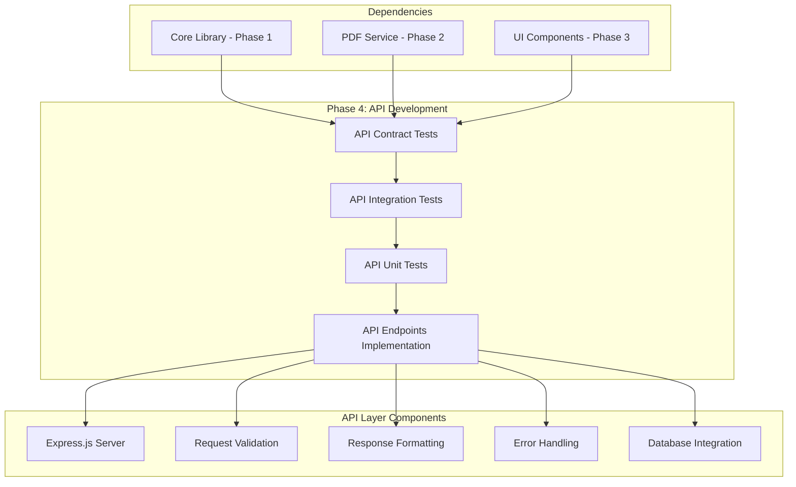
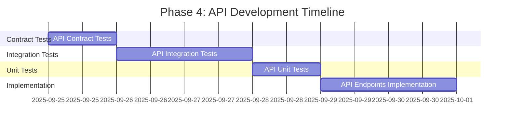

# Phase 4 Implementation Plan: API Development

## Phase Overview

**Phase 4: API Development** focuses on implementing the server-side RESTful API layer that provides backend services for the Invoice Generator application. This phase implements all API endpoints defined in the OpenAPI 3.0 specification, including request validation, response formatting, and error handling.

### Phase Objectives
- Implement RESTful API endpoints for invoice management
- Create robust request validation and response formatting
- Integrate API layer with existing core library and PDF service
- Ensure API-First design principles compliance
- Provide comprehensive API testing and documentation

### Phase Duration
- **Estimated Time**: 32 hours (4 tasks)
- **Timeline**: Week 2-3 of development
- **Team Size**: 2-3 backend developers

## Phase Architecture



## Task Breakdown (TDD Order: Contract → Integration → Unit → Implementation)

### Contract Tests (TDD Order 1)

#### Task 4.1: API Contract Tests
- **Priority**: High
- **Estimated Time**: 8 hours
- **Dependencies**: Phase 3 Completion (UI Components)
- **Traceability**: API-First Gate
- **Description**: Create contract tests for all API endpoints using Dredd and OpenAPI 3.0 specification validation
- **Acceptance Criteria**:
  - POST /api/v1/invoices contract tests
  - GET /api/v1/invoices/{id} contract tests
  - PUT /api/v1/invoices/{id} contract tests
  - POST /api/v1/invoices/{id}/pdf contract tests
  - OpenAPI spec validation working
- **Definition of Done**:
  - [ ] All API contracts tested
  - [ ] Request/response validation working
  - [ ] Error responses tested
  - [ ] OpenAPI spec validation working
- **Quality Check Workflow**:
  ```bash
  # Install dependencies
  npm install --save-dev dredd supertest
  
  # Run contract tests
  npm run test:contracts
  
  # Validate OpenAPI spec
  npm run validate:openapi
  
  # Check test coverage
  npm run test:coverage -- --testPathPatterns=tests/contracts
  ```

### Integration Tests (TDD Order 2)

#### Task 4.2: API Integration Tests
- **Priority**: High
- **Estimated Time**: 10 hours
- **Dependencies**: Task 4.1 (API Contract Tests)
- **Traceability**: All API endpoints
- **Description**: Create comprehensive integration tests for API endpoints with real database and PDF generation
- **Acceptance Criteria**:
  - End-to-end API tests
  - Database integration tests
  - PDF generation integration tests
  - Error handling tests
- **Definition of Done**:
  - [ ] API integration working
  - [ ] Database integration tested
  - [ ] PDF generation integrated
  - [ ] Error handling working
- **Quality Check Workflow**:
  ```bash
  # Install test dependencies
  npm install --save-dev jest supertest mongodb-memory-server
  
  # Run integration tests
  npm run test:integration
  
  # Test database integration
  npm run test:integration -- --testNamePattern="database"
  
  # Test PDF generation integration
  npm run test:integration -- --testNamePattern="pdf"
  
  # Check integration test coverage
  npm run test:coverage -- --testPathPatterns=tests/integration
  ```

### Unit Tests (TDD Order 4)

#### Task 4.3: API Unit Tests
- **Priority**: High
- **Estimated Time**: 8 hours
- **Dependencies**: Task 4.2 (API Integration Tests)
- **Traceability**: All API endpoints
- **Description**: Create comprehensive unit tests for API layer components
- **Acceptance Criteria**:
  - Request validation tests
  - Response formatting tests
  - Error handling tests
  - Business logic tests
- **Definition of Done**:
  - [ ] All API functions tested
  - [ ] Validation logic tested
  - [ ] Response formatting tested
  - [ ] Error handling tested
- **Quality Check Workflow**:
  ```bash
  # Run unit tests
  npm run test:unit -- --testPathPatterns=tests/unit/api
  
  # Test request validation
  npm run test:unit -- --testNamePattern="validation"
  
  # Test response formatting
  npm run test:unit -- --testNamePattern="formatting"
  
  # Test error handling
  npm run test:unit -- --testNamePattern="error"
  
  # Check unit test coverage
  npm run test:coverage -- --testPathPatterns=tests/unit/api
  ```

### Implementation (TDD Order 5)

#### Task 4.4: API Endpoints Implementation
- **Priority**: High
- **Estimated Time**: 16 hours
- **Dependencies**: Task 4.3 (API Unit Tests)
- **Traceability**: All API endpoints
- **Description**: Implement all RESTful API endpoints with Express.js server
- **Acceptance Criteria**:
  - All endpoints implemented
  - Request validation working
  - Response formatting working
  - Error handling implemented
- **Definition of Done**:
  - [ ] All endpoints working
  - [ ] Validation implemented
  - [ ] Response formatting working
  - [ ] Error handling working
- **Quality Check Workflow**:
  ```bash
  # Install production dependencies
  npm install express cors helmet morgan compression
  npm install --save-dev @types/express @types/cors
  
  # Build and compile
  npm run build
  
  # Run linting
  npm run lint
  
  # Run all tests
  npm run test:all
  
  # Start development server
  npm run dev:api
  
  # Test API endpoints
  npm run test:api
  ```

## Task Dependencies and Execution Order



## API Endpoints Specification

### 1. POST /api/v1/invoices
**Purpose**: Create a new invoice
**Request Body**:
```json
{
  "client": {
    "name": "string (required)",
    "address": "string (required)",
    "email": "string (required, email format)",
    "phone": "string (optional)"
  },
  "items": [
    {
      "description": "string (required)",
      "quantity": "number (required, > 0)",
      "unitPrice": "number (required, >= 0)"
    }
  ],
  "taxRate": "number (optional, 0-100)"
}
```

**Response**:
```json
{
  "id": "string",
  "client": "Client object",
  "items": "LineItem array",
  "subtotal": "number",
  "taxAmount": "number",
  "total": "number",
  "invoiceNumber": "string",
  "date": "string",
  "dueDate": "string",
  "status": "string"
}
```

### 2. GET /api/v1/invoices/{id}
**Purpose**: Retrieve invoice by ID
**Response**: Same as POST response

### 3. PUT /api/v1/invoices/{id}
**Purpose**: Update existing invoice
**Request Body**: Same as POST request body
**Response**: Updated invoice object

### 4. POST /api/v1/invoices/{id}/pdf
**Purpose**: Generate PDF for specific invoice
**Response**: PDF file (application/pdf)

### 5. GET /api/v1/invoices
**Purpose**: List all invoices (optional)
**Query Parameters**: 
- `page`: Page number (default: 1)
- `limit`: Items per page (default: 10)
- `status`: Filter by status (optional)

## Phase Prerequisites

### Technical Prerequisites
- ✅ Phase 1 Complete: Core Library implementation
- ✅ Phase 2 Complete: PDF Generation Service
- ✅ Phase 3 Complete: React UI Components
- ✅ Node.js 18+ installed
- ✅ Express.js framework knowledge
- ✅ Database setup (MongoDB/PostgreSQL)

### Development Environment Setup
```bash
# Install API dependencies
npm install express cors helmet morgan compression
npm install --save-dev @types/express @types/cors supertest

# Install database dependencies
npm install mongoose  # or pg for PostgreSQL

# Install validation dependencies
npm install joi express-validator

# Install testing dependencies
npm install --save-dev jest supertest mongodb-memory-server
```

### Project Structure
```
src/
├── api/
│   ├── controllers/
│   │   ├── invoiceController.ts
│   │   └── pdfController.ts
│   ├── middleware/
│   │   ├── validation.ts
│   │   ├── errorHandler.ts
│   │   └── auth.ts
│   ├── routes/
│   │   └── invoiceRoutes.ts
│   ├── services/
│   │   ├── invoiceService.ts
│   │   └── pdfService.ts
│   └── server.ts
├── lib/          # Existing core library
├── types/        # Existing type definitions
└── tests/
    ├── contracts/
    │   └── api.contract.test.ts
    ├── integration/
    │   └── api.integration.test.ts
    └── unit/
        └── api/
            ├── controllers.test.ts
            ├── middleware.test.ts
            └── services.test.ts
```

## Quality Gates & Review Checklist

### Code Quality Requirements
- [ ] All API endpoints implemented and tested
- [ ] Request validation working for all endpoints
- [ ] Response formatting consistent across all endpoints
- [ ] Error handling comprehensive and user-friendly
- [ ] OpenAPI specification validation passing
- [ ] 90%+ test coverage for API layer
- [ ] All tests passing (unit, integration, contract)
- [ ] No linting errors
- [ ] TypeScript compilation successful

### Performance Requirements
- [ ] API response time < 200ms for simple operations
- [ ] PDF generation < 2s for standard invoices
- [ ] Database queries optimized
- [ ] Proper error handling and logging
- [ ] Rate limiting implemented (if needed)

### Security Requirements
- [ ] Input validation and sanitization
- [ ] CORS properly configured
- [ ] Security headers implemented (helmet)
- [ ] No sensitive data in error messages
- [ ] Request size limits configured

### Documentation Requirements
- [ ] OpenAPI specification updated
- [ ] API documentation generated
- [ ] Error codes documented
- [ ] Usage examples provided
- [ ] Integration guide written

## Risk Mitigation

### Technical Risks
1. **Database Integration Complexity**: Use MongoDB Memory Server for testing, implement proper connection pooling
2. **PDF Generation Performance**: Optimize PDF generation, implement caching if needed
3. **API Versioning**: Implement proper versioning strategy from the start
4. **Error Handling**: Comprehensive error handling with proper HTTP status codes

### Project Risks
1. **Scope Creep**: Stick to defined API endpoints, defer additional features
2. **Integration Challenges**: Early integration testing with existing components
3. **Performance Issues**: Load testing and optimization throughout development
4. **Security Vulnerabilities**: Regular security audits and dependency updates

## Success Criteria

### Functional Success
- ✅ All 5 API endpoints implemented and working
- ✅ Request validation prevents invalid data
- ✅ Response formatting consistent and correct
- ✅ Error handling provides meaningful feedback
- ✅ PDF generation works through API

### Non-Functional Success
- ✅ API response time < 200ms
- ✅ 90%+ test coverage
- ✅ OpenAPI specification validation passing
- ✅ Security best practices implemented
- ✅ Comprehensive error handling

### Integration Success
- ✅ API integrates seamlessly with existing core library
- ✅ PDF generation works through API endpoints
- ✅ Frontend can consume API endpoints
- ✅ Database operations work correctly
- ✅ All tests passing

## Next Steps After Phase 4

1. **Phase 5**: Testing & Optimization
   - Cross-browser testing
   - Performance optimization
   - Security implementation
   - Final integration

2. **Deployment Preparation**
   - Production environment setup
   - CI/CD pipeline configuration
   - Monitoring and logging setup
   - Documentation finalization

3. **Optional Enhancements**
   - Authentication and authorization
   - Advanced filtering and search
   - Invoice templates
   - Recurring invoices
   - Multi-tenant support

## Conclusion

Phase 4 provides a comprehensive API layer that enables server-side invoice management while maintaining the existing client-side functionality. The implementation follows TDD principles and ensures high quality through extensive testing and validation.

The API layer serves as a bridge between the frontend and backend services, enabling future enhancements like data persistence, user management, and advanced features while maintaining the current standalone functionality.
