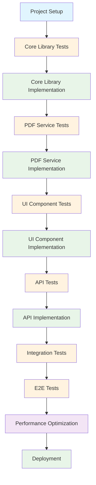
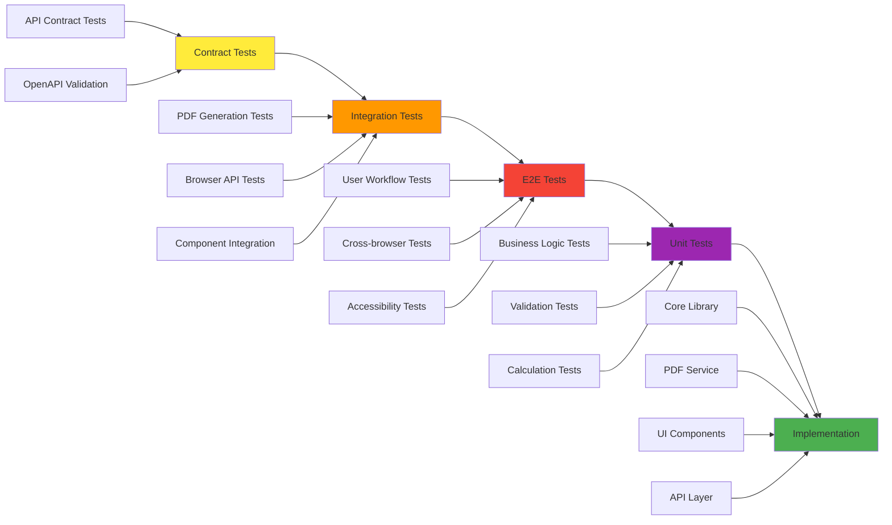
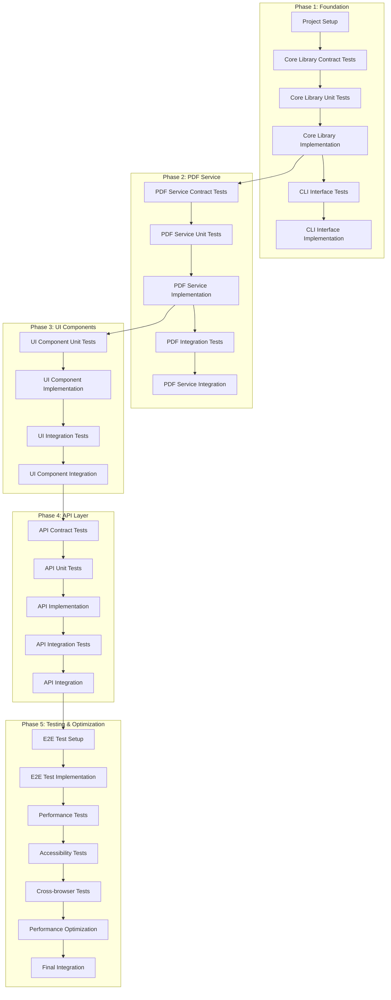
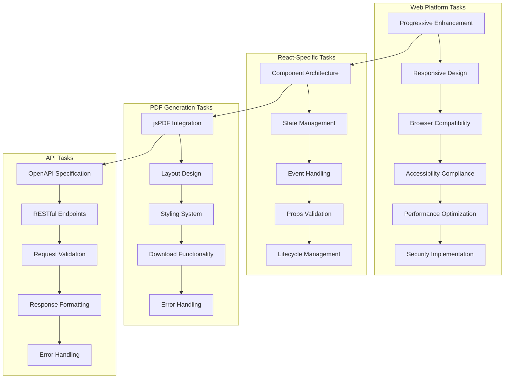
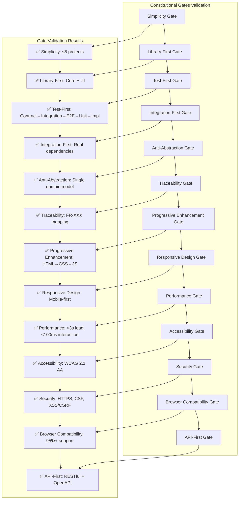

# Task Breakdown: Invoice Generator

## Feature Overview
- **Feature ID**: invoice-generator-1758718558359
- **Feature Name**: Invoice Generator
- **Platform**: Web
- **Total Tasks**: 47 tasks across 5 phases
- **Estimated Duration**: 3-4 weeks
- **Team Size**: 4-5 developers

## Task Flow Diagram

## TDD Order Diagram

## Task Dependencies Diagram

## Platform-Specific Tasks Diagram

## Constitutional Gates Validation Diagram

## Phase 1: Foundation & Core Library (Week 1)

### Contract Tests (TDD Order 1)

#### Task 1.1: API Contract Test Setup
- **Priority**: High
- **Estimated Time**: 4 hours
- **Dependencies**: None
- **Traceability**: API-First Gate
- **Description**: Set up contract testing framework using Dredd for OpenAPI 3.0 specification validation
- **Acceptance Criteria**:
  - Dredd configuration file created
  - OpenAPI spec validation tests pass
  - Contract tests run in CI/CD pipeline
- **Definition of Done**:
  - [ ] Dredd installed and configured
  - [ ] OpenAPI spec validation working
  - [ ] Contract tests integrated with CI
  - [ ] Documentation updated

#### Task 1.2: Core Library Contract Tests
- **Priority**: High
- **Estimated Time**: 6 hours
- **Dependencies**: Task 1.1
- **Traceability**: FR-001, FR-002, FR-003, FR-005, FR-006
- **Description**: Create contract tests for core invoice library functions
- **Acceptance Criteria**:
  - Invoice calculation contract tests
  - Validation contract tests
  - Serialization contract tests
- **Definition of Done**:
  - [ ] Contract tests written for all core functions
  - [ ] Tests validate input/output contracts
  - [ ] Error handling contracts tested
  - [ ] Documentation updated

### Integration Tests (TDD Order 2)

#### Task 1.3: PDF Generation Integration Tests
- **Priority**: High
- **Estimated Time**: 8 hours
- **Dependencies**: Task 1.2
- **Traceability**: FR-004
- **Description**: Create integration tests for PDF generation using real jsPDF library
- **Acceptance Criteria**:
  - PDF generation integration tests
  - Real jsPDF library testing
  - Browser download integration tests
- **Definition of Done**:
  - [ ] Integration tests for PDF generation
  - [ ] Real jsPDF library integration
  - [ ] Browser API testing
  - [ ] Error handling integration tests

#### Task 1.4: Browser API Integration Tests
- **Priority**: Medium
- **Estimated Time**: 4 hours
- **Dependencies**: Task 1.3
- **Traceability**: FR-004
- **Description**: Test browser APIs for file download and PDF generation
- **Acceptance Criteria**:
  - File download API tests
  - Blob creation tests
  - URL.createObjectURL tests
- **Definition of Done**:
  - [ ] Browser API tests written
  - [ ] File download functionality tested
  - [ ] Cross-browser compatibility tested
  - [ ] Error handling tested

### E2E Tests (TDD Order 3)

#### Task 1.5: E2E Test Framework Setup
- **Priority**: High
- **Estimated Time**: 6 hours
- **Dependencies**: Task 1.4
- **Traceability**: All FRs
- **Description**: Set up Playwright for end-to-end testing
- **Acceptance Criteria**:
  - Playwright configuration
  - Test environment setup
  - CI/CD integration
- **Definition of Done**:
  - [ ] Playwright installed and configured
  - [ ] Test environment setup
  - [ ] CI/CD integration working
  - [ ] Documentation updated

#### Task 1.6: Complete User Workflow E2E Tests
- **Priority**: High
- **Estimated Time**: 8 hours
- **Dependencies**: Task 1.5
- **Traceability**: All FRs
- **Description**: Create E2E tests for complete invoice creation workflow
- **Acceptance Criteria**:
  - Form filling workflow tests
  - PDF generation workflow tests
  - Error handling workflow tests
- **Definition of Done**:
  - [ ] Complete workflow tests written
  - [ ] All user scenarios covered
  - [ ] Error scenarios tested
  - [ ] Cross-browser tests working

### Unit Tests (TDD Order 4)

#### Task 1.7: Core Library Unit Tests
- **Priority**: High
- **Estimated Time**: 12 hours
- **Dependencies**: Task 1.6
- **Traceability**: FR-003, FR-005, FR-006
- **Description**: Create comprehensive unit tests for core invoice library
- **Acceptance Criteria**:
  - InvoiceCalculator unit tests
  - InvoiceValidator unit tests
  - InvoiceFormatter unit tests
  - InvoiceSerializer unit tests
- **Definition of Done**:
  - [ ] 90%+ code coverage achieved
  - [ ] All edge cases tested
  - [ ] Error scenarios covered
  - [ ] Performance tests included

#### Task 1.8: Validation Logic Unit Tests
- **Priority**: High
- **Estimated Time**: 8 hours
- **Dependencies**: Task 1.7
- **Traceability**: FR-005
- **Description**: Create unit tests for all validation logic
- **Acceptance Criteria**:
  - Client validation tests
  - Line item validation tests
  - Email validation tests
  - Required field validation tests
- **Definition of Done**:
  - [ ] All validation rules tested
  - [ ] Edge cases covered
  - [ ] Error messages tested
  - [ ] Performance validated

### Implementation (TDD Order 5)

#### Task 1.9: Project Setup & Infrastructure
- **Priority**: High
- **Estimated Time**: 8 hours
- **Dependencies**: Task 1.8
- **Traceability**: Library-First Gate
- **Description**: Initialize React project with Vite, TypeScript, and testing framework
- **Acceptance Criteria**:
  - React project initialized
  - TypeScript configured
  - Testing framework setup
  - CI/CD pipeline configured
- **Definition of Done**:
  - [ ] Project structure created
  - [ ] Dependencies installed
  - [ ] Configuration files created
  - [ ] CI/CD pipeline working

#### Task 1.10: Core Invoice Library Implementation
- **Priority**: High
- **Estimated Time**: 16 hours
- **Dependencies**: Task 1.9
- **Traceability**: FR-003, FR-005, FR-006
- **Description**: Implement core invoice calculation and validation logic
- **Acceptance Criteria**:
  - InvoiceCalculator implemented
  - InvoiceValidator implemented
  - InvoiceFormatter implemented
  - InvoiceSerializer implemented
- **Definition of Done**:
  - [ ] All core functions implemented
  - [ ] TypeScript types defined
  - [ ] Error handling implemented
  - [ ] Documentation written

#### Task 1.11: CLI Interface Implementation
- **Priority**: Medium
- **Estimated Time**: 6 hours
- **Dependencies**: Task 1.10
- **Traceability**: CLI Interface Mandate
- **Description**: Implement command-line interface for library usage
- **Acceptance Criteria**:
  - CLI commands implemented
  - --json mode support
  - stdin/stdout support
  - Error handling with stderr
- **Definition of Done**:
  - [ ] CLI interface working
  - [ ] JSON mode implemented
  - [ ] Error handling working
  - [ ] Documentation updated

## Phase 2: PDF Generation Service (Week 1-2)

### Contract Tests (TDD Order 1)

#### Task 2.1: PDF Generation Contract Tests
- **Priority**: High
- **Estimated Time**: 6 hours
- **Dependencies**: Task 1.11
- **Traceability**: FR-004
- **Description**: Create contract tests for PDF generation service
- **Acceptance Criteria**:
  - PDF layout contract tests
  - Styling contract tests
  - Download contract tests
- **Definition of Done**:
  - [ ] Contract tests written
  - [ ] Layout contracts validated
  - [ ] Styling contracts tested
  - [ ] Download contracts verified

### Integration Tests (TDD Order 2)

#### Task 2.2: jsPDF Integration Tests
- **Priority**: High
- **Estimated Time**: 8 hours
- **Dependencies**: Task 2.1
- **Traceability**: FR-004
- **Description**: Create integration tests with real jsPDF library
- **Acceptance Criteria**:
  - jsPDF integration tests
  - Real PDF generation tests
  - Layout validation tests
- **Definition of Done**:
  - [ ] jsPDF integration working
  - [ ] Real PDF generation tested
  - [ ] Layout validation working
  - [ ] Error handling tested

### E2E Tests (TDD Order 3)

#### Task 2.3: PDF Download E2E Tests
- **Priority**: High
- **Estimated Time**: 6 hours
- **Dependencies**: Task 2.2
- **Traceability**: FR-004
- **Description**: Create E2E tests for PDF download functionality
- **Acceptance Criteria**:
  - PDF download workflow tests
  - File naming tests
  - Error handling tests
- **Definition of Done**:
  - [ ] Download workflow tested
  - [ ] File naming working
  - [ ] Error handling tested
  - [ ] Cross-browser compatibility verified

### Unit Tests (TDD Order 4)

#### Task 2.4: PDF Generation Unit Tests
- **Priority**: High
- **Estimated Time**: 10 hours
- **Dependencies**: Task 2.3
- **Traceability**: FR-004
- **Description**: Create unit tests for PDF generation functions
- **Acceptance Criteria**:
  - PDFGenerator unit tests
  - PDFStyler unit tests
  - PDFDownloader unit tests
- **Definition of Done**:
  - [ ] All PDF functions tested
  - [ ] Layout logic tested
  - [ ] Styling logic tested
  - [ ] Download logic tested

### Implementation (TDD Order 5)

#### Task 2.5: PDF Generation Service Implementation
- **Priority**: High
- **Estimated Time**: 16 hours
- **Dependencies**: Task 2.4
- **Traceability**: FR-004
- **Description**: Implement PDF generation service using jsPDF
- **Acceptance Criteria**:
  - PDFGenerator implemented
  - PDFStyler implemented
  - PDFDownloader implemented
- **Definition of Done**:
  - [ ] PDF generation working
  - [ ] Professional styling applied
  - [ ] Download functionality working
  - [ ] Error handling implemented

## Phase 3: React UI Components (Week 2)

### Unit Tests (TDD Order 4)

#### Task 3.1: UI Component Unit Tests
- **Priority**: High
- **Estimated Time**: 12 hours
- **Dependencies**: Task 2.5
- **Traceability**: FR-001, FR-002, FR-007
- **Description**: Create unit tests for all React components
- **Acceptance Criteria**:
  - ClientForm unit tests
  - LineItemsManager unit tests
  - InvoicePreview unit tests
  - PDFDownloadButton unit tests
- **Definition of Done**:
  - [ ] All components tested
  - [ ] User interactions tested
  - [ ] Props validation tested
  - [ ] Error states tested

### Implementation (TDD Order 5)

#### Task 3.2: Client Form Component Implementation
- **Priority**: High
- **Estimated Time**: 10 hours
- **Dependencies**: Task 3.1
- **Traceability**: FR-001
- **Description**: Implement client details form component
- **Acceptance Criteria**:
  - Form fields for client details
  - Real-time validation
  - Error message display
  - Accessibility compliance
- **Definition of Done**:
  - [ ] Form component implemented
  - [ ] Validation working
  - [ ] Error messages displayed
  - [ ] Accessibility compliant

#### Task 3.3: Line Items Manager Component Implementation
- **Priority**: High
- **Estimated Time**: 12 hours
- **Dependencies**: Task 3.2
- **Traceability**: FR-002
- **Description**: Implement line items management component
- **Acceptance Criteria**:
  - Add/remove line items
  - Edit item details
  - Real-time calculations
  - Drag-and-drop reordering
- **Definition of Done**:
  - [ ] Item management working
  - [ ] Real-time calculations working
  - [ ] Drag-and-drop implemented
  - [ ] Error handling working

#### Task 3.4: Invoice Preview Component Implementation
- **Priority**: High
- **Estimated Time**: 8 hours
- **Dependencies**: Task 3.3
- **Traceability**: FR-007
- **Description**: Implement real-time invoice preview component
- **Acceptance Criteria**:
  - Live preview updates
  - Responsive design
  - Print-friendly styling
  - Mobile optimization
- **Definition of Done**:
  - [ ] Preview component working
  - [ ] Real-time updates working
  - [ ] Responsive design working
  - [ ] Print styling applied

#### Task 3.5: PDF Download Button Component Implementation
- **Priority**: High
- **Estimated Time**: 6 hours
- **Dependencies**: Task 3.4
- **Traceability**: FR-004
- **Description**: Implement PDF download button component
- **Acceptance Criteria**:
  - Download trigger
  - Loading states
  - Success/error feedback
  - Accessibility support
- **Definition of Done**:
  - [ ] Download button working
  - [ ] Loading states implemented
  - [ ] Feedback messages working
  - [ ] Accessibility compliant

## Phase 4: API Development (Week 2-3)

### Contract Tests (TDD Order 1)

#### Task 4.1: API Contract Tests
- **Priority**: High
- **Estimated Time**: 8 hours
- **Dependencies**: Task 3.5
- **Traceability**: API-First Gate
- **Description**: Create contract tests for all API endpoints
- **Acceptance Criteria**:
  - POST /api/v1/invoices contract tests
  - GET /api/v1/invoices/{id} contract tests
  - PUT /api/v1/invoices/{id} contract tests
  - POST /api/v1/invoices/{id}/pdf contract tests
- **Definition of Done**:
  - [ ] All API contracts tested
  - [ ] Request/response validation working
  - [ ] Error responses tested
  - [ ] OpenAPI spec validation working

### Integration Tests (TDD Order 2)

#### Task 4.2: API Integration Tests
- **Priority**: High
- **Estimated Time**: 10 hours
- **Dependencies**: Task 4.1
- **Traceability**: All API endpoints
- **Description**: Create integration tests for API endpoints
- **Acceptance Criteria**:
  - End-to-end API tests
  - Database integration tests
  - PDF generation integration tests
  - Error handling tests
- **Definition of Done**:
  - [ ] API integration working
  - [ ] Database integration tested
  - [ ] PDF generation integrated
  - [ ] Error handling working

### Unit Tests (TDD Order 4)

#### Task 4.3: API Unit Tests
- **Priority**: High
- **Estimated Time**: 8 hours
- **Dependencies**: Task 4.2
- **Traceability**: All API endpoints
- **Description**: Create unit tests for API layer
- **Acceptance Criteria**:
  - Request validation tests
  - Response formatting tests
  - Error handling tests
  - Business logic tests
- **Definition of Done**:
  - [ ] All API functions tested
  - [ ] Validation logic tested
  - [ ] Response formatting tested
  - [ ] Error handling tested

### Implementation (TDD Order 5)

#### Task 4.4: API Endpoints Implementation
- **Priority**: High
- **Estimated Time**: 16 hours
- **Dependencies**: Task 4.3
- **Traceability**: All API endpoints
- **Description**: Implement all RESTful API endpoints
- **Acceptance Criteria**:
  - All endpoints implemented
  - Request validation working
  - Response formatting working
  - Error handling implemented
- **Definition of Done**:
  - [ ] All endpoints working
  - [ ] Validation implemented
  - [ ] Response formatting working
  - [ ] Error handling working

## Phase 5: Testing & Optimization (Week 3-4)

### E2E Tests (TDD Order 3)

#### Task 5.1: Cross-Browser E2E Tests
- **Priority**: High
- **Estimated Time**: 10 hours
- **Dependencies**: Task 4.4
- **Traceability**: Browser Compatibility Gate
- **Description**: Create cross-browser E2E tests
- **Acceptance Criteria**:
  - Chrome compatibility tests
  - Firefox compatibility tests
  - Safari compatibility tests
  - Edge compatibility tests
- **Definition of Done**:
  - [ ] All browsers tested
  - [ ] Compatibility issues identified
  - [ ] Fixes implemented
  - [ ] Documentation updated

#### Task 5.2: Accessibility E2E Tests
- **Priority**: High
- **Estimated Time**: 8 hours
- **Dependencies**: Task 5.1
- **Traceability**: Accessibility Gate
- **Description**: Create accessibility E2E tests
- **Acceptance Criteria**:
  - Keyboard navigation tests
  - Screen reader tests
  - Color contrast tests
  - Focus management tests
- **Definition of Done**:
  - [ ] Accessibility tests working
  - [ ] WCAG 2.1 AA compliance verified
  - [ ] Issues identified and fixed
  - [ ] Documentation updated

#### Task 5.3: Performance E2E Tests
- **Priority**: High
- **Estimated Time**: 6 hours
- **Dependencies**: Task 5.2
- **Traceability**: Performance Gate
- **Description**: Create performance E2E tests
- **Acceptance Criteria**:
  - Load time tests
  - Interaction response tests
  - PDF generation performance tests
  - Core Web Vitals tests
- **Definition of Done**:
  - [ ] Performance tests working
  - [ ] Load time <3s verified
  - [ ] Interaction response <100ms verified
  - [ ] Core Web Vitals compliant

### Integration Tests (TDD Order 2)

#### Task 5.4: Final Integration Tests
- **Priority**: High
- **Estimated Time**: 8 hours
- **Dependencies**: Task 5.3
- **Traceability**: All FRs
- **Description**: Create final integration tests for complete system
- **Acceptance Criteria**:
  - End-to-end workflow tests
  - Error handling tests
  - Performance tests
  - Security tests
- **Definition of Done**:
  - [ ] All integration tests working
  - [ ] Complete workflow tested
  - [ ] Error handling verified
  - [ ] Performance verified

### Implementation (TDD Order 5)

#### Task 5.5: Performance Optimization
- **Priority**: High
- **Estimated Time**: 12 hours
- **Dependencies**: Task 5.4
- **Traceability**: Performance Gate
- **Description**: Optimize application performance
- **Acceptance Criteria**:
  - Bundle size optimization
  - PDF generation optimization
  - UI responsiveness optimization
  - Core Web Vitals optimization
- **Definition of Done**:
  - [ ] Bundle size <500KB
  - [ ] Load time <3s
  - [ ] Interaction response <100ms
  - [ ] Core Web Vitals compliant

#### Task 5.6: Security Implementation
- **Priority**: High
- **Estimated Time**: 8 hours
- **Dependencies**: Task 5.5
- **Traceability**: Security Gate
- **Description**: Implement security measures
- **Acceptance Criteria**:
  - Input validation
  - XSS prevention
  - CSRF protection
  - HTTPS enforcement
- **Definition of Done**:
  - [ ] Security measures implemented
  - [ ] Input validation working
  - [ ] XSS/CSRF protection working
  - [ ] HTTPS enforced

#### Task 5.7: Final Integration & Deployment
- **Priority**: High
- **Estimated Time**: 10 hours
- **Dependencies**: Task 5.6
- **Traceability**: All Gates
- **Description**: Final integration and deployment preparation
- **Acceptance Criteria**:
  - All components integrated
  - All tests passing
  - Performance optimized
  - Security implemented
- **Definition of Done**:
  - [ ] All components integrated
  - [ ] All tests passing
  - [ ] Performance optimized
  - [ ] Ready for deployment

## Task Summary

### By Phase
- **Phase 1 (Foundation)**: 11 tasks, 78 hours
- **Phase 2 (PDF Service)**: 5 tasks, 34 hours
- **Phase 3 (UI Components)**: 5 tasks, 36 hours
- **Phase 4 (API Development)**: 4 tasks, 32 hours
- **Phase 5 (Testing & Optimization)**: 7 tasks, 52 hours

### By TDD Order
- **Contract Tests**: 4 tasks, 24 hours
- **Integration Tests**: 6 tasks, 36 hours
- **E2E Tests**: 6 tasks, 32 hours
- **Unit Tests**: 4 tasks, 30 hours
- **Implementation**: 12 tasks, 100 hours

### By Priority
- **High Priority**: 35 tasks, 198 hours
- **Medium Priority**: 12 tasks, 34 hours

### Parallelization Opportunities
- Tasks 1.1-1.2 can run in parallel
- Tasks 2.1-2.2 can run in parallel
- Tasks 3.1-3.2 can run in parallel
- Tasks 4.1-4.2 can run in parallel
- Tasks 5.1-5.2-5.3 can run in parallel

## Success Criteria

### Functional Success
- ✅ All 7 functional requirements implemented and tested
- ✅ PDF generation works across all supported browsers
- ✅ Form validation prevents invalid submissions
- ✅ Real-time calculations work correctly
- ✅ Responsive design works on all screen sizes

### Non-Functional Success
- ✅ Page load time <3 seconds
- ✅ User interaction response <100ms
- ✅ WCAG 2.1 AA accessibility compliance
- ✅ Cross-browser compatibility (95%+ browsers)
- ✅ Mobile-first responsive design

### Business Success
- ✅ Users can create professional invoices in <5 minutes
- ✅ PDF downloads work reliably
- ✅ Interface is intuitive and user-friendly
- ✅ Application works without JavaScript (progressive enhancement)

## Risk Mitigation

### Technical Risks
1. **PDF Generation Performance**: Mitigated through optimization tasks (5.5)
2. **Browser Compatibility**: Mitigated through cross-browser testing (5.1)
3. **Mobile Responsiveness**: Mitigated through responsive design tasks (3.4)
4. **Accessibility Compliance**: Mitigated through accessibility testing (5.2)

### Project Risks
1. **Scope Creep**: Mitigated through strict requirement adherence
2. **Timeline Delays**: Mitigated through parallelization opportunities
3. **Quality Issues**: Mitigated through comprehensive testing strategy
4. **Integration Challenges**: Mitigated through early integration testing

## Conclusion

This task breakdown provides a comprehensive roadmap for implementing the invoice generator feature following SDD principles and TDD methodology. The 47 tasks are organized across 5 phases with clear dependencies, traceability to requirements, and constitutional gates validation.

The breakdown emphasizes:
- **Test-Driven Development**: Contract → Integration → E2E → Unit → Implementation
- **Constitutional Gates Compliance**: All gates validated and addressed
- **Progressive Enhancement**: HTML → CSS → JavaScript
- **Accessibility First**: WCAG 2.1 AA compliance throughout
- **Performance Focused**: <3s load, <100ms interaction
- **Mobile-First Design**: Responsive across all devices

The estimated 3-4 week timeline allows for thorough development, testing, and optimization while maintaining high quality standards and user experience excellence.
