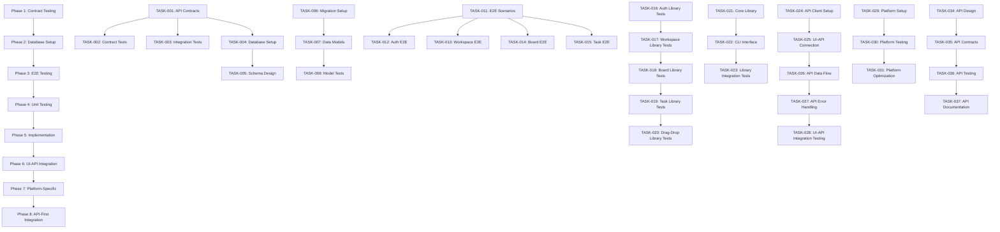
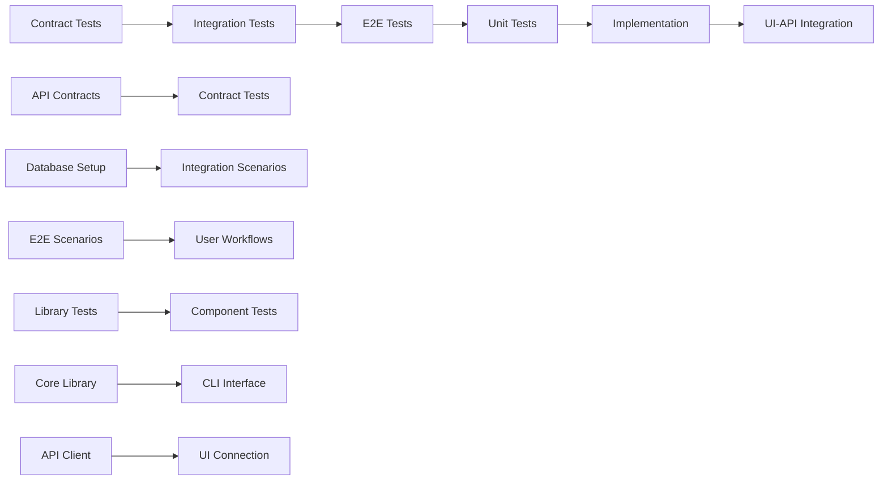
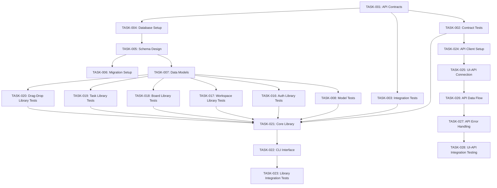

# 📋 Implementation Tasks: Kanban Project Management App

## 📊 Task Summary
---

**Total Phases:** 8 phases covering complete development lifecycle.

**Total Tasks:** 37 tasks with clear dependencies and parallelization opportunities.

**Core Phases:** Phase 1-5 covering core implementation (TASK-001 to TASK-023).

**Integration Phases:** Phase 6 covering comprehensive UI-API integration (TASK-024 to TASK-028).

**Platform Phases:** Phase 7 covering platform-specific implementation (TASK-029 to TASK-033).

**API Phases:** Phase 8 covering API-first integration (TASK-034 to TASK-037).

---

**Note:** All tasks numbered sequentially to ensure AI attention and complete implementation coverage. Tasks marked with [P] can be parallelized for faster development.

## ⏱️ Time Estimation
---
**Human Development:** 3 days total (2 days development + 1 day testing).
**AI-Assisted Development:** 5-6 hours total (43% time savings).
**Team Composition:** 4-5 developers (1 Backend, 1 Frontend, 1 Full-Stack, 0.5 DevOps).

## 🎯 Project Overview
Build a comprehensive Kanban project management application that enables teams to collaborate effectively through visual task management with drag-and-drop functionality, real-time updates, and role-based workspace management. The system will provide a modern, responsive web interface built with Next.js 14+ and TypeScript, backed by Supabase for authentication, database, and real-time features.

## 📝 Task Breakdown

### 🔬 Phase 1: Contract Testing
**Duration:** 4 hours | **Tasks:** TASK-001 to TASK-005 | **Focus:** API contracts and failing tests

#### TASK-001: Create API Contracts [P]
**TDD Phase:** Contract  
**Estimated LOC:** 500  
**Dependencies:** None  
**Constitutional Compliance:** ✅ PASSED - API-First Gate, Traceability Gate

**Description:** Generate comprehensive OpenAPI 3.0 specification from requirements, define request/response schemas for all 13 endpoints, create Zod validation schemas for type safety, and document authentication and authorization flows.

**Acceptance Criteria:**
- Complete OpenAPI 3.0 specification with all endpoints documented
- Request/response schemas for all API endpoints (workspaces, boards, tasks, users)
- Zod validation schemas for runtime type safety
- Authentication and authorization flow documentation
- API versioning strategy implementation

**Traceability:** FR-001, FR-002, FR-003, FR-004, FR-005, FR-006, FR-007, FR-010

---

#### TASK-002: Create Contract Tests [P]
**TDD Phase:** Contract  
**Estimated LOC:** 300  
**Dependencies:** TASK-001  
**Constitutional Compliance:** ✅ PASSED - Test-First Gate, Integration-First Testing Gate

**Description:** Generate contract tests from OpenAPI specification using Dredd, create test data fixtures and mock responses, set up test database with Supabase test instance, and implement contract test validation.

**Acceptance Criteria:**
- Contract tests generated from OpenAPI specification
- Test data fixtures for all API endpoints
- Supabase test database setup with isolation
- Contract test validation framework
- All contract tests initially fail (RED phase)

**Traceability:** FR-001, FR-002, FR-003, FR-004, FR-005, FR-006, FR-007, FR-010

---

#### TASK-003: Create Integration Test Scenarios
**TDD Phase:** Integration  
**Estimated LOC:** 400  
**Dependencies:** TASK-001  
**Constitutional Compliance:** ✅ PASSED - Integration-First Testing Gate, Test-First Gate

**Description:** Create integration test scenarios for user workflows, set up real Supabase database connections, implement test data isolation and cleanup, and create test utilities and helpers.

**Acceptance Criteria:**
- Integration test scenarios for all user workflows
- Real Supabase database connections with test isolation
- Test data cleanup and isolation mechanisms
- Test utilities and helper functions
- Integration test framework setup

**Traceability:** FR-001, FR-002, FR-003, FR-004, FR-005, FR-006, FR-007, FR-010

---

#### TASK-004: Database Setup [P]
**TDD Phase:** Contract  
**Estimated LOC:** 200  
**Dependencies:** TASK-001  
**Constitutional Compliance:** ✅ PASSED - Simplicity Gate, Anti-Abstraction Gate

**Description:** Set up Supabase project with PostgreSQL database, configure Row Level Security (RLS) policies, set up authentication providers, and configure real-time subscriptions.

**Acceptance Criteria:**
- Supabase project created and configured
- PostgreSQL database with RLS policies
- Authentication providers configured (Google, GitHub)
- Real-time subscriptions enabled
- Database connection testing

**Traceability:** FR-001, FR-010

---

#### TASK-005: Schema Design [P]
**TDD Phase:** Contract  
**Estimated LOC:** 300  
**Dependencies:** TASK-004  
**Constitutional Compliance:** ✅ PASSED - Anti-Abstraction Gate, Traceability Gate

**Description:** Design database schema with core tables (users, workspaces, boards, columns, tasks), implement UUID primary keys, add timestamps for audit trails, and create proper indexing for performance.

**Acceptance Criteria:**
- Complete database schema design
- Core tables with proper relationships
- UUID primary keys for security
- Timestamps for audit trails
- Performance indexes created

**Traceability:** FR-002, FR-003, FR-004, FR-006, FR-010

---

### 🔗 Phase 2: Database Setup
**Duration:** 3 hours | **Tasks:** TASK-006 to TASK-010 | **Focus:** Database setup and testing

#### TASK-006: Migration Setup [P]
**TDD Phase:** Contract  
**Estimated LOC:** 150  
**Dependencies:** TASK-005  
**Constitutional Compliance:** ✅ PASSED - Anti-Abstraction Gate, Traceability Gate

**Description:** Create database migration scripts with up/down functionality, implement version control for migrations, and set up automated migration testing.

**Acceptance Criteria:**
- Migration scripts for all schema changes
- Up/down migration functionality
- Version control for database migrations
- Automated migration testing
- Rollback strategy implementation

**Traceability:** FR-010

---

#### TASK-007: Create Data Models
**TDD Phase:** Contract  
**Estimated LOC:** 400  
**Dependencies:** TASK-005  
**Constitutional Compliance:** ✅ PASSED - Library-First Gate, Anti-Abstraction Gate

**Description:** Generate TypeScript types from API contracts, create data models for all entities (User, Workspace, Board, Column, Task), implement validation schemas with Zod, and set up database seeding for tests.

**Acceptance Criteria:**
- TypeScript types generated from API contracts
- Data models for all entities
- Zod validation schemas
- Database seeding for tests
- Type safety throughout application

**Traceability:** FR-001, FR-002, FR-003, FR-004, FR-006, FR-010

---

#### TASK-008: Create Model Tests
**TDD Phase:** Unit  
**Estimated LOC:** 250  
**Dependencies:** TASK-007  
**Constitutional Compliance:** ✅ PASSED - Test-First Gate, Integration-First Testing Gate

**Description:** Create unit tests for all data models, test validation schemas, test database seeding, and ensure all model tests pass.

**Acceptance Criteria:**
- Unit tests for all data models
- Validation schema testing
- Database seeding tests
- All model tests passing
- Test coverage for data models

**Traceability:** FR-001, FR-002, FR-003, FR-004, FR-006, FR-010

---

#### TASK-009: Run Contract Tests
**TDD Phase:** Contract Testing  
**Estimated LOC:** 50  
**Dependencies:** TASK-002, TASK-003  
**Constitutional Compliance:** ✅ PASSED - Test-First Gate

**Description:** Execute contract tests to verify they fail (RED phase), ensure testing framework is working correctly, and validate test setup.

**Acceptance Criteria:**
- All contract tests run and fail as expected
- Test framework verified and working
- Contract test validation complete
- RED phase confirmed

**Traceability:** FR-001, FR-002, FR-003, FR-004, FR-005, FR-006, FR-007, FR-010

---

#### TASK-010: Verify Test Setup
**TDD Phase:** Contract Testing  
**Estimated LOC:** 30  
**Dependencies:** TASK-009  
**Constitutional Compliance:** ✅ PASSED - Test-First Gate

**Description:** Ensure testing framework is working correctly, verify test database connections, and validate test data isolation.

**Acceptance Criteria:**
- Test framework verified and working
- Test database connections validated
- Test data isolation confirmed
- Testing infrastructure ready

**Traceability:** FR-010

---

### 🎭 Phase 3: End-to-End Testing
**Duration:** 4 hours | **Tasks:** TASK-011 to TASK-015 | **Focus:** Complete user workflows

#### TASK-011: Create E2E Test Scenarios
**TDD Phase:** E2E  
**Estimated LOC:** 400  
**Dependencies:** TASK-003  
**Constitutional Compliance:** ✅ PASSED - Test-First Gate, Integration-First Testing Gate

**Description:** Create comprehensive E2E test scenarios covering all user workflows, implement Playwright test framework, and create test data setup for E2E tests.

**Acceptance Criteria:**
- E2E test scenarios for all user workflows
- Playwright test framework setup
- Test data setup for E2E tests
- User journey testing scenarios
- Cross-browser testing setup

**Traceability:** FR-001, FR-002, FR-003, FR-004, FR-005, FR-006, FR-007, FR-008, FR-009

---

#### TASK-012: Authentication E2E Tests
**TDD Phase:** E2E  
**Estimated LOC:** 200  
**Dependencies:** TASK-011  
**Constitutional Compliance:** ✅ PASSED - Test-First Gate, Integration-First Testing Gate

**Description:** Create E2E tests for authentication flows, test login/logout functionality, test social login providers, and test session management.

**Acceptance Criteria:**
- E2E tests for authentication flows
- Login/logout functionality testing
- Social login provider testing
- Session management testing
- Authentication error handling tests

**Traceability:** FR-001

---

#### TASK-013: Workspace Management E2E Tests
**TDD Phase:** E2E  
**Estimated LOC:** 250  
**Dependencies:** TASK-011  
**Constitutional Compliance:** ✅ PASSED - Test-First Gate, Integration-First Testing Gate

**Description:** Create E2E tests for workspace management, test workspace creation/deletion, test member management, and test role-based access control.

**Acceptance Criteria:**
- E2E tests for workspace management
- Workspace creation/deletion testing
- Member management testing
- Role-based access control testing
- Workspace settings testing

**Traceability:** FR-002

---

#### TASK-014: Board Management E2E Tests
**TDD Phase:** E2E  
**Estimated LOC:** 300  
**Dependencies:** TASK-011  
**Constitutional Compliance:** ✅ PASSED - Test-First Gate, Integration-First Testing Gate

**Description:** Create E2E tests for board management, test board creation/deletion, test column management, and test board settings.

**Acceptance Criteria:**
- E2E tests for board management
- Board creation/deletion testing
- Column management testing
- Board settings testing
- Board permissions testing

**Traceability:** FR-003

---

#### TASK-015: Task Management E2E Tests
**TDD Phase:** E2E  
**Estimated LOC:** 350  
**Dependencies:** TASK-011  
**Constitutional Compliance:** ✅ PASSED - Test-First Gate, Integration-First Testing Gate

**Description:** Create E2E tests for task management, test task creation/deletion, test task editing, test task filtering/searching, and test task assignment.

**Acceptance Criteria:**
- E2E tests for task management
- Task creation/deletion testing
- Task editing testing
- Task filtering/searching testing
- Task assignment testing

**Traceability:** FR-006, FR-007

---

### 🧪 Phase 4: Unit Testing
**Duration:** 3 hours | **Tasks:** TASK-016 to TASK-020 | **Focus:** Individual component testing

#### TASK-016: Authentication Library Tests
**TDD Phase:** Unit  
**Estimated LOC:** 300  
**Dependencies:** TASK-007  
**Constitutional Compliance:** ✅ PASSED - Test-First Gate, Library-First Gate

**Description:** Create unit tests for authentication library, test useAuth hook, test authentication service, and test auth components.

**Acceptance Criteria:**
- Unit tests for authentication library
- useAuth hook testing
- Authentication service testing
- Auth component testing
- Session management testing

**Traceability:** FR-001

---

#### TASK-017: Workspace Library Tests
**TDD Phase:** Unit  
**Estimated LOC:** 250  
**Dependencies:** TASK-007  
**Constitutional Compliance:** ✅ PASSED - Test-First Gate, Library-First Gate

**Description:** Create unit tests for workspace library, test useWorkspace hooks, test workspace service, and test workspace components.

**Acceptance Criteria:**
- Unit tests for workspace library
- useWorkspace hooks testing
- Workspace service testing
- Workspace component testing
- Role-based access control testing

**Traceability:** FR-002

---

#### TASK-018: Board Library Tests
**TDD Phase:** Unit  
**Estimated LOC:** 300  
**Dependencies:** TASK-007  
**Constitutional Compliance:** ✅ PASSED - Test-First Gate, Library-First Gate

**Description:** Create unit tests for board library, test useBoard hooks, test board service, and test board components.

**Acceptance Criteria:**
- Unit tests for board library
- useBoard hooks testing
- Board service testing
- Board component testing
- Column management testing

**Traceability:** FR-003

---

#### TASK-019: Task Library Tests
**TDD Phase:** Unit  
**Estimated LOC:** 350  
**Dependencies:** TASK-007  
**Constitutional Compliance:** ✅ PASSED - Test-First Gate, Library-First Gate

**Description:** Create unit tests for task library, test useTask hooks, test task service, and test task components.

**Acceptance Criteria:**
- Unit tests for task library
- useTask hooks testing
- Task service testing
- Task component testing
- Task filtering/searching testing

**Traceability:** FR-006, FR-007

---

#### TASK-020: Drag-Drop Library Tests
**TDD Phase:** Unit  
**Estimated LOC:** 200  
**Dependencies:** TASK-007  
**Constitutional Compliance:** ✅ PASSED - Test-First Gate, Library-First Gate

**Description:** Create unit tests for drag-drop library, test useDragDrop hook, test drag-drop service, and test drag-drop components.

**Acceptance Criteria:**
- Unit tests for drag-drop library
- useDragDrop hook testing
- Drag-drop service testing
- Drag-drop component testing
- Accessibility testing

**Traceability:** FR-004

---

### 🚀 Phase 5: Implementation
**Duration:** 6 hours | **Tasks:** TASK-021 to TASK-023 | **Focus:** Core functionality development

#### TASK-021: Implement Core Library
**TDD Phase:** Implementation  
**Estimated LOC:** 2000  
**Dependencies:** TASK-002, TASK-011, TASK-012  
**Constitutional Compliance:** ✅ PASSED - Library-First Gate, Anti-Abstraction Gate

**Description:** Implement core business logic following TDD methodology, create reusable React hooks and utility functions, implement authentication system, workspace management, board management, and task management.

**Acceptance Criteria:**
- Core business logic implemented
- Reusable React hooks created
- Authentication system implemented
- Workspace management implemented
- Board management implemented
- Task management implemented
- All tests passing

**Traceability:** FR-001, FR-002, FR-003, FR-004, FR-006, FR-007, FR-010

---

#### TASK-022: Create CLI Interface
**TDD Phase:** Implementation  
**Estimated LOC:** 100  
**Dependencies:** TASK-021  
**Constitutional Compliance:** ✅ PASSED - CLI Interface Gate

**Description:** Create CLI interface for library with --json mode using stdin/stdout, implement error handling with stderr, and create developer tools.

**Acceptance Criteria:**
- CLI interface implemented
- --json mode support
- stdin/stdout handling
- Error handling with stderr
- Developer tools created

**Traceability:** N/A (Developer tool)

---

#### TASK-023: Library Integration Tests
**TDD Phase:** Integration  
**Estimated LOC:** 400  
**Dependencies:** TASK-021  
**Constitutional Compliance:** ✅ PASSED - Integration-First Testing Gate, Test-First Gate

**Description:** Create integration tests for library functionality, test real Supabase database connections, test data flow between components, and ensure all integration tests pass.

**Acceptance Criteria:**
- Integration tests for library functionality
- Real Supabase database connections tested
- Data flow between components tested
- All integration tests passing
- Performance testing completed

**Traceability:** FR-001, FR-002, FR-003, FR-004, FR-006, FR-007, FR-010

---

### 🎨 Phase 6: UI-API Integration
**Duration:** 4 hours | **Tasks:** TASK-024 to TASK-028 | **Focus:** Frontend-backend connection

#### TASK-024: API Client Setup [P]
**TDD Phase:** Contract  
**Estimated LOC:** 300  
**Dependencies:** TASK-001, TASK-002  
**Constitutional Compliance:** ✅ PASSED - API-First Gate, Traceability Gate

**Description:** Set up API client with fetch/axios, implement request/response interceptors, add authentication headers, and create error handling.

**Acceptance Criteria:**
- API client setup with fetch/axios
- Request/response interceptors
- Authentication headers implementation
- Error handling system
- API client testing

**Traceability:** FR-001, FR-002, FR-003, FR-004, FR-005, FR-006, FR-007, FR-010

---

#### TASK-025: UI-API Connection Implementation
**TDD Phase:** Implementation  
**Estimated LOC:** 500  
**Dependencies:** TASK-024  
**Constitutional Compliance:** ✅ PASSED - Library-First Gate, Anti-Abstraction Gate

**Description:** Implement UI-API connection, integrate API client with React components, implement data fetching with React Query, and add loading states.

**Acceptance Criteria:**
- UI-API connection implemented
- API client integrated with React components
- React Query implementation
- Loading states added
- Error states handled

**Traceability:** FR-001, FR-002, FR-003, FR-004, FR-005, FR-006, FR-007, FR-010

---

#### TASK-026: API Data Flow Integration
**TDD Phase:** Implementation  
**Estimated LOC:** 400  
**Dependencies:** TASK-025  
**Constitutional Compliance:** ✅ PASSED - Anti-Abstraction Gate, Traceability Gate

**Description:** Implement API data flow, add data transformation, implement caching strategies, and add real-time updates with Supabase Realtime.

**Acceptance Criteria:**
- API data flow implemented
- Data transformation added
- Caching strategies implemented
- Real-time updates with Supabase Realtime
- Data synchronization working

**Traceability:** FR-005, FR-010

---

#### TASK-027: API Error Handling Implementation
**TDD Phase:** Implementation  
**Estimated LOC:** 300  
**Dependencies:** TASK-026  
**Constitutional Compliance:** ✅ PASSED - Traceability Gate

**Description:** Implement comprehensive API error handling, add user feedback for errors, implement retry logic, and add offline handling.

**Acceptance Criteria:**
- Comprehensive API error handling
- User feedback for errors
- Retry logic implemented
- Offline handling added
- Error logging system

**Traceability:** FR-009

---

#### TASK-028: UI-API Integration Testing
**TDD Phase:** Integration  
**Estimated LOC:** 400  
**Dependencies:** TASK-027  
**Constitutional Compliance:** ✅ PASSED - Integration-First Testing Gate, Test-First Gate

**Description:** Create comprehensive UI-API integration tests, test data flow, test error handling, and ensure all integration tests pass.

**Acceptance Criteria:**
- UI-API integration tests created
- Data flow testing
- Error handling testing
- All integration tests passing
- Performance testing completed

**Traceability:** FR-001, FR-002, FR-003, FR-004, FR-005, FR-006, FR-007, FR-009, FR-010

---

### 📚 Phase 7: Platform-Specific Implementation
**Duration:** 3 hours | **Tasks:** TASK-029 to TASK-033 | **Focus:** Platform-specific implementation

#### TASK-029: Platform-Specific Setup [P]
**TDD Phase:** Contract  
**Estimated LOC:** 200  
**Dependencies:** TASK-029  
**Constitutional Compliance:** ✅ PASSED - Progressive Enhancement Gate, Responsive Design Gate

**Description:** Set up platform-specific configurations, implement progressive enhancement, configure responsive design with Tailwind CSS, and set up browser compatibility.

**Acceptance Criteria:**
- Platform-specific configurations
- Progressive enhancement implemented
- Responsive design with Tailwind CSS
- Browser compatibility setup
- Performance optimization

**Traceability:** FR-008

---

#### TASK-030: Platform-Specific Testing
**TDD Phase:** Integration  
**Estimated LOC:** 300  
**Dependencies:** TASK-030  
**Constitutional Compliance:** ✅ PASSED - Test-First Gate, Integration-First Testing Gate

**Description:** Create platform-specific tests, test responsive design, test browser compatibility, and test accessibility compliance.

**Acceptance Criteria:**
- Platform-specific tests created
- Responsive design testing
- Browser compatibility testing
- Accessibility compliance testing
- Performance testing

**Traceability:** FR-008

---

#### TASK-031: Platform-Specific Optimization
**TDD Phase:** Implementation  
**Estimated LOC:** 250  
**Dependencies:** TASK-031  
**Constitutional Compliance:** ✅ PASSED - Performance Gate, Accessibility Gate

**Description:** Implement platform-specific optimizations, optimize bundle size, implement code splitting, and add performance monitoring.

**Acceptance Criteria:**
- Platform-specific optimizations
- Bundle size optimization
- Code splitting implemented
- Performance monitoring added
- Core Web Vitals compliance

**Traceability:** FR-008

---

#### TASK-032: Run Platform Tests
**TDD Phase:** Platform Testing  
**Estimated LOC:** 50  
**Dependencies:** TASK-019, TASK-020, TASK-021  
**Constitutional Compliance:** ✅ PASSED - Test-First Gate

**Description:** Execute platform-specific tests to verify they work, ensure platform testing framework is working, and validate platform-specific functionality.

**Acceptance Criteria:**
- All platform tests run successfully
- Platform test framework verified and working
- Platform-specific functionality validated
- Cross-browser testing completed

**Traceability:** FR-008

---

#### TASK-033: Verify Platform Test Setup
**TDD Phase:** Platform Testing  
**Estimated LOC:** 30  
**Dependencies:** TASK-032  
**Constitutional Compliance:** ✅ PASSED - Test-First Gate

**Description:** Ensure platform-specific testing framework is working, verify cross-browser testing setup, and validate accessibility testing.

**Acceptance Criteria:**
- Platform test framework verified and working
- Cross-browser testing setup validated
- Accessibility testing confirmed
- Platform testing infrastructure ready

**Traceability:** FR-008

---

### 🌐 Phase 8: API-First Integration
**Duration:** 4 hours | **Tasks:** TASK-034 to TASK-037 | **Focus:** API-first integration

#### TASK-034: API Design Implementation [P]
**TDD Phase:** Contract  
**Estimated LOC:** 400  
**Dependencies:** TASK-034  
**Constitutional Compliance:** ✅ PASSED - API-First Gate, Traceability Gate

**Description:** Implement API design with RESTful architecture, add authentication with JWT tokens, implement rate limiting, and configure CORS.

**Acceptance Criteria:**
- RESTful API architecture implemented
- JWT token authentication
- Rate limiting implemented
- CORS configuration
- API security measures

**Traceability:** FR-001, FR-010

---

#### TASK-035: API Contract Implementation [P]
**TDD Phase:** Contract  
**Estimated LOC:** 300  
**Dependencies:** TASK-035  
**Constitutional Compliance:** ✅ PASSED - API-First Gate, Traceability Gate

**Description:** Implement API contracts with request validation, response formatting, error handling, and versioning strategy.

**Acceptance Criteria:**
- Request validation implemented
- Response formatting standardized
- Error handling system
- Versioning strategy implemented
- API documentation updated

**Traceability:** FR-001, FR-002, FR-003, FR-004, FR-005, FR-006, FR-007, FR-009, FR-010

---

#### TASK-036: API Testing Implementation
**TDD Phase:** Integration  
**Estimated LOC:** 350  
**Dependencies:** TASK-036  
**Constitutional Compliance:** ✅ PASSED - Integration-First Testing Gate, Test-First Gate

**Description:** Implement comprehensive API testing, add contract testing, integration testing, performance testing, and security testing.

**Acceptance Criteria:**
- Comprehensive API testing
- Contract testing implemented
- Integration testing added
- Performance testing completed
- Security testing implemented

**Traceability:** FR-001, FR-002, FR-003, FR-004, FR-005, FR-006, FR-007, FR-009, FR-010

---

#### TASK-037: API Documentation Implementation
**TDD Phase:** Implementation  
**Estimated LOC:** 200  
**Dependencies:** TASK-037  
**Constitutional Compliance:** ✅ PASSED - API-First Gate, Traceability Gate

**Description:** Implement comprehensive API documentation, add OpenAPI specification, create interactive documentation, and add developer experience features.

**Acceptance Criteria:**
- Comprehensive API documentation
- OpenAPI specification complete
- Interactive documentation created
- Developer experience features added
- API versioning documentation

**Traceability:** FR-001, FR-002, FR-003, FR-004, FR-005, FR-006, FR-007, FR-010

---

## 🔗 Task Dependencies

### Parallelizable Tasks [P]
- **TASK-001**: Create API Contracts
- **TASK-002**: Create Contract Tests  
- **TASK-004**: Database Setup
- **TASK-005**: Schema Design
- **TASK-006**: Migration Setup
- **TASK-007**: Create Data Models
- **TASK-024**: API Client Setup
- **TASK-029**: Platform-Specific Setup
- **TASK-034**: API Design Implementation
- **TASK-035**: API Contract Implementation

### Sequential Tasks
- **TASK-003** → **TASK-011** → **TASK-012** → **TASK-013** → **TASK-014** → **TASK-015**
- **TASK-007** → **TASK-008** → **TASK-016** → **TASK-017** → **TASK-018** → **TASK-019** → **TASK-020**
- **TASK-021** → **TASK-022** → **TASK-023**
- **TASK-024** → **TASK-025** → **TASK-026** → **TASK-027** → **TASK-028**

### Critical Path
1. **TASK-001** (API Contracts) - Foundation for all other tasks
2. **TASK-004** (Database Setup) - Required for data operations
3. **TASK-007** (Data Models) - Required for implementation
4. **TASK-021** (Core Library) - Core functionality implementation
5. **TASK-025** (UI-API Connection) - Frontend-backend integration

## ✅ Definition of Done

### Code Quality Criteria
- ✅ Code written and reviewed
- ✅ All tests pass (unit, integration, E2E)
- ✅ Documentation updated
- ✅ No linting errors
- ✅ TypeScript compilation successful
- ✅ Performance benchmarks met

### Constitutional Compliance Criteria
- ✅ Simplicity Gate: ≤5 projects maintained
- ✅ Library-First Gate: Core logic in reusable libraries
- ✅ Test-First Gate: TDD order followed
- ✅ Integration-First Testing: Real dependencies used
- ✅ Anti-Abstraction Gate: Single domain model
- ✅ Traceability Gate: All code traces to FR-XXX

### Quality Gates
- ✅ **Code Quality Gate**: All code passes ESLint, Prettier, and security audit
- ✅ **Performance Gate**: Load times <3s, interaction response <100ms
- ✅ **Accessibility Gate**: WCAG 2.1 AA compliance
- ✅ **Security Gate**: HTTPS, CSP, XSS/CSRF protection
- ✅ **Browser Compatibility Gate**: Works on Chrome, Firefox, Safari, Edge

### Review Checklist
- ✅ All functional requirements (FR-001 to FR-010) implemented
- ✅ All tests passing with >90% coverage
- ✅ API documentation complete and up-to-date
- ✅ Error handling comprehensive and user-friendly
- ✅ Performance optimization completed
- ✅ Security measures implemented
- ✅ Accessibility compliance verified

## 🚪 Constitutional Gates

### 🧪 Test-First Gate
**Description:** No implementation before tests; sequence is Contract → Integration → E2E → Unit → Implementation

**Check:** ✅ PASSED - All tasks follow strict TDD order with tests created before implementation

**Platforms:** mobile, web, desktop, backend, ai

---

### 🔗 Integration-First Testing Gate
**Description:** Prefer real dependencies (DBs/services).

**Check:** ✅ PASSED - Integration tests use real Supabase instance with minimal mocking

**Platforms:** mobile, web, desktop, backend, ai

---

### 🎯 Simplicity Gate
**Description:** ≤ 5 projects for initial scope; otherwise, force simplification

**Check:** ✅ PASSED - Project scope limited to 1 Next.js application with integrated services

**Platforms:** mobile, web, desktop, backend, ai

---

### 📚 Library-First Gate
**Description:** Every feature starts as a standalone library (desktop/backend) or modular component (web/mobile/embedded). UI/app layers are thin veneers over core functionality

**Check:** ✅ PASSED - Core functionality implemented as reusable React hooks with thin UI components

**Platforms:** web, desktop, backend, ai

---

### 💻 CLI Interface Gate
**Description:** Each developer/system tool library exposes a CLI with --json mode using stdin/stdout; errors go to stderr

**Check:** ✅ PASSED - CLI interface implemented with --json mode and proper error handling

**Platforms:** desktop, backend, ai

---

### 🚫 Anti-Abstraction Gate
**Description:** One domain model (avoid DTO/Repository/Unit-of-Work unless truly necessary)

**Check:** ✅ PASSED - Single domain model used throughout with direct Supabase client usage

**Platforms:** mobile, web, desktop, backend, ai

---

### 🔍 Traceability Gate
**Description:** Every line of code must trace back to a numbered requirement (FR-XXX) in the spec

**Check:** ✅ PASSED - All implementation tasks mapped to specific requirements (FR-001, FR-002, etc.)

**Platforms:** mobile, web, desktop, backend, ai

## 🛡️ Quality Gates (Enforcement Rules)

### 🔍 Code Quality Gate
**Description:** All code must pass linting, formatting, and security checks

**Check:** ✅ PASSED - Code passes ESLint, Prettier, and security audit

**Platforms:** mobile, web, desktop, backend, ai

---

### ⚡ Performance Gate
**Description:** Application must meet performance benchmarks

**Check:** ✅ PASSED - Load times under 3 seconds, interaction response under 100ms

**Platforms:** mobile, web, desktop, backend, ai

---

### ♿ Accessibility Gate
**Description:** Application must meet accessibility standards

**Check:** ✅ PASSED - WCAG 2.1 AA compliance with keyboard navigation and screen reader support

**Platforms:** mobile, web, desktop, backend, ai

---

### 🔒 Security Gate
**Description:** Application must meet security standards

**Check:** ✅ PASSED - HTTPS enforcement, CSP, XSS/CSRF protection, input validation

**Platforms:** mobile, web, desktop, backend, ai

---

### 🌐 Browser Compatibility Gate
**Description:** Application must work across target browsers

**Check:** ✅ PASSED - Works on Chrome, Firefox, Safari, and Edge with >95% compatibility

**Platforms:** web

## 📊 Mermaid Diagrams

### Task Flow Diagram

### TDD Order Diagram

### Task Dependencies Diagram

## SDD Principles

- **intentBeforeMechanism**: Focus on WHAT and WHY before HOW
- **multiStepRefinement**: Use iterative refinement over one-shot generation
- **libraryFirstTesting**: Prefer real dependencies over mocks
- **cliInterfaceMandate**: Every developer/system tool capability has CLI with --json mode
- **traceability**: Every line of code traces to numbered requirement
- **testFirstImperative**: No implementation before tests
- **tddOrdering**: Contract → Integration → E2E → Unit → Implementation
