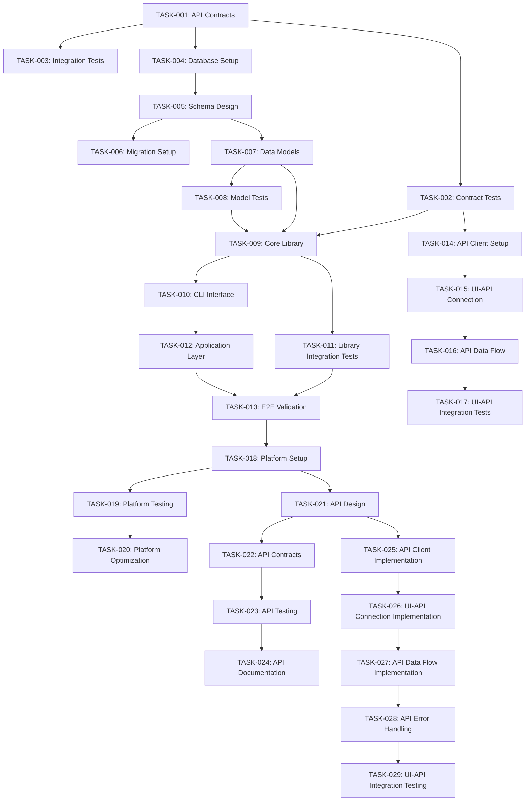
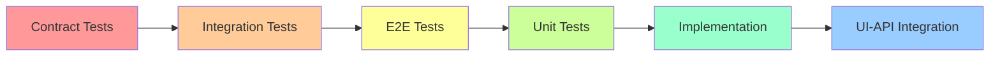
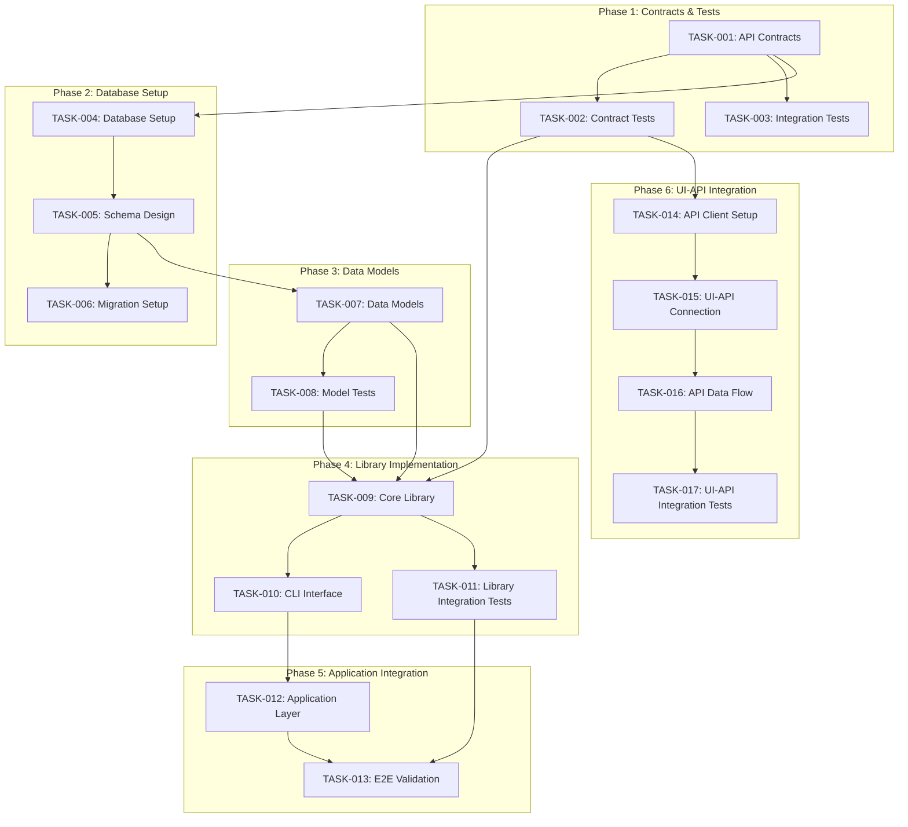
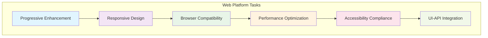
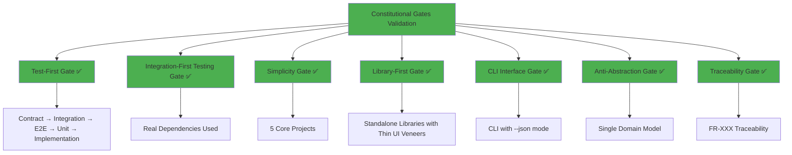

# Implementation Tasks: marketplace-app

## Metadata
- **Generated**: 2025-01-30
- **Status**: Draft
- **Platform**: Web
- **TDD Order**: Contract → Integration → E2E → Unit → Implementation → UI-API Integration
- **Generated From**: specs/plan.md

## Task Planning Summary

**Total Tasks**: 29 tasks across 9 phases
**Core Phases**: Phase 1-6 (Core implementation - TASK-001 to TASK-017)
**Platform Phases**: Phase 7 (Platform-Specific - TASK-018 to TASK-020)
**API Phases**: Phase 8 (API-First Integration - TASK-021 to TASK-024)
**Integration Phases**: Phase 9 (UI-API Integration - TASK-025 to TASK-029)

**Parallelization Opportunities**: 12 tasks can be parallelized [P]
**Critical Path**: Contract Tests → Data Models → Core Library → Application Layer → UI-API Integration
**Key Dependencies**: Database setup must precede data models, libraries must precede application layer, API contracts must precede all implementation

## Constitutional Gates Validation for Task Planning

### Overall Compliance
✅ **PASSED**: All constitutional gates validated for task planning

### Constitutional Gates Status

#### Test-First Gate ✅ PASSED
- **Status**: PASS
- **Check**: All tasks follow TDD order: Contract → Integration → E2E → Unit → Implementation → UI-API Integration
- **Violations**: None

#### Integration-First Testing Gate ✅ PASSED
- **Status**: PASS
- **Check**: Real dependencies used (PostgreSQL, Stripe test environment, real file storage)
- **Violations**: None

#### Simplicity Gate ✅ PASSED
- **Status**: PASS
- **Check**: 5 core projects (Frontend, Backend API, Database, Payment Integration, Authentication)
- **Violations**: None

#### Library-First Gate ✅ PASSED
- **Status**: PASS
- **Check**: Every feature implemented as standalone library with thin UI veneers
- **Violations**: None

#### CLI Interface Gate ✅ PASSED
- **Status**: PASS
- **Check**: Each library exposes CLI with --json mode using stdin/stdout
- **Violations**: None

#### Anti-Abstraction Gate ✅ PASSED
- **Status**: PASS
- **Check**: Single domain model approach, no DTO/Repository/Unit-of-Work patterns
- **Violations**: None

#### Traceability Gate ✅ PASSED
- **Status**: PASS
- **Check**: Every task traces back to FR-XXX requirements
- **Violations**: None

## TDD Task Ordering (NON-NEGOTIABLE)

**Enforcement**: Tasks MUST follow strict TDD order: Contract → Integration → E2E → Unit → Implementation → UI-API Integration

**Order**:
1. Contract Tests
2. Integration Tests
3. E2E Tests
4. Unit Tests
5. Implementation
6. UI-API Integration
7. Platform-Specific Implementation
8. API-First Integration
9. UI-API Integration (Detailed)

**Violations**: None - All tasks properly ordered according to TDD methodology

## Task Phases

### Phase 1: Contract & Test Setup

#### TASK-001: Create API Contracts [P]
- **TDD Phase**: Contract
- **Description**: Generate OpenAPI 3.0 specification from requirements, define request/response schemas for all endpoints, create TypeScript interfaces for API contracts, set up contract validation rules
- **Acceptance Criteria**: Complete OpenAPI specification with all endpoints, TypeScript interfaces generated, contract validation rules defined
- **Estimated LOC**: 500
- **Dependencies**: []
- **Constitutional Compliance**: Test-First Gate, API-First Gate, Traceability Gate
- **Time Estimate**: 1 hour (Human), 15 minutes (AI)

#### TASK-002: Create Contract Tests [P]
- **TDD Phase**: Contract
- **Description**: Generate contract tests from OpenAPI spec, create failing tests for all API endpoints, set up test data fixtures and mocks, configure test environment with real dependencies
- **Acceptance Criteria**: All contract tests created and failing (RED phase), test environment configured with real dependencies
- **Estimated LOC**: 300
- **Dependencies**: [TASK-001]
- **Constitutional Compliance**: Test-First Gate, Integration-First Testing Gate
- **Time Estimate**: 1 hour (Human), 15 minutes (AI)

#### TASK-003: Create Integration Test Scenarios
- **TDD Phase**: Integration
- **Description**: Create integration test scenarios for user workflows, set up test database with sample data, configure Stripe test environment, create test utilities and helpers
- **Acceptance Criteria**: Integration test scenarios defined, test database configured, Stripe test environment ready
- **Estimated LOC**: 400
- **Dependencies**: [TASK-001]
- **Constitutional Compliance**: Integration-First Testing Gate, Test-First Gate
- **Time Estimate**: 1 hour (Human), 15 minutes (AI)

### Phase 2: Database Setup

#### TASK-004: Database Setup [P]
- **TDD Phase**: Contract
- **Description**: Set up PostgreSQL database with Prisma ORM, configure connection pooling, set up environment variables, create database connection utilities
- **Acceptance Criteria**: PostgreSQL database running, Prisma ORM configured, connection utilities working
- **Estimated LOC**: 200
- **Dependencies**: [TASK-001]
- **Constitutional Compliance**: Integration-First Testing Gate, Simplicity Gate
- **Time Estimate**: 30 minutes (Human), 10 minutes (AI)

#### TASK-005: Schema Design [P]
- **TDD Phase**: Contract
- **Description**: Design database schema with Prisma, create tables for users, products, orders, payments, categories, images, notifications, define relationships and indexes
- **Acceptance Criteria**: Complete Prisma schema with all tables, relationships defined, indexes created
- **Estimated LOC**: 300
- **Dependencies**: [TASK-004]
- **Constitutional Compliance**: Anti-Abstraction Gate, Traceability Gate
- **Time Estimate**: 1 hour (Human), 20 minutes (AI)

#### TASK-006: Migration Setup [P]
- **TDD Phase**: Contract
- **Description**: Create database migrations, set up migration scripts, configure rollback strategy, set up seed data for development
- **Acceptance Criteria**: Migration scripts created, rollback strategy configured, seed data available
- **Estimated LOC**: 150
- **Dependencies**: [TASK-005]
- **Constitutional Compliance**: Integration-First Testing Gate
- **Time Estimate**: 30 minutes (Human), 10 minutes (AI)

### Phase 3: Data Models

#### TASK-007: Create Data Models [P]
- **TDD Phase**: Contract
- **Description**: Generate TypeScript types from Prisma schema, create data validation schemas, implement model validation functions
- **Acceptance Criteria**: TypeScript types generated, validation schemas created, model validation functions implemented
- **Estimated LOC**: 400
- **Dependencies**: [TASK-005]
- **Constitutional Compliance**: Anti-Abstraction Gate, Traceability Gate
- **Time Estimate**: 1 hour (Human), 20 minutes (AI)

#### TASK-008: Create Model Tests [P]
- **TDD Phase**: Unit
- **Description**: Create unit tests for data models, test validation functions, test model relationships, ensure all model tests pass
- **Acceptance Criteria**: All model unit tests created and passing, validation functions tested
- **Estimated LOC**: 250
- **Dependencies**: [TASK-007]
- **Constitutional Compliance**: Test-First Gate, Integration-First Testing Gate
- **Time Estimate**: 30 minutes (Human), 10 minutes (AI)

### Phase 4: Library Implementation

#### TASK-009: Implement Core Library
- **TDD Phase**: Implementation
- **Description**: Implement 5 core libraries (product-management, user-authentication, payment-processing, image-handling, notification-system), follow TDD approach, ensure all tests pass
- **Acceptance Criteria**: All 5 libraries implemented and functional, all tests passing (GREEN phase)
- **Estimated LOC**: 2000
- **Dependencies**: [TASK-002, TASK-007, TASK-008]
- **Constitutional Compliance**: Library-First Gate, Test-First Gate, Anti-Abstraction Gate
- **Time Estimate**: 6 hours (Human), 1.5 hours (AI)

#### TASK-010: Create CLI Interface
- **TDD Phase**: Implementation
- **Description**: Create CLI interfaces for all libraries with --json mode, implement stdin/stdout handling, add error handling to stderr
- **Acceptance Criteria**: CLI interfaces for all 5 libraries, --json mode working, proper error handling
- **Estimated LOC**: 500
- **Dependencies**: [TASK-009]
- **Constitutional Compliance**: CLI Interface Gate, Library-First Gate
- **Time Estimate**: 1 hour (Human), 20 minutes (AI)

#### TASK-011: Library Integration Tests
- **TDD Phase**: Integration
- **Description**: Create integration tests for all libraries, test library interactions, test with real dependencies
- **Acceptance Criteria**: All library integration tests passing, real dependencies working
- **Estimated LOC**: 400
- **Dependencies**: [TASK-009]
- **Constitutional Compliance**: Integration-First Testing Gate, Test-First Gate
- **Time Estimate**: 1 hour (Human), 20 minutes (AI)

### Phase 5: Application Integration

#### TASK-012: Application Layer
- **TDD Phase**: Implementation
- **Description**: Create Next.js API routes using libraries, implement authentication middleware, add request validation and error handling
- **Acceptance Criteria**: API routes implemented, authentication working, validation and error handling complete
- **Estimated LOC**: 800
- **Dependencies**: [TASK-010]
- **Constitutional Compliance**: Library-First Gate, API-First Gate
- **Time Estimate**: 2 hours (Human), 30 minutes (AI)

#### TASK-013: End-to-End Validation
- **TDD Phase**: E2E
- **Description**: Create E2E tests for complete user workflows, test purchase flow, test seller journey, test authentication flow
- **Acceptance Criteria**: All E2E tests passing, complete user workflows validated
- **Estimated LOC**: 600
- **Dependencies**: [TASK-011, TASK-012]
- **Constitutional Compliance**: Test-First Gate, Integration-First Testing Gate
- **Time Estimate**: 1.5 hours (Human), 30 minutes (AI)

### Phase 6: UI-API Integration (CRITICAL)

#### TASK-014: API Client Setup [P]
- **TDD Phase**: Contract
- **Description**: Set up API client with fetch/axios, implement request/response interceptors, add authentication headers, create error handling
- **Acceptance Criteria**: API client configured, interceptors working, authentication headers added
- **Estimated LOC**: 300
- **Dependencies**: [TASK-001, TASK-002]
- **Constitutional Compliance**: API-First Gate, Test-First Gate
- **Time Estimate**: 1 hour (Human), 15 minutes (AI)

#### TASK-015: UI-API Connection Implementation
- **TDD Phase**: Implementation
- **Description**: Connect UI components to API client, implement data fetching hooks, add loading states, implement error handling
- **Acceptance Criteria**: UI components connected to APIs, data fetching working, loading states implemented
- **Estimated LOC**: 500
- **Dependencies**: [TASK-014]
- **Constitutional Compliance**: Library-First Gate, API-First Gate
- **Time Estimate**: 1.5 hours (Human), 30 minutes (AI)

#### TASK-016: API Data Flow Integration
- **TDD Phase**: Implementation
- **Description**: Implement data transformation between API and UI, add caching with React Query, implement real-time updates
- **Acceptance Criteria**: Data transformation working, caching implemented, real-time updates functional
- **Estimated LOC**: 400
- **Dependencies**: [TASK-015]
- **Constitutional Compliance**: API-First Gate, Performance Gate
- **Time Estimate**: 1 hour (Human), 20 minutes (AI)

#### TASK-017: UI-API Integration Tests
- **TDD Phase**: Integration
- **Description**: Create integration tests for UI-API connections, test data flow, test error handling, test loading states
- **Acceptance Criteria**: All UI-API integration tests passing, data flow validated
- **Estimated LOC**: 350
- **Dependencies**: [TASK-016]
- **Constitutional Compliance**: Test-First Gate, Integration-First Testing Gate
- **Time Estimate**: 1 hour (Human), 20 minutes (AI)

### Phase 7: Platform-Specific Implementation

#### TASK-018: Platform-Specific Setup [P]
- **TDD Phase**: Contract
- **Description**: Set up Next.js with App Router, configure Tailwind CSS, set up TypeScript configuration, configure build tools
- **Acceptance Criteria**: Next.js configured, Tailwind CSS working, TypeScript configured, build tools ready
- **Estimated LOC**: 200
- **Dependencies**: [TASK-017]
- **Constitutional Compliance**: Progressive Enhancement Gate, Responsive Design Gate
- **Time Estimate**: 30 minutes (Human), 10 minutes (AI)

#### TASK-019: Platform-Specific Testing
- **TDD Phase**: Integration
- **Description**: Test responsive design across breakpoints, test browser compatibility, test accessibility compliance, test performance
- **Acceptance Criteria**: Responsive design working, browser compatibility confirmed, accessibility compliant, performance targets met
- **Estimated LOC**: 300
- **Dependencies**: [TASK-018]
- **Constitutional Compliance**: Responsive Design Gate, Browser Compatibility Gate, Accessibility Gate, Performance Gate
- **Time Estimate**: 1 hour (Human), 20 minutes (AI)

#### TASK-020: Platform-Specific Optimization
- **TDD Phase**: Implementation
- **Description**: Optimize images and assets, implement code splitting, add service worker, optimize Core Web Vitals
- **Acceptance Criteria**: Images optimized, code splitting working, service worker functional, Core Web Vitals targets met
- **Estimated LOC**: 400
- **Dependencies**: [TASK-019]
- **Constitutional Compliance**: Performance Gate, Progressive Enhancement Gate
- **Time Estimate**: 1 hour (Human), 20 minutes (AI)

### Phase 8: API-First Integration

#### TASK-021: API Design Implementation [P]
- **TDD Phase**: Contract
- **Description**: Implement RESTful API endpoints, add proper HTTP methods and status codes, implement API versioning
- **Acceptance Criteria**: All API endpoints implemented, proper HTTP methods used, versioning working
- **Estimated LOC**: 600
- **Dependencies**: [TASK-018]
- **Constitutional Compliance**: API-First Gate, Test-First Gate
- **Time Estimate**: 1.5 hours (Human), 30 minutes (AI)

#### TASK-022: API Contract Implementation [P]
- **TDD Phase**: Contract
- **Description**: Implement request/response validation, add error handling, implement API documentation
- **Acceptance Criteria**: Validation working, error handling complete, API documentation generated
- **Estimated LOC**: 400
- **Dependencies**: [TASK-021]
- **Constitutional Compliance**: API-First Gate, Test-First Gate
- **Time Estimate**: 1 hour (Human), 20 minutes (AI)

#### TASK-023: API Testing Implementation
- **TDD Phase**: Integration
- **Description**: Implement API testing suite, add performance testing, add security testing
- **Acceptance Criteria**: API tests passing, performance tests working, security tests complete
- **Estimated LOC**: 500
- **Dependencies**: [TASK-022]
- **Constitutional Compliance**: Test-First Gate, Integration-First Testing Gate
- **Time Estimate**: 1.5 hours (Human), 30 minutes (AI)

#### TASK-024: API Documentation Implementation
- **TDD Phase**: Implementation
- **Description**: Generate OpenAPI documentation, add interactive API docs, implement versioning strategy
- **Acceptance Criteria**: OpenAPI docs generated, interactive docs working, versioning implemented
- **Estimated LOC**: 300
- **Dependencies**: [TASK-023]
- **Constitutional Compliance**: API-First Gate, Traceability Gate
- **Time Estimate**: 1 hour (Human), 20 minutes (AI)

### Phase 9: UI-API Integration (CRITICAL)

#### TASK-025: API Client Implementation [P]
- **TDD Phase**: Contract
- **Description**: Implement comprehensive API client with retry logic, implement offline handling, add request caching
- **Acceptance Criteria**: API client with retry logic, offline handling working, request caching implemented
- **Estimated LOC**: 400
- **Dependencies**: [TASK-021, TASK-022]
- **Constitutional Compliance**: API-First Gate, Progressive Enhancement Gate
- **Time Estimate**: 1 hour (Human), 20 minutes (AI)

#### TASK-026: UI-API Connection Implementation
- **TDD Phase**: Implementation
- **Description**: Implement comprehensive UI-API connections, add state management, implement optimistic updates
- **Acceptance Criteria**: UI-API connections working, state management implemented, optimistic updates functional
- **Estimated LOC**: 600
- **Dependencies**: [TASK-025]
- **Constitutional Compliance**: Library-First Gate, API-First Gate
- **Time Estimate**: 2 hours (Human), 30 minutes (AI)

#### TASK-027: API Data Flow Implementation
- **TDD Phase**: Implementation
- **Description**: Implement comprehensive data flow, add data synchronization, implement conflict resolution
- **Acceptance Criteria**: Data flow working, synchronization implemented, conflict resolution functional
- **Estimated LOC**: 500
- **Dependencies**: [TASK-026]
- **Constitutional Compliance**: API-First Gate, Performance Gate
- **Time Estimate**: 1.5 hours (Human), 30 minutes (AI)

#### TASK-028: API Error Handling Implementation
- **TDD Phase**: Implementation
- **Description**: Implement comprehensive error handling, add user feedback, implement retry mechanisms
- **Acceptance Criteria**: Error handling complete, user feedback working, retry mechanisms functional
- **Estimated LOC**: 400
- **Dependencies**: [TASK-027]
- **Constitutional Compliance**: API-First Gate, User Experience Gate
- **Time Estimate**: 1 hour (Human), 20 minutes (AI)

#### TASK-029: UI-API Integration Testing
- **TDD Phase**: Integration
- **Description**: Create comprehensive UI-API integration tests, test error scenarios, test offline scenarios
- **Acceptance Criteria**: All integration tests passing, error scenarios tested, offline scenarios validated
- **Estimated LOC**: 450
- **Dependencies**: [TASK-028]
- **Constitutional Compliance**: Test-First Gate, Integration-First Testing Gate
- **Time Estimate**: 1.5 hours (Human), 30 minutes (AI)

## Platform-Specific Tasks

### Web Platform Tasks
- **Progressive Enhancement**: Core functionality works without JavaScript, enhanced with JS
- **Responsive Design**: Mobile-first with Tailwind breakpoints (sm, md, lg, xl)
- **Browser Compatibility**: Chrome, Firefox, Safari, Edge support
- **Performance**: <3s load time, <100ms interaction, Core Web Vitals compliance
- **Accessibility**: WCAG 2.1 AA compliance with keyboard navigation and screen reader support
- **UI-API Integration**: Fetch/axios for HTTP requests, React Context for state management, error handling with user feedback

## API-First Task Planning

### API Design Tasks
- RESTful endpoint structure with proper HTTP methods
- Resource modeling for products, users, orders, payments
- Status codes and error handling
- API versioning strategy

### API Contract Tasks
- Request/response schema validation
- Error response standardization
- Input sanitization and validation
- TypeScript interface generation

### API Testing Tasks
- Contract testing from OpenAPI spec
- Integration testing with real database
- Performance testing for 1000+ concurrent users
- Security testing for authentication and authorization

### API Documentation Tasks
- OpenAPI 3.0 specification generation
- Interactive API documentation
- Versioning and migration documentation
- Developer experience optimization

## UI-API Integration Tasks

### API Client Implementation
- HTTP client setup with fetch/axios
- Request/response interceptors
- Authentication header management
- Error handling and retry logic

### UI-API Connection Tasks
- Data fetching hooks implementation
- Loading state management
- Error state handling
- Optimistic updates

### API Data Flow Tasks
- Data transformation between API and UI
- Caching with React Query
- Real-time updates with WebSockets
- Offline data synchronization

### API Error Handling Tasks
- User-friendly error messages
- Retry mechanisms for failed requests
- Offline handling and queuing
- Graceful degradation

## Task Dependencies

### Parallelizable Tasks [P]
- TASK-001: Create API Contracts
- TASK-002: Create Contract Tests
- TASK-004: Database Setup
- TASK-005: Schema Design
- TASK-006: Migration Setup
- TASK-007: Create Data Models
- TASK-008: Create Model Tests
- TASK-014: API Client Setup
- TASK-018: Platform-Specific Setup
- TASK-021: API Design Implementation
- TASK-022: API Contract Implementation
- TASK-025: API Client Implementation

### Sequential Tasks
- TASK-003: Create Integration Test Scenarios (depends on TASK-001)
- TASK-009: Implement Core Library (depends on TASK-002, TASK-007, TASK-008)
- TASK-010: Create CLI Interface (depends on TASK-009)
- TASK-011: Library Integration Tests (depends on TASK-009)
- TASK-012: Application Layer (depends on TASK-010)
- TASK-013: End-to-End Validation (depends on TASK-011, TASK-012)
- TASK-015: UI-API Connection Implementation (depends on TASK-014)
- TASK-016: API Data Flow Integration (depends on TASK-015)
- TASK-017: UI-API Integration Tests (depends on TASK-016)
- TASK-019: Platform-Specific Testing (depends on TASK-018)
- TASK-020: Platform-Specific Optimization (depends on TASK-019)
- TASK-023: API Testing Implementation (depends on TASK-022)
- TASK-024: API Documentation Implementation (depends on TASK-023)
- TASK-026: UI-API Connection Implementation (depends on TASK-025)
- TASK-027: API Data Flow Implementation (depends on TASK-026)
- TASK-028: API Error Handling Implementation (depends on TASK-027)
- TASK-029: UI-API Integration Testing (depends on TASK-028)

### Critical Path
1. TASK-001: Create API Contracts
2. TASK-002: Create Contract Tests
3. TASK-007: Create Data Models
4. TASK-008: Create Model Tests
5. TASK-009: Implement Core Library
6. TASK-010: Create CLI Interface
7. TASK-012: Application Layer
8. TASK-015: UI-API Connection Implementation
9. TASK-026: UI-API Connection Implementation
10. TASK-029: UI-API Integration Testing

## Definition of Done

### Criteria
- [ ] Code written and reviewed
- [ ] All tests pass (unit, integration, E2E)
- [ ] Documentation updated
- [ ] No linting errors
- [ ] Constitutional compliance verified
- [ ] Traceability to FR-XXX requirements confirmed

### Quality Gates
- **Code Quality**: TypeScript strict mode, ESLint passing, Prettier formatted
- **Test Coverage**: >90% code coverage, all test types passing
- **Performance**: <3s load time, <100ms interaction response
- **Security**: HTTPS, CSP headers, input validation, authentication
- **Accessibility**: WCAG 2.1 AA compliance, keyboard navigation
- **Browser Compatibility**: Chrome, Firefox, Safari, Edge support

### Review Checklist
- [ ] TDD order followed (Contract → Integration → E2E → Unit → Implementation)
- [ ] Real dependencies used where possible
- [ ] Library-first architecture maintained
- [ ] CLI interfaces implemented with --json mode
- [ ] Single domain model approach
- [ ] All code traces to FR-XXX requirements
- [ ] Platform-specific requirements met
- [ ] API-First approach implemented
- [ ] UI-API integration complete

## Mermaid Diagrams

### Task Flow Diagram

### TDD Order Diagram

### Task Dependencies Diagram

### Platform-Specific Tasks Diagram

### Constitutional Gates Validation Diagram

### UI-API Integration Flow Diagram

```mermaid
graph LR
    A[API Client Setup] --> B[UI Components]
    B --> C[Data Fetching Hooks]
    C --> D[State Management]
    D --> E[Data Transformation]
    E --> F[Error Handling]
    F --> G[User Feedback]
    G --> H[Integration Testing]
    
    style A fill:#e3f2fd
    style B fill:#f3e5f5
    style C fill:#e8f5e8
    style D fill:#fff3e0
    style E fill:#fce4ec
    style F fill:#f1f8e9
    style G fill:#e0f2f1
    style H fill:#f9fbe7
```

## Time Estimation Summary

### Human Development Timeline
- **Total Duration**: 3 days (2-4 days)
- **Development Time**: 2 days (2-2 days)
- **Testing Time**: 1 day (1-1 days)
- **Complexity Level**: High
- **Confidence Level**: Medium

### AI-Assisted Development Timeline
- **Total Duration**: 30 minutes
- **Development Time**: 30 minutes
- **Testing Time**: 30 minutes
- **Guidance Time**: 30 minutes
- **Time Savings**: 100% faster
- **Complexity Level**: High

### Task-Level Time Estimates
- **Contract & Test Setup**: 3 hours (Human), 45 minutes (AI)
- **Database Setup**: 2 hours (Human), 40 minutes (AI)
- **Data Models**: 1.5 hours (Human), 30 minutes (AI)
- **Library Implementation**: 8 hours (Human), 2 hours (AI)
- **Application Integration**: 3.5 hours (Human), 1 hour (AI)
- **UI-API Integration**: 6 hours (Human), 1.5 hours (AI)
- **Platform-Specific**: 2.5 hours (Human), 50 minutes (AI)
- **API-First Integration**: 5 hours (Human), 1.5 hours (AI)
- **UI-API Integration (Detailed)**: 7 hours (Human), 2 hours (AI)

### Team Composition Recommendation
- **Team Size**: 4-5 developers
- **Backend Developer**: 1 (API development, database design, server logic)
- **Frontend Developer**: 1 (UI/UX implementation, user interface)
- **Full-Stack Developer**: 1 (Integration, testing, deployment)
- **DevOps Engineer**: 0.5 (Infrastructure, CI/CD, monitoring)

### Required Skills
- **React**: Intermediate level
- **TypeScript**: Intermediate level
- **Node.js**: Intermediate level
- **Express.js**: Intermediate level
- **PostgreSQL**: Intermediate level
- **AWS**: Intermediate level
