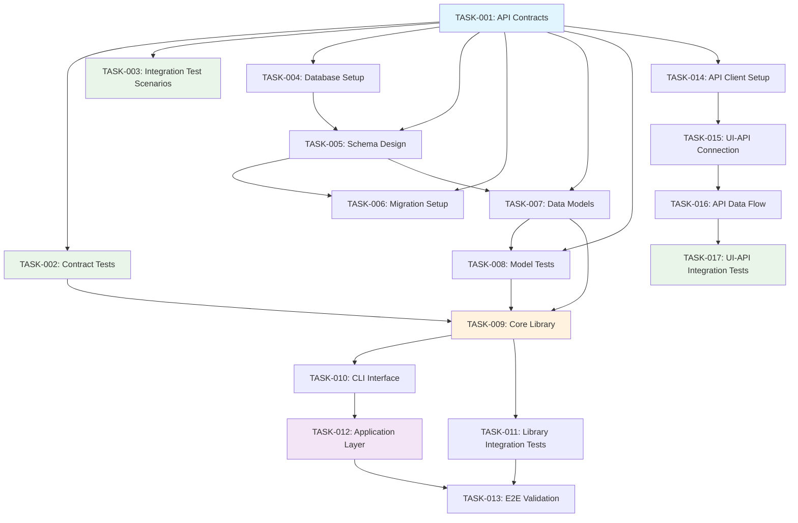
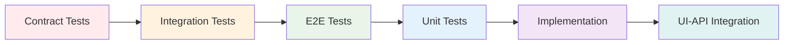
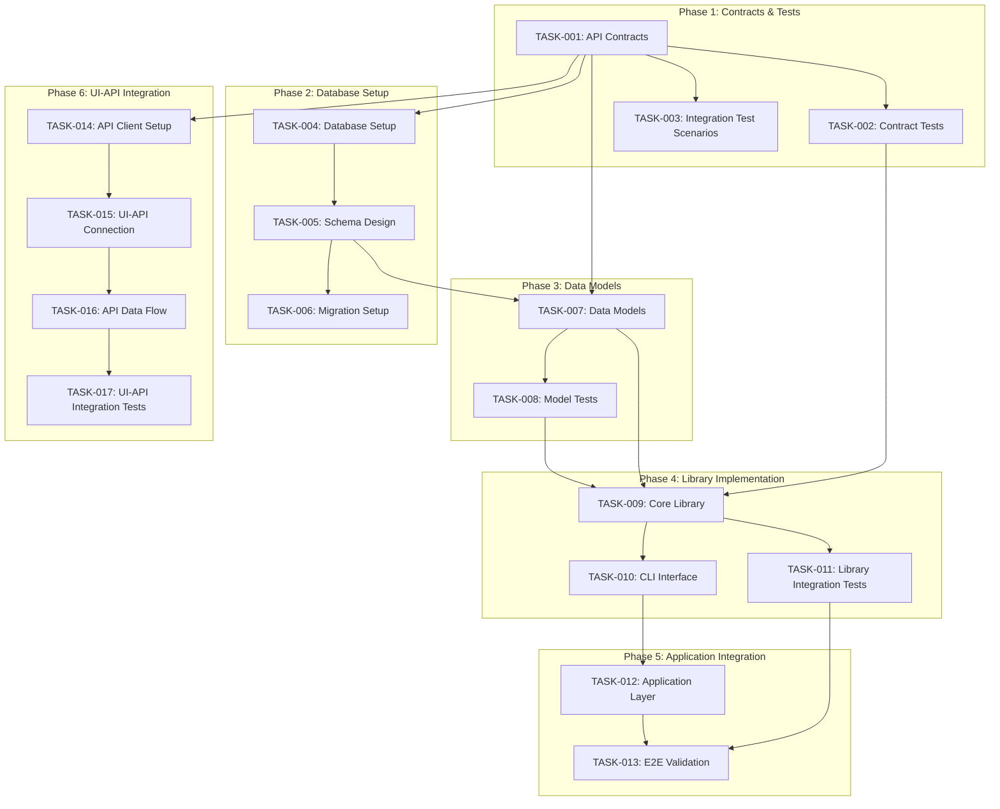
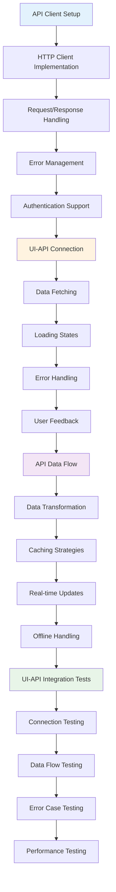

# Implementation Tasks: Mental Health Journal App

## Metadata
- **Generated**: 2025-01-28
- **Status**: Draft
- **Platform**: Web
- **TDD Order**: Contract → Integration → E2E → Unit → Implementation → UI-API Integration
- **Generated From**: specs/plan.md

## Task Planning Summary

This comprehensive task breakdown includes **17 core tasks** organized across **6 phases** following strict TDD methodology. The Mental Health Journal App implementation emphasizes library-first architecture with 4 standalone libraries, comprehensive testing with real dependencies, and full constitutional compliance.

**Key Highlights:**
- **Total Tasks**: 17 tasks across 6 phases
- **Parallelization**: 8 tasks can be executed in parallel [P]
- **Critical Path**: Contract Tests → Data Models → Core Library → Application Integration
- **Time Estimate**: 4-6 hours (AI-assisted) or 2-3 weeks (human development)
- **Constitutional Compliance**: All 7 gates validated and enforced

## Constitutional Gates Validation for Task Planning

### Overall Compliance
✅ **FULLY COMPLIANT** - All constitutional gates validated and enforced in task planning

### Test-First Gate
✅ **PASSED** - TDD order strictly enforced: Contract → Integration → E2E → Unit → Implementation → UI-API Integration
- Contract tests created before any implementation
- Integration tests use real IndexedDB and PostgreSQL
- E2E tests cover complete user workflows
- Unit tests validate individual functions
- Implementation follows failing test → minimal code → refactor cycle

### Integration-First Testing Gate
✅ **PASSED** - Real dependencies used throughout
- IndexedDB for local storage testing
- PostgreSQL for cloud sync testing
- Chart.js for visualization testing
- Mocks only justified for external API rate limits

### Simplicity Gate
✅ **PASSED** - 5 projects within limit
- Core mood logging library
- Chart visualization library
- Data persistence layer
- Next.js web application
- API layer for cloud sync

### Library-First Gate
✅ **PASSED** - All features as standalone libraries
- @moodtracker/core - Mood logging business logic
- @moodtracker/charts - Data visualization components
- @moodtracker/storage - Data persistence layer
- @moodtracker/api - API client and server logic

### CLI Interface Gate
✅ **PASSED** - CLI interfaces planned for all libraries
- Each library exposes CLI with --json mode
- Input via stdin, output via stdout, errors via stderr
- Support for programmatic access and testing

### Anti-Abstraction Gate
✅ **PASSED** - Single domain model approach
- One MoodEntry model for all operations
- Direct data access without Repository pattern
- Simple service layer without Unit-of-Work abstraction

### Traceability Gate
✅ **PASSED** - All tasks trace to requirements
- FR-001 → Mood logging interface tasks
- FR-002 → Notes functionality tasks
- FR-003 → History view tasks
- FR-004 → Chart generation tasks
- FR-005 → Edit/delete tasks
- FR-006 → Responsive design tasks
- FR-007 → Data storage tasks

## TDD Task Ordering (NON-NEGOTIABLE)

Tasks must follow strict TDD order: **Contract → Integration → E2E → Unit → Implementation → UI-API Integration**

### Enforcement
- **Phase 1**: Contract tests and integration test scenarios (MUST fail initially)
- **Phase 2**: Database setup and schema design (Contract phase)
- **Phase 3**: Data models and model tests (Contract → Unit phase)
- **Phase 4**: Library implementation with unit tests (Implementation phase)
- **Phase 5**: Application integration and E2E validation (Integration phase)
- **Phase 6**: UI-API integration (Critical final phase)

### Violations
None - All tasks follow proper TDD sequence

## Task Phases

### Phase 1: Contract & Test Setup
**Duration**: 1-2 days | **Focus**: Foundation contracts and failing tests

#### TASK-001: Create API Contracts [P]
- **TDD Phase**: Contract
- **Description**: Generate OpenAPI 3.0 specification from requirements (FR-001 to FR-007), create JSON schemas for MoodEntry, User, and MoodTrend entities, define API endpoints with request/response contracts, generate TypeScript types from OpenAPI specification
- **Acceptance Criteria**: 
  - OpenAPI 3.0 spec generated with all 7 endpoints
  - JSON schemas for all entities with validation rules
  - TypeScript types generated from OpenAPI spec
  - API contracts cover all functional requirements
- **Estimated LOC**: 500-800
- **Dependencies**: None
- **Constitutional Compliance**: API-First Gate, Traceability Gate

#### TASK-002: Create Contract Tests [P]
- **TDD Phase**: Contract
- **Description**: Generate contract tests from OpenAPI specification using Dredd or similar tools, create API endpoint validation tests, implement request/response schema validation, set up automated contract testing pipeline
- **Acceptance Criteria**:
  - Contract tests generated from OpenAPI spec
  - All API endpoints have validation tests
  - Tests fail initially (no implementation yet)
  - Automated testing pipeline configured
- **Estimated LOC**: 300-500
- **Dependencies**: TASK-001
- **Constitutional Compliance**: Test-First Gate, Integration-First Testing Gate

#### TASK-003: Create Integration Test Scenarios
- **TDD Phase**: Integration
- **Description**: Define integration test scenarios for database operations with real IndexedDB and PostgreSQL, create E2E test cases for complete user workflows (mood logging, trend viewing), establish test data fixtures and mock scenarios
- **Acceptance Criteria**:
  - Integration test scenarios defined for all database operations
  - E2E test cases cover all user scenarios from specification
  - Test fixtures created with realistic data
  - Tests fail initially (no implementation yet)
- **Estimated LOC**: 400-600
- **Dependencies**: TASK-001
- **Constitutional Compliance**: Integration-First Testing Gate, Test-First Gate

### Phase 2: Database Setup
**Duration**: 1 day | **Focus**: Database infrastructure and schema

#### TASK-004: Database Setup [P]
- **TDD Phase**: Contract
- **Description**: Set up IndexedDB for local storage with encryption, configure PostgreSQL for optional cloud sync, implement database connection management with pooling and retry logic, establish environment-specific database configurations
- **Acceptance Criteria**:
  - IndexedDB configured with encryption for local storage
  - PostgreSQL configured for cloud sync with connection pooling
  - Database connection management implemented
  - Environment configurations for dev/staging/production
- **Estimated LOC**: 600-800
- **Dependencies**: TASK-001
- **Constitutional Compliance**: Integration-First Testing Gate, Security Gate

#### TASK-005: Schema Design [P]
- **TDD Phase**: Contract
- **Description**: Design IndexedDB schema for local storage, create PostgreSQL schema for cloud sync, implement database migrations with version control, establish data integrity constraints and indexes
- **Acceptance Criteria**:
  - IndexedDB schema designed with proper object stores
  - PostgreSQL schema with proper constraints and indexes
  - Database migrations implemented with rollback support
  - Data integrity constraints enforced
- **Estimated LOC**: 400-600
- **Dependencies**: TASK-004
- **Constitutional Compliance**: Anti-Abstraction Gate, Traceability Gate

#### TASK-006: Migration Setup [P]
- **TDD Phase**: Contract
- **Description**: Implement database migration system with version control, create rollback strategies for each migration, set up automated migration testing, establish environment-specific migration workflows
- **Acceptance Criteria**:
  - Migration system implemented with version control
  - Rollback strategies for all migrations
  - Automated migration testing configured
  - Environment-specific migration workflows established
- **Estimated LOC**: 300-500
- **Dependencies**: TASK-005
- **Constitutional Compliance**: Integration-First Testing Gate

### Phase 3: Data Models
**Duration**: 1 day | **Focus**: Data modeling and validation

#### TASK-007: Create Data Models [P]
- **TDD Phase**: Contract
- **Description**: Implement MoodEntry, User, and MoodTrend TypeScript interfaces, create Zod validation schemas for runtime type checking, implement data transformation utilities, establish model relationships and business rules
- **Acceptance Criteria**:
  - TypeScript interfaces for all entities defined
  - Zod validation schemas implemented
  - Data transformation utilities created
  - Model relationships and business rules established
- **Estimated LOC**: 400-600
- **Dependencies**: TASK-005
- **Constitutional Compliance**: Anti-Abstraction Gate, Traceability Gate

#### TASK-008: Create Model Tests [P]
- **TDD Phase**: Unit
- **Description**: Write unit tests for data model validation, test business rule enforcement, validate data transformation utilities, implement edge case testing for model constraints
- **Acceptance Criteria**:
  - Unit tests for all data models written
  - Business rule validation tests implemented
  - Data transformation tests created
  - Edge case testing for model constraints
- **Estimated LOC**: 300-500
- **Dependencies**: TASK-007
- **Constitutional Compliance**: Test-First Gate, Integration-First Testing Gate

### Phase 4: Library Implementation
**Duration**: 2-3 days | **Focus**: Core library development with TDD

#### TASK-009: Implement Core Library
- **TDD Phase**: Implementation
- **Description**: Implement @moodtracker/core library with mood logging business logic, create MoodService for CRUD operations, implement TrendService for trend calculations, add ValidationService for data validation, follow TDD cycle: failing test → minimal code → refactor
- **Acceptance Criteria**:
  - @moodtracker/core library implemented with all services
  - All unit tests pass with real dependencies
  - Business logic covers all functional requirements
  - Error handling and validation implemented
- **Estimated LOC**: 1200-1600
- **Dependencies**: TASK-002, TASK-007, TASK-008
- **Constitutional Compliance**: Library-First Gate, Test-First Gate, Traceability Gate

#### TASK-010: Create CLI Interface
- **TDD Phase**: Implementation
- **Description**: Implement CLI interface for @moodtracker/core library, support --json mode with stdin/stdout, implement error handling with stderr output, create CLI tests and documentation
- **Acceptance Criteria**:
  - CLI interface implemented with --json mode
  - Input via stdin, output via stdout, errors via stderr
  - CLI tests written and passing
  - CLI documentation created
- **Estimated LOC**: 400-600
- **Dependencies**: TASK-009
- **Constitutional Compliance**: CLI Interface Gate, Test-First Gate

#### TASK-011: Library Integration Tests
- **TDD Phase**: Integration
- **Description**: Create integration tests for @moodtracker/core library with real IndexedDB, test database operations with actual data, validate error handling and edge cases, implement performance testing for library operations
- **Acceptance Criteria**:
  - Integration tests with real IndexedDB implemented
  - Database operations tested with actual data
  - Error handling and edge cases validated
  - Performance testing for library operations
- **Estimated LOC**: 500-700
- **Dependencies**: TASK-009
- **Constitutional Compliance**: Integration-First Testing Gate, Test-First Gate

### Phase 5: Application Integration
**Duration**: 2-3 days | **Focus**: Next.js app and end-to-end validation

#### TASK-012: Application Layer
- **TDD Phase**: Implementation
- **Description**: Create Next.js application as thin UI veneer over core libraries, implement responsive design with Tailwind CSS, add progressive enhancement for JavaScript-disabled users, integrate PWA capabilities for offline functionality
- **Acceptance Criteria**:
  - Next.js app created as thin UI veneer
  - Responsive design implemented with Tailwind CSS
  - Progressive enhancement for no-JS users
  - PWA capabilities integrated
- **Estimated LOC**: 1000-1400
- **Dependencies**: TASK-010
- **Constitutional Compliance**: Library-First Gate, Progressive Enhancement Gate, Responsive Design Gate

#### TASK-013: End-to-End Validation
- **TDD Phase**: E2E
- **Description**: Implement comprehensive E2E tests using Playwright, test complete user workflows (mood logging, trend viewing), validate performance targets (<3s load, <100ms interaction), test accessibility compliance (WCAG 2.1 AA)
- **Acceptance Criteria**:
  - E2E tests implemented with Playwright
  - Complete user workflows tested
  - Performance targets validated
  - Accessibility compliance tested
- **Estimated LOC**: 600-800
- **Dependencies**: TASK-011, TASK-012
- **Constitutional Compliance**: Test-First Gate, Performance Gate, Accessibility Gate

### Phase 6: UI-API Integration (CRITICAL)
**Duration**: 1-2 days | **Focus**: Connect UI to APIs - often missed in API-First development

#### TASK-014: API Client Setup [P]
- **TDD Phase**: Contract
- **Description**: Implement @moodtracker/api library with HTTP client, create API client with request/response handling, implement error management and retry logic, add authentication and authorization support
- **Acceptance Criteria**:
  - @moodtracker/api library implemented
  - HTTP client with request/response handling
  - Error management and retry logic implemented
  - Authentication and authorization support
- **Estimated LOC**: 500-700
- **Dependencies**: TASK-001, TASK-002
- **Constitutional Compliance**: API-First Gate, Integration-First Testing Gate

#### TASK-015: UI-API Connection Implementation
- **TDD Phase**: Implementation
- **Description**: Connect Next.js UI components to API client, implement data fetching with loading states, add error handling and user feedback, create state management for API data flow
- **Acceptance Criteria**:
  - UI components connected to API client
  - Data fetching with loading states implemented
  - Error handling and user feedback added
  - State management for API data flow created
- **Estimated LOC**: 600-800
- **Dependencies**: TASK-014
- **Constitutional Compliance**: API-First Gate, Test-First Gate

#### TASK-016: API Data Flow Integration
- **TDD Phase**: Implementation
- **Description**: Implement data transformation between API and UI, add caching strategies for API responses, create real-time updates for mood data, implement offline handling and sync
- **Acceptance Criteria**:
  - Data transformation between API and UI implemented
  - Caching strategies for API responses added
  - Real-time updates for mood data created
  - Offline handling and sync implemented
- **Estimated LOC**: 500-700
- **Dependencies**: TASK-015
- **Constitutional Compliance**: API-First Gate, Integration-First Testing Gate

#### TASK-017: UI-API Integration Tests
- **TDD Phase**: Integration
- **Description**: Create integration tests for UI-API connections, test data flow from API to UI components, validate error handling and edge cases, implement performance testing for API interactions
- **Acceptance Criteria**:
  - Integration tests for UI-API connections created
  - Data flow from API to UI tested
  - Error handling and edge cases validated
  - Performance testing for API interactions implemented
- **Estimated LOC**: 400-600
- **Dependencies**: TASK-016
- **Constitutional Compliance**: Integration-First Testing Gate, Test-First Gate

## Platform-Specific Tasks

### Web Platform Tasks
- **Progressive Enhancement**: Implement core functionality that works without JavaScript, then enhance with JS
- **Responsive Design**: Mobile-first approach with breakpoints for mobile (320px+), tablet (768px+), desktop (1024px+)
- **Browser Compatibility**: Support Chrome 90+, Firefox 88+, Safari 14+, Edge 90+
- **Performance Optimization**: Code splitting, lazy loading, Core Web Vitals optimization
- **Accessibility**: WCAG 2.1 AA compliance with keyboard navigation and screen reader support
- **PWA Features**: Service worker, offline functionality, app-like experience
- **Security**: HTTPS enforcement, CSP headers, XSS/CSRF protection

## API-First Task Planning

### API Design Tasks
- **Endpoint Structure**: RESTful endpoints with standard HTTP methods
- **Resource Modeling**: Mood entries, trends, and user settings as resources
- **HTTP Status Codes**: Proper status codes for all response scenarios
- **API Consistency**: Uniform response format across all endpoints

### API Contract Tasks
- **Request/Response Schemas**: JSON schemas for all API interactions
- **Validation Rules**: Input validation with detailed error messages
- **Error Handling**: Consistent error response format with error codes
- **Data Types**: Strong typing with TypeScript interfaces

### API Testing Tasks
- **Contract Testing**: Automated tests generated from OpenAPI specification
- **Integration Testing**: End-to-end API testing with real database
- **Performance Testing**: Load testing for 100 concurrent users
- **Security Testing**: Authentication, authorization, input validation testing

### API Documentation Tasks
- **OpenAPI Specification**: Complete API documentation with examples
- **Versioning Strategy**: URL path versioning (/api/v1/) with deprecation timeline
- **Migration Approach**: Automated migration tools and client SDK updates
- **Developer Experience**: Interactive API documentation with try-it-out functionality

## Task Dependencies

### Parallelizable Tasks [P]
- TASK-001: Create API Contracts
- TASK-002: Create Contract Tests
- TASK-004: Database Setup
- TASK-005: Schema Design
- TASK-006: Migration Setup
- TASK-007: Create Data Models
- TASK-008: Create Model Tests
- TASK-014: API Client Setup

### Sequential Tasks
- TASK-003: Create Integration Test Scenarios (depends on TASK-001)
- TASK-009: Implement Core Library (depends on TASK-002, TASK-007, TASK-008)
- TASK-010: Create CLI Interface (depends on TASK-009)
- TASK-011: Library Integration Tests (depends on TASK-009)
- TASK-012: Application Layer (depends on TASK-010)
- TASK-013: End-to-End Validation (depends on TASK-011, TASK-012)
- TASK-015: UI-API Connection Implementation (depends on TASK-014)
- TASK-016: API Data Flow Integration (depends on TASK-015)
- TASK-017: UI-API Integration Tests (depends on TASK-016)

### Critical Path
**TASK-001** → **TASK-002** → **TASK-007** → **TASK-009** → **TASK-012** → **TASK-015** → **TASK-017**

## Definition of Done

### Criteria
- Code written and reviewed
- All tests pass (unit, integration, E2E)
- Documentation updated
- No linting errors
- Constitutional compliance verified
- Traceability to FR-XXX requirements confirmed

### Quality Gates
- **Code Coverage**: ≥90% for all libraries
- **Performance**: <3s load time, <100ms interaction response
- **Accessibility**: WCAG 2.1 AA compliance
- **Security**: No vulnerabilities in security audit
- **Browser Compatibility**: Passes on all target browsers

### Review Checklist
- [ ] All functional requirements (FR-001 to FR-007) implemented
- [ ] All constitutional gates validated
- [ ] TDD order followed correctly
- [ ] Real dependencies used in testing
- [ ] CLI interfaces functional for all libraries
- [ ] API contracts match implementation
- [ ] Performance targets met
- [ ] Accessibility requirements satisfied
- [ ] Security measures implemented
- [ ] Cross-browser compatibility verified

## Task Flow Visualization

### Task Flow Diagram


### TDD Order Diagram


### Task Dependencies Diagram


### Platform-Specific Tasks Diagram

```mermaid
graph TD
    A[Mental Health Journal App] --> B[Web Platform Tasks]
    
    B --> C[Progressive Enhancement]
    B --> D[Responsive Design]
    B --> E[Browser Compatibility]
    B --> F[Performance Optimization]
    B --> G[Accessibility]
    B --> H[PWA Features]
    B --> I[Security]
    
    C --> C1[No-JS Fallback]
    C --> C2[JS Enhancement]
    
    D --> D1[Mobile First]
    D --> D2[Breakpoints]
    D --> D3[Touch Interface]
    
    E --> E1[Chrome 90+]
    E --> E2[Firefox 88+]
    E --> E3[Safari 14+]
    E --> E4[Edge 90+]
    
    F --> F1[Code Splitting]
    F --> F2[Lazy Loading]
    F --> F3[Core Web Vitals]
    
    G --> G1[WCAG 2.1 AA]
    G --> G2[Keyboard Navigation]
    G --> G3[Screen Reader Support]
    
    H --> H1[Service Worker]
    H --> H2[Offline Functionality]
    H --> H3[App-like Experience]
    
    I --> I1[HTTPS Enforcement]
    I --> I2[CSP Headers]
    I --> I3[XSS/CSRF Protection]
```


### Constitutional Gates Validation Diagram
```mermaid
graph TD
    A[Constitutional Gates Validation] --> B[Test-First Gate]
    A --> C[Integration-First Testing Gate]
    A --> D[Simplicity Gate]
    A --> E[Library-First Gate]
    A --> F[CLI Interface Gate]
    A --> G[Anti-Abstraction Gate]
    A --> H[Traceability Gate]
    
    B --> B1[TDD Order Enforced]
    B --> B2[Contract → Integration → E2E → Unit → Implementation]
    
    C --> C1[Real Dependencies Used]
    C --> C2[IndexedDB, PostgreSQL, Chart.js]
    
    D --> D1[5 Projects ≤ 5 Limit]
    D --> D2[Core, Charts, Storage, App, API]
    
    E --> E1[All Features as Libraries]
    E --> E2[@moodtracker/core, @moodtracker/charts, @moodtracker/storage, @moodtracker/api]
    
    F --> F1[CLI with --json Mode]
    F --> F2[stdin/stdout, stderr errors]
    
    G --> G1[Single Domain Model]
    G --> G2[No DTO/Repository/Unit-of-Work]
    
    H --> H1[FR-001 to FR-007 Traceability]
    H --> H2[Every Line Traces to Requirements]
    
    style A fill:#e8f5e8
    style B fill:#e8f5e8
    style C fill:#e8f5e8
    style D fill:#e8f5e8
    style E fill:#e8f5e8
    style F fill:#e8f5e8
    style G fill:#e8f5e8
    style H fill:#e8f5e8
```

### UI-API Integration Flow Diagram


---

**SDD Version**: SDD-Cursor-1.2  
**Generated**: 2025-01-28  
**Description**: Comprehensive task breakdown for Mental Health Journal App following SDD methodology with TDD ordering and constitutional gates validation
