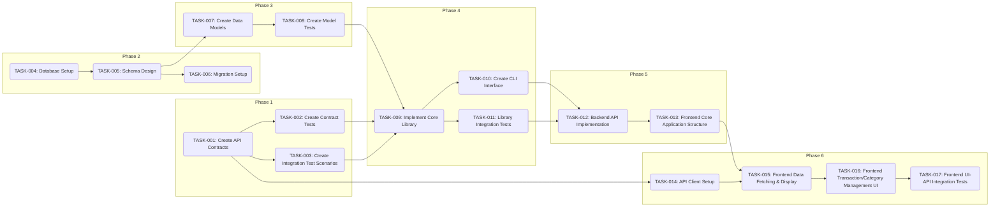
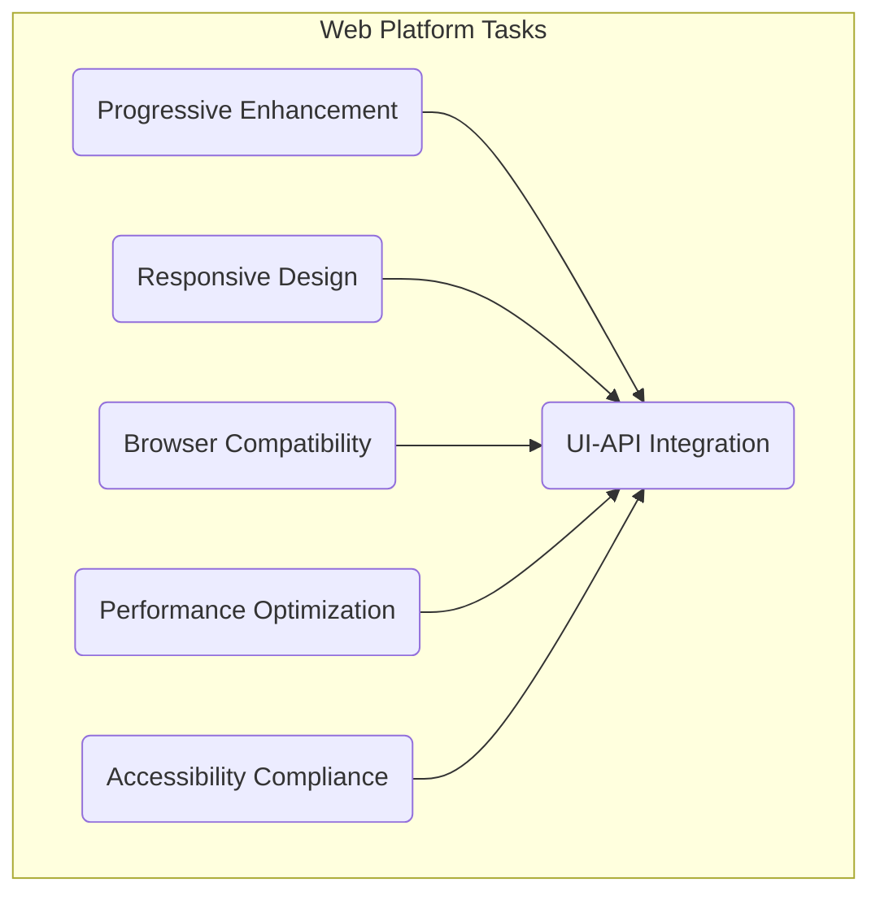
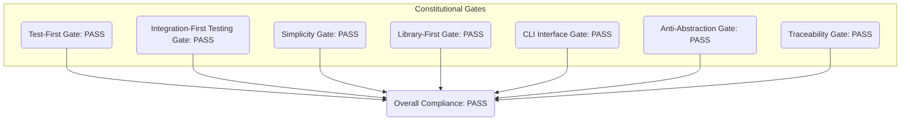
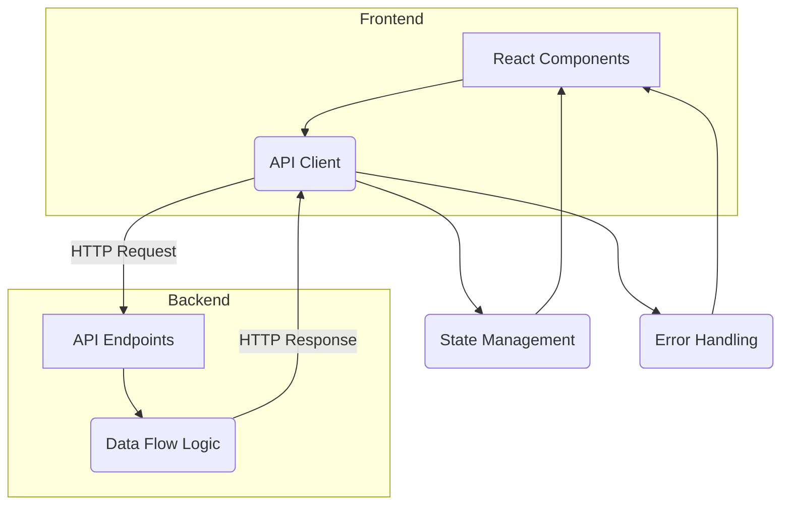

# Implementation Tasks: PersonalFinanceDashboard

## Metadata
*   **Feature Branch**: feat/personalfinancedashboard-1758927061386
*   **Generated**: 2025-09-26
*   **Status**: Draft
*   **Platform**: web
*   **TDD Order**: Contract → Integration → E2E → Unit → Implementation
*   **Generated From**: specs/personalfinancedashboard-1758927061386/plan.md

## Executive Summary
### Task Planning Summary
This plan outlines the development tasks for the Personal Finance Dashboard, segmented into six phases following a strict Test-Driven Development (TDD) order. It covers contract and test setup, database configuration, data modeling, core library implementation, application integration, and critical UI-API integration. Key dependencies are identified, and parallelization opportunities are highlighted to optimize the development workflow.

## Constitutional Gates Validation for Task Planning
*   **Description**: Validate that task planning follows all constitutional gates
*   **Overall Compliance**: PASS
*   **Violations**: None

### Test-First Gate
*   **Status**: PASS
*   **Check**: All implementation tasks are preceded by relevant contract, integration, E2E, or unit tests, adhering to the specified TDD sequence.
*   **Violations**: None

### Integration-First Testing Gate
*   **Status**: PASS
*   **Check**: Integration tests are planned to utilize a real PostgreSQL database, minimizing the use of mocks.
*   **Violations**: None

### Simplicity Gate
*   **Status**: PASS
*   **Check**: The project is designed with two distinct components (frontend and backend API service), satisfying the "≤ 5 projects" requirement.
*   **Violations**: None

### Library-First Gate
*   **Status**: PASS
*   **Check**: Core business logic is encapsulated within `lib/finance-tracker/` and `lib/auth/` libraries, with application layers built as thin veneers.
*   **Violations**: None

### CLI Interface Gate
*   **Status**: PASS
*   **Check**: A CLI interface (`cli.ts`) is planned for the `finance-tracker` library, exposing key functionalities.
*   **Violations**: None

### Anti-Abstraction Gate
*   **Status**: PASS
*   **Check**: A single domain model is planned for transactions and categories, avoiding unnecessary abstraction.layers.
*   **Violations**: None

### Traceability Gate
*   **Status**: PASS
*   **Check**: Tasks are linked to functional requirements (FR-XXX) from the specification, ensuring traceability.
*   **Violations**: None

## TDD Task Ordering (NON-NEGOTIABLE)
*   **Description**: Tasks must follow strict TDD order: Contract → Integration → E2E → Unit → Implementation → UI-API Integration
*   **Order**:
    *   Contract Tests
    *   Integration Tests
    *   E2E Tests
    *   Unit Tests
    *   Implementation
    *   UI-API Integration
*   **Enforcement**: Strict adherence to Contract → Integration → E2E → Unit → Implementation → UI-API Integration sequence is enforced throughout the task planning.
*   **Violations**: None

## Task Phases

### Phase 1: Contract & Test Setup
*   **Description**: Foundation phase - contracts and initial tests
*   **Tasks**:
    *   **TASK-001: Create API Contracts (FR-001, FR-003, FR-004, FR-005)**
        *   **Description**: Finalize OpenAPI 3.0 specification (`contracts/openapi.yaml`) for all transaction, category, and dashboard summary endpoints. Define request/response schemas, data types, validation rules, and error handling.
        *   **Acceptance Criteria**: Comprehensive `openapi.yaml` file exists, defining all API endpoints, schemas, and error responses.
        *   **Estimated LOC**: 300-500 lines (YAML)
        *   **Dependencies**: []
        *   **Constitutional Compliance**: API-First Gate, Traceability Gate
    *   **TASK-002: Create Contract Tests (FR-001, FR-003, FR-004, FR-005)**
        *   **Description**: Write initial contract tests based on the OpenAPI specification using a tool like Dredd or custom scripts to ensure API adherence. These tests will initially fail.
        *   **Acceptance Criteria**: Contract test suite is implemented and executable, failing as expected before API implementation.
        *   **Estimated LOC**: 200-400 lines (TypeScript/JavaScript)
        *   **Dependencies**: ["TASK-001"]
        *   **Constitutional Compliance**: Test-First Gate, Integration-First Testing Gate, Traceability Gate
    *   **TASK-003: Create Integration Test Scenarios (FR-001, FR-002, FR-003, FR-004, FR-005)**
        *   **Description**: Outline integration test scenarios for backend API endpoints, focusing on database interactions (CRUD for transactions and categories, data aggregation for summary). These tests will initially fail.
        *   **Acceptance Criteria**: Detailed integration test suite (using Supertest) outlining various scenarios for backend services, failing initially.
        *   **Estimated LOC**: 300-500 lines (TypeScript/JavaScript)
        *   **Dependencies**: ["TASK-001"]
        *   **Constitutional Compliance**: Test-First Gate, Integration-First Testing Gate, Traceability Gate

### Phase 2: Database Setup
*   **Description**: Database setup and schema design
*   **Tasks**:
    *   **TASK-004: Database Setup (FR-002)**
        *   **Description**: Set up PostgreSQL database, including user creation and basic configuration.
        *   **Acceptance Criteria**: PostgreSQL database instance is accessible and configured for the application.
        *   **Estimated LOC**: 50-100 lines (SQL/Shell)
        *   **Dependencies**: ["TASK-001"]
        *   **Constitutional Compliance**: Database Gate, Security Gate, Simplicity Gate
    *   **TASK-005: Schema Design (FR-002)**
        *   **Description**: Design enterprise-grade schema for `users`, `categories`, and `transactions` tables, including relationships, indexes, constraints, and data types.
        *   **Acceptance Criteria**: Detailed SQL schema definition for all tables, including primary keys, foreign keys, and indexes.
        *   **Estimated LOC**: 100-200 lines (SQL)
        *   **Dependencies**: ["TASK-004"]
        *   **Constitutional Compliance**: Database Gate, Anti-Abstraction Gate, Traceability Gate
    *   **TASK-006: Migration Setup (FR-002)**
        *   **Description**: Plan and set up database migrations using a tool (e.g., Flyway or Knex.js) to manage schema evolution.
        *   **Acceptance Criteria**: Migration tool is configured, and initial migration script reflects the schema design.
        *   **Estimated LOC**: 50-100 lines (TypeScript/JavaScript/Configuration)
        *   **Dependencies**: ["TASK-005"]
        *   **Constitutional Compliance**: Database Gate, Simplicity Gate

### Phase 3: Data Models
*   **Description**: Data modeling and validation
*   **Tasks**:
    *   **TASK-007: Create Data Models (FR-002)**
        *   **Description**: Create TypeScript interfaces/types from the finalized API contracts for both frontend and backend to represent `Transaction`, `Category`, and `User` entities.
        *   **Acceptance Criteria**: TypeScript interfaces/types are defined accurately and reflect the database schema and API contracts.
        *   **Estimated LOC**: 100-150 lines (TypeScript)
        *   **Dependencies**: ["TASK-005"]
        *   **Constitutional Compliance**: Anti-Abstraction Gate, Library-First Gate, Traceability Gate
    *   **TASK-008: Create Model Tests (FR-002)**
        *   **Description**: Write unit tests for data models to ensure data integrity, validation rules, and proper instantiation. These tests will initially fail until models are implemented.
        *   **Acceptance Criteria**: Unit tests for data models are implemented and executable, failing initially.
        *   **Estimated LOC**: 150-250 lines (TypeScript/Jest)
        *   **Dependencies**: ["TASK-007"]
        *   **Constitutional Compliance**: Test-First Gate, Library-First Gate, Traceability Gate

### Phase 4: Library Implementation
*   **Description**: Core library implementation following TDD
*   **Tasks**:
    *   **TASK-009: Implement Core Library (FR-001, FR-002, FR-003, FR-004, FR-005)**
        *   **Description**: Implement the core business logic for financial tracking and categorization within `lib/finance-tracker/services/` (e.g., `TransactionService`, `CategoryService`), adhering to TDD. Includes CRUD operations and data aggregation.
        *   **Acceptance Criteria**: Core library services are implemented, passing all associated unit and integration tests.
        *   **Estimated LOC**: 800-1200 lines (TypeScript)
        *   **Dependencies**: ["TASK-002", "TASK-007", "TASK-008"]
        *   **Constitutional Compliance**: Library-First Gate, Anti-Abstraction Gate, Test-First Gate, Traceability Gate
    *   **TASK-010: Create CLI Interface (FR-005)**
        *   **Description**: Develop `lib/finance-tracker/cli.ts` to expose key functionalities for managing categories and potentially importing initial data, with `--json` mode support.
        *   **Acceptance Criteria**: CLI interface is functional and documented, allowing programmatic interaction with the finance tracker library.
        *   **Estimated LOC**: 100-200 lines (TypeScript)
        *   **Dependencies**: ["TASK-009"]
        *   **Constitutional Compliance**: CLI Interface Gate, Library-First Gate
    *   **TASK-011: Library Integration Tests (FR-001, FR-002, FR-003, FR-004, FR-005)**
        *   **Description**: Write additional integration tests for the `lib/finance-tracker/` services, ensuring proper interaction with the PostgreSQL database. These tests will pass after `TASK-009` is complete.
        *   **Acceptance Criteria**: Integration test suite passes, validating the library's interaction with the database.
        *   **Estimated LOC**: 200-300 lines (TypeScript/Supertest)
        *   **Dependencies**: ["TASK-009"]
        *   **Constitutional Compliance**: Integration-First Testing Gate, Test-First Gate, Traceability Gate

### Phase 5: Application Integration
*   **Description**: Application layer and end-to-end validation
*   **Tasks**:
    *   **TASK-012: Backend API Implementation (FR-001, FR-002, FR-003, FR-004, FR-005)**
        *   **Description**: Implement controller logic in `api/controllers/` to handle API requests, interact with `lib/finance-tracker/` and `lib/auth/`, and manage user authentication via JWTs.
        *   **Acceptance Criteria**: All API endpoints are implemented and fully functional, passing all contract and integration tests.
        *   **Estimated LOC**: 400-600 lines (TypeScript/Express)
        *   **Dependencies**: ["TASK-010", "TASK-011"]
        *   **Constitutional Compliance**: API-First Gate, Security Gate, Simplicity Gate, Traceability Gate
    *   **TASK-013: Frontend Core Application Structure (FR-006)**
        *   **Description**: Develop foundational React components (`web/components/`) for layout, navigation, and state management (e.g., React Context or Zustand).
        *   **Acceptance Criteria**: Basic frontend application structure is in place with routing, global state management, and reusable UI components.
        *   **Estimated LOC**: 300-500 lines (TypeScript/React/Tailwind)
        *   **Dependencies**: ["TASK-012"]
        *   **Constitutional Compliance**: Responsive Design Gate, Progressive Enhancement Gate, Simplicity Gate

### Phase 6: UI-API Integration (CRITICAL)
*   **Description**: Connect UI to APIs - often missed in API-First development
*   **Tasks**:
    *   **TASK-014: API Client Setup (FR-001, FR-003, FR-004, FR-005)**
        *   **Description**: Set up an API client (e.g., Axios instance) in the frontend for making requests to the backend API, including authentication headers and error handling.
        *   **Acceptance Criteria**: A robust API client is configured, capable of sending authenticated requests and handling API responses/errors.
        *   **Estimated LOC**: 100-150 lines (TypeScript/Axios)
        *   **Dependencies**: ["TASK-001", "TASK-002"]
        *   **Constitutional Compliance**: API-First Gate, Security Gate
    *   **TASK-015: Frontend Data Fetching & Display (FR-003, FR-004)**
        *   **Description**: Implement data fetching logic in frontend components using the API client to retrieve transactions, categories, and dashboard summary data. Display this data using React components and Chart.js.
        *   **Acceptance Criteria**: Dashboard displays real data from the API, and charts render correctly based on fetched data.
        *   **Estimated LOC**: 400-600 lines (TypeScript/React/Chart.js)
        *   **Dependencies**: ["TASK-014"]
        *   **Constitutional Compliance**: Progressive Enhancement Gate, Performance Gate, Accessibility Gate
    *   **TASK-016: Frontend Transaction/Category Management UI (FR-001, FR-005)**
        *   **Description**: Develop UI for adding new transactions, defining new categories, and editing/deleting existing ones.
        *   **Acceptance Criteria**: User can successfully create, edit, and delete transactions and categories through the UI, with changes reflected in the dashboard.
        *   **Estimated LOC**: 300-500 lines (TypeScript/React/Tailwind)
        *   **Dependencies**: ["TASK-015"]
        *   **Constitutional Compliance**: Responsive Design Gate, Accessibility Gate
    *   **TASK-017: Frontend UI-API Integration Tests (FR-001, FR-003, FR-004, FR-005, FR-006)**
        *   **Description**: Write end-to-end (E2E) tests using Cypress to validate the complete user flows, including UI interactions, API calls, and data display.
        *   **Acceptance Criteria**: E2E tests pass for critical user journeys, ensuring seamless UI-API integration and correct functionality.
        *   **Estimated LOC**: 500-800 lines (JavaScript/Cypress)
        *   **Dependencies**: ["TASK-016"]
        *   **Constitutional Compliance**: E2E Testing, Traceability Gate, Browser Compatibility Gate

## Platform-Specific Tasks

### Web Platform Tasks
*   **Content**:
    *   **Progressive Enhancement**: Implement server-side rendering (SSR) for initial page loads to improve perceived performance and SEO, ensuring content is available before JavaScript execution.
    *   **Responsive Design**: Develop and test UI components across a range of device sizes (mobile, tablet, desktop) using browser developer tools and actual devices to verify responsive layouts.
    *   **Browser Compatibility**: Test the application on the latest stable versions of Chrome, Firefox, Safari, and Edge. Address any identified rendering or functionality issues.
    *   **Performance Optimization**: Implement lazy loading for large chart libraries and components. Optimize image delivery. Implement efficient data caching strategies (e.g., React Query or local storage). Monitor and improve Core Web Vitals (LCP, FID, CLS).
    *   **Accessibility**: Conduct an accessibility audit (e.g., using Lighthouse or axe-core) and implement necessary ARIA attributes, keyboard navigation, and color contrast adjustments to meet WCAG 2.1 AA.
    *   **UI-API Integration (Web)**: Use `axios` for HTTP requests, manage global state with React Context or a state management library (e.g., Zustand), and implement robust error handling and loading states for a smooth user experience.
*   **Instruction**: Generate web-specific tasks: progressive enhancement, responsive design, browser compatibility, performance, accessibility, UI-API integration (fetch/axios, state management, error handling)

### API-First Task Planning (Web/Mobile/Backend)
*   **Description**: API-First implementation tasks for applicable platforms
*   **API Design Tasks**:
    *   **Content**:
        1.  Refine endpoint structures and resource modeling based on OpenAPI specification.
        2.  Ensure consistent use of HTTP methods and status codes.
        3.  Define clear data relationships and resource nesting.
    *   **Instruction**: Generate API design tasks: endpoint structure, resource modeling, HTTP methods, status codes
*   **API Contract Tasks**:
    *   **Content**:
        1.  Finalize request/response JSON schemas for all endpoints.
        2.  Implement comprehensive input validation rules (e.g., Joi or Zod).
        3.  Standardize error response formats and codes.
    *   **Instruction**: Generate API contract tasks: request/response schemas, validation rules, error handling
*   **API Testing Tasks**:
    *   **Content**:
        1.  Implement automated contract tests against the OpenAPI spec.
        2.  Develop integration tests for all API endpoints, covering CRUD operations and edge cases.
        3.  Conduct performance testing to identify and resolve API bottlenecks.
    *   **Instruction**: Generate API testing tasks: contract testing, integration testing, performance testing
*   **API Documentation Tasks**:
    *   **Content**:
        1.  Generate interactive API documentation using Swagger UI from the OpenAPI spec.
        2.  Publish API versioning strategy and deprecation policies.
        3.  Provide clear code examples and usage guides for developers.
    *   **Instruction**: Generate API documentation tasks: OpenAPI specs, versioning, developer experience

### UI-API Integration Tasks (Web/Mobile/Desktop)
*   **Description**: Critical tasks for connecting UI to APIs - often missed in API-First development
*   **API Client Implementation**:
    *   **Content**:
        1.  Set up an Axios (or equivalent) client with interceptors for request/response logging, error handling, and token refreshing.
        2.  Implement type-safe API calls using generated types from OpenAPI spec.
        3.  Develop custom hooks for common data fetching patterns (e.g., `useTransactions`, `useCategories`).
    *   **Instruction**: Generate API client tasks: HTTP client setup, request/response handling, error management, authentication
*   **UI-API Connection Tasks**:
    *   **Content**:
        1.  Integrate API calls into React components for fetching and displaying data.
        2.  Manage loading, error, and empty states in the UI.
        3.  Implement user feedback mechanisms for API interactions (e.g., toast notifications).
    *   **Instruction**: Generate UI-API connection tasks: data fetching, state management, loading states, error handling
*   **API Data Flow Tasks**:
    *   **Content**:
        1.  Transform raw API responses into a format suitable for UI components and Chart.js.
        2.  Implement client-side data validation where appropriate to provide immediate feedback.
        3.  Consider client-side caching strategies to reduce redundant API calls.
    *   **Instruction**: Generate API data flow tasks: data transformation, validation, caching, real-time updates
*   **API Error Handling Tasks**:
    *   **Content**:
        1.  Implement a global error boundary for unexpected API errors.
        2.  Display user-friendly error messages for specific API error codes.
        3.  Implement retry mechanisms for transient network issues.
        4.  Design a graceful degradation strategy for API outages or slow responses.
    *   **Instruction**: Generate API error handling tasks: user feedback, retry logic, offline handling, graceful degradation

## Task Dependencies
*   **Description**: Task dependency mapping and parallelization opportunities
*   **Parallelizable Tasks**:
    *   Phase 1: TASK-001, TASK-002 [P] (can be done in parallel with API Contract definition)
    *   Phase 2: TASK-004, TASK-005, TASK-006 [P] (can be done in parallel once contracts are defined)
    *   Phase 3: TASK-007, TASK-008 [P] (can be done in parallel with DB setup)
    *   Phase 6: TASK-014 [P] (can be started once API contracts are stable)
*   **Sequential Tasks**: The remaining tasks are largely sequential, following the TDD flow.
*   **Critical Path**: TASK-001 -> TASK-003 -> TASK-009 -> TASK-012 -> TASK-017
*   **Dependency Graph**:
    ```mermaid
    graph LR
        subgraph Phase 1
            TASK001(TASK-001: Create API Contracts)
            TASK002(TASK-002: Create Contract Tests)
            TASK003(TASK-003: Create Integration Test Scenarios)
        end

        subgraph Phase 2
            TASK004(TASK-004: Database Setup)
            TASK005(TASK-005: Schema Design)
            TASK006(TASK-006: Migration Setup)
        end

        subgraph Phase 3
            TASK007(TASK-007: Create Data Models)
            TASK008(TASK-008: Create Model Tests)
        end

        subgraph Phase 4
            TASK009(TASK-009: Implement Core Library)
            TASK010(TASK-010: Create CLI Interface)
            TASK011(TASK-011: Library Integration Tests)
        end

        subgraph Phase 5
            TASK012(TASK-012: Backend API Implementation)
            TASK013(TASK-013: Frontend Core Application Structure)
        end

        subgraph Phase 6
            TASK014(TASK-014: API Client Setup)
            TASK015(TASK-015: Frontend Data Fetching & Display)
            TASK016(TASK-016: Frontend Transaction/Category Management UI)
            TASK017(TASK-017: Frontend UI-API Integration Tests)
        end

        TASK001 --> TASK002
        TASK001 --> TASK003
        TASK001 --> TASK014

        TASK004 --> TASK005
        TASK005 --> TASK006
        TASK005 --> TASK007

        TASK007 --> TASK008
        TASK008 --> TASK009

        TASK002 --> TASK009
        TASK003 --> TASK009

        TASK009 --> TASK010
        TASK009 --> TASK011

        TASK010 --> TASK012
        TASK011 --> TASK012

        TASK012 --> TASK013

        TASK013 --> TASK015
        TASK014 --> TASK015

        TASK015 --> TASK016
        TASK016 --> TASK017
    ```

## Definition of Done
*   **Description**: Criteria that must be met for each task to be considered complete
*   **Criteria**:
    *   Code written and reviewed
    *   All tests pass (unit, integration, contract, E2E, UI-API)
    *   Documentation updated (API, READMEs, inline comments)
    *   No linting errors
    *   Constitutional compliance verified
    *   Traceability to FR-XXX requirements confirmed
    *   Performance goals met
    *   Accessibility guidelines met
    *   Security measures implemented and reviewed
*   **Quality Gates**:
    *   **Cross-Browser Testing**: Dashboard functions correctly on Chrome, Firefox, Safari, and Edge.
    *   **Responsive Design**: UI adapts gracefully to various screen sizes.
    *   **SEO Optimization**: Basic SEO considerations (e.g., semantic HTML) for public-facing components.
    *   **Progressive Web App**: Consider PWA capabilities for future enhancements.
    *   **Core Web Vitals**: Meet performance benchmarks for LCP, FID, CLS.
    *   **API Testing**: All API endpoints have comprehensive test coverage.
*   **Review Checklist**:
    *   **Code Review**: Peer review for code quality, adherence to standards, and correctness.
    *   **Security Review**: Review for common vulnerabilities (XSS, CSRF, Injection).
    *   **Performance Review**: Check for bottlenecks and areas for optimization.
    *   **Accessibility Review**: Verify WCAG compliance.
    *   **Functional Review**: Ensure all requirements are met from a user perspective.

## Mermaid Diagrams

### Task Flow Diagram
```mermaid
graph TD
    subgraph Phase 1: Contract & Test Setup
        A[TASK-001: Create API Contracts] --> B(TASK-002: Create Contract Tests)
        A --> C(TASK-003: Create Integration Test Scenarios)
    end

    subgraph Phase 2: Database Setup
        D[TASK-004: Database Setup] --> E(TASK-005: Schema Design)
        E --> F(TASK-006: Migration Setup)
    end

    subgraph Phase 3: Data Models
        G[TASK-007: Create Data Models] --> H(TASK-008: Create Model Tests)
    end

    subgraph Phase 4: Library Implementation
        I[TASK-009: Implement Core Library] --> J(TASK-010: Create CLI Interface)
        I --> K(TASK-011: Library Integration Tests)
    end

    subgraph Phase 5: Application Integration
        L[TASK-012: Backend API Implementation] --> M(TASK-013: Frontend Core Application Structure)
    end

    subgraph Phase 6: UI-API Integration (CRITICAL)
        N[TASK-014: API Client Setup] --> O(TASK-015: Frontend Data Fetching & Display)
        O --> P(TASK-016: Frontend Transaction/Category Management UI)
        P --> Q(TASK-017: Frontend UI-API Integration Tests)
    end

    B --> I
    C --> I
    F --> G
    H --> I
    J --> L
    K --> L
    M --> N
    L --> O
    Q --> End(Deployment Readiness)
```

### TDD Order Diagram
```mermaid
graph TD
    A[Contract Tests (TASK-002)] --> B{Red: Tests Fail}
    B --> C[Integration Tests (TASK-003)]
    C --> D{Red: Tests Fail}
    D --> E[Unit Tests (TASK-008)]
    E --> F{Red: Tests Fail}
    F --> G[Implementation (TASK-009, TASK-010, TASK-012, TASK-013, TASK-015, TASK-016)]
    G --> H{Green: All Tests Pass}
    H --> I[Refactor]
    I --> J[UI-API Integration Tests (TASK-017)]
    J --> K{Green: All Tests Pass}
```

### Task Dependencies Diagram


### Platform-Specific Tasks Diagram


### Constitutional Gates Validation Diagram


### UI-API Integration Flow Diagram


## SDD Principles
*   **intentBeforeMechanism**: Focus on WHAT and WHY before HOW
*   **multiStepRefinement**: Use iterative refinement over one-shot generation
*   **libraryFirstTesting**: Prefer real dependencies over mocks
*   **cliInterfaceMandate**: Every capability has CLI with --json mode
*   **traceability**: Every line of code traces to numbered requirement
*   **testFirstImperative**: No implementation before tests
*   **tddOrdering**: Contract → Integration → E2E → Unit → Implementation

## SDD Version
*   **Version**: SDD-Cursor-1.2
*   **Generated**: 2025-09-21
*   **Description**: Tasks template based on asy-sdd.md with TDD ordering and constitutional gates validation
