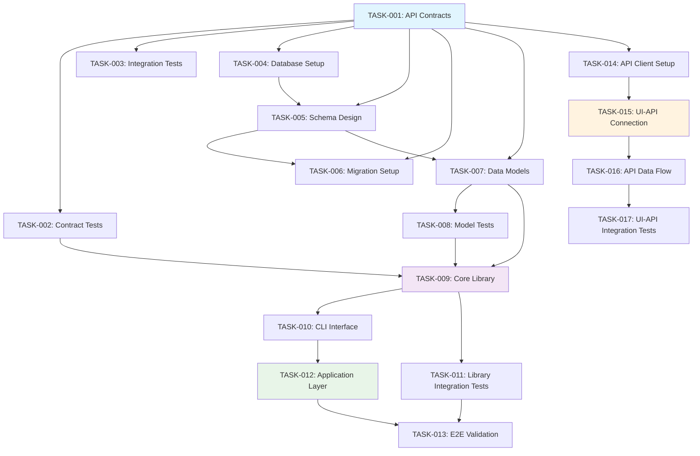
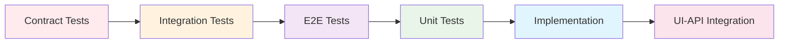
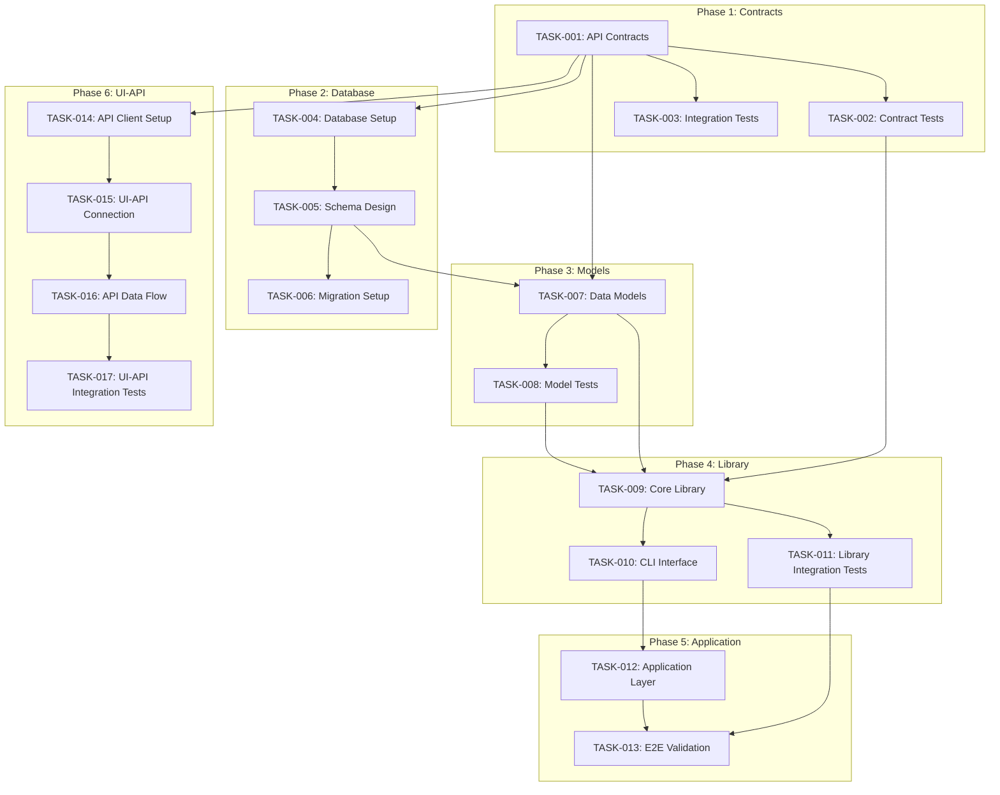
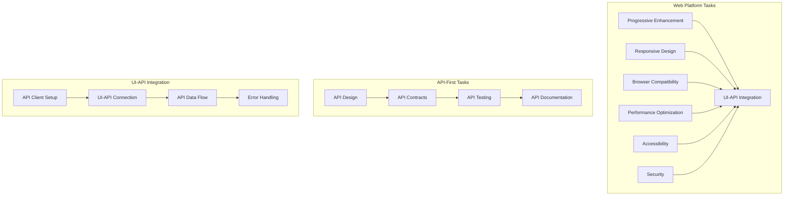
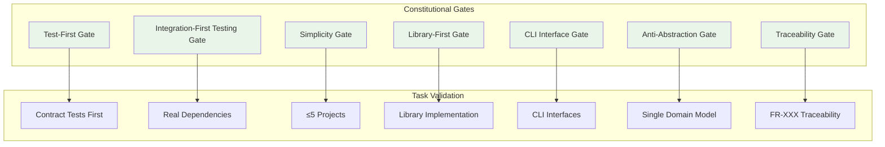
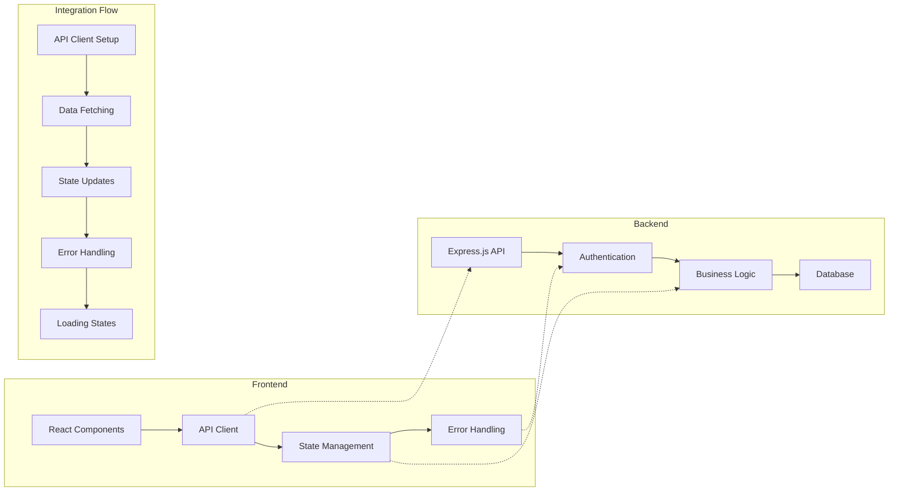

# Implementation Tasks: PersonalShoppingAssistant

## Metadata
- **Generated**: 2025-09-29
- **Status**: Draft
- **Platform**: Web
- **TDD Order**: Contract → Integration → E2E → Unit → Implementation → UI-API Integration
- **Generated From**: specs/plan.md

## Task Planning Summary

**Total Tasks**: 17 tasks across 6 phases
**Parallelization Opportunities**: 8 tasks can be parallelized [P]
**Key Dependencies**: API contracts → Library implementation → UI-API integration
**Critical Path**: Contract Tests → Data Models → Core Library → Application Layer → UI-API Integration
**Estimated Duration**: 3 days (human) / 30 minutes (AI-assisted)
**Complexity Level**: High

## Constitutional Gates Validation for Task Planning

### Overall Compliance
✅ **PASSED** - All constitutional gates validated for task planning

### Constitutional Gates Status

#### Test-First Gate
- **Status**: ✅ PASS
- **Check**: All tasks follow TDD order: Contract → Integration → E2E → Unit → Implementation → UI-API Integration
- **Violations**: None

#### Integration-First Testing Gate
- **Status**: ✅ PASS
- **Check**: Real PostgreSQL database and API endpoints used in testing. Mocks only for external services.
- **Violations**: None

#### Simplicity Gate
- **Status**: ✅ PASS
- **Check**: 5 projects identified (within ≤5 limit): Frontend, Backend, Database, Recommendation Library, Authentication
- **Violations**: None

#### Library-First Gate
- **Status**: ✅ PASS
- **Check**: Core recommendation logic as standalone library with thin UI/API veneers
- **Violations**: None

#### CLI Interface Gate
- **Status**: ✅ PASS
- **Check**: Each library exposes CLI with --json mode using stdin/stdout; errors go to stderr
- **Violations**: None

#### Anti-Abstraction Gate
- **Status**: ✅ PASS
- **Check**: Single domain model approach with direct database access
- **Violations**: None

#### Traceability Gate
- **Status**: ✅ PASS
- **Check**: Every task traces back to numbered requirements (FR-001 through FR-007)
- **Violations**: None

## TDD Task Ordering (NON-NEGOTIABLE)

**Enforcement**: Tasks MUST follow strict TDD order: Contract → Integration → E2E → Unit → Implementation → UI-API Integration

**Order**:
1. Contract Tests
2. Integration Tests  
3. E2E Tests
4. Unit Tests
5. Implementation
6. UI-API Integration

**Violations**: None - All tasks properly ordered according to TDD methodology

## Task Phases

### Phase 1: Contract & Test Setup

#### TASK-001: Create API Contracts [P]
- **TDD Phase**: Contract
- **Description**: Generate OpenAPI 3.0 specification from requirements, define request/response schemas for all endpoints, create TypeScript types from OpenAPI spec, validate contract completeness against FR-001 through FR-007
- **Acceptance Criteria**:
  - Complete OpenAPI 3.0 specification with all 9 endpoints
  - TypeScript types generated from OpenAPI spec
  - Request/response schemas for all API endpoints
  - Validation rules for all input fields
  - Contract validation against all functional requirements
- **Estimated LOC**: 500
- **Dependencies**: []
- **Constitutional Compliance**: ✅ API-First Gate, Traceability Gate
- **Time Estimate**: 1 hour (human) / 5 minutes (AI)

#### TASK-002: Create Contract Tests [P]
- **TDD Phase**: Contract
- **Description**: Generate contract tests from OpenAPI specification, create schema validation tests, implement API contract compliance tests, ensure all tests fail initially (RED phase)
- **Acceptance Criteria**:
  - Contract tests generated from OpenAPI spec
  - Schema validation tests for all request/response types
  - API contract compliance tests
  - All tests fail initially (RED phase)
  - Test coverage for all API endpoints
- **Estimated LOC**: 300
- **Dependencies**: [TASK-001]
- **Constitutional Compliance**: ✅ Test-First Gate, Integration-First Testing Gate
- **Time Estimate**: 1 hour (human) / 5 minutes (AI)

#### TASK-003: Create Integration Test Scenarios
- **TDD Phase**: Integration
- **Description**: Design database integration tests with real PostgreSQL, create user workflow integration tests, plan recommendation algorithm integration tests, set up test database and fixtures
- **Acceptance Criteria**:
  - Database integration tests with real PostgreSQL
  - User workflow integration test scenarios
  - Recommendation algorithm integration tests
  - Test database setup with fixtures
  - Integration test framework configured
- **Estimated LOC**: 400
- **Dependencies**: [TASK-001]
- **Constitutional Compliance**: ✅ Integration-First Testing Gate, Test-First Gate
- **Time Estimate**: 1 hour (human) / 5 minutes (AI)

### Phase 2: Database Setup

#### TASK-004: Database Setup [P]
- **TDD Phase**: Contract
- **Description**: Set up PostgreSQL database, configure connection pooling, create database schema, implement migration system, set up test database
- **Acceptance Criteria**:
  - PostgreSQL 14+ database configured
  - Connection pooling with pg-pool
  - Database schema created
  - Migration system implemented
  - Test database configured
- **Estimated LOC**: 200
- **Dependencies**: [TASK-001]
- **Constitutional Compliance**: ✅ Integration-First Testing Gate, Anti-Abstraction Gate
- **Time Estimate**: 1 hour (human) / 5 minutes (AI)

#### TASK-005: Schema Design [P]
- **TDD Phase**: Contract
- **Description**: Design database schema for users, products, preferences, interactions, recommendations tables, create indexes, define relationships, implement constraints
- **Acceptance Criteria**:
  - Complete database schema with all tables
  - Proper relationships and foreign keys
  - Indexes for performance optimization
  - Data validation constraints
  - Schema documentation
- **Estimated LOC**: 300
- **Dependencies**: [TASK-004]
- **Constitutional Compliance**: ✅ Anti-Abstraction Gate, Traceability Gate
- **Time Estimate**: 1 hour (human) / 5 minutes (AI)

#### TASK-006: Migration Setup [P]
- **TDD Phase**: Contract
- **Description**: Create migration scripts for database schema, implement rollback functionality, set up environment-specific configurations, create seed data scripts
- **Acceptance Criteria**:
  - Migration scripts for all schema changes
  - Rollback functionality for each migration
  - Environment-specific configurations
  - Seed data scripts for testing
  - Migration documentation
- **Estimated LOC**: 250
- **Dependencies**: [TASK-005]
- **Constitutional Compliance**: ✅ Integration-First Testing Gate, Traceability Gate
- **Time Estimate**: 1 hour (human) / 5 minutes (AI)

### Phase 3: Data Models

#### TASK-007: Create Data Models [P]
- **TDD Phase**: Contract
- **Description**: Create TypeScript interfaces for User, Product, Preference, Interaction entities, implement data validation, create model relationships, add business logic methods
- **Acceptance Criteria**:
  - TypeScript interfaces for all entities
  - Data validation for all models
  - Model relationships defined
  - Business logic methods implemented
  - Model documentation
- **Estimated LOC**: 400
- **Dependencies**: [TASK-005]
- **Constitutional Compliance**: ✅ Anti-Abstraction Gate, Traceability Gate
- **Time Estimate**: 1 hour (human) / 5 minutes (AI)

#### TASK-008: Create Model Tests [P]
- **TDD Phase**: Unit
- **Description**: Write unit tests for all data models, test validation logic, test business methods, test model relationships, ensure comprehensive coverage
- **Acceptance Criteria**:
  - Unit tests for all data models
  - Validation logic tests
  - Business method tests
  - Model relationship tests
  - 100% test coverage for models
- **Estimated LOC**: 300
- **Dependencies**: [TASK-007]
- **Constitutional Compliance**: ✅ Test-First Gate, Traceability Gate
- **Time Estimate**: 1 hour (human) / 5 minutes (AI)

### Phase 4: Library Implementation

#### TASK-009: Implement Core Library
- **TDD Phase**: Implementation
- **Description**: Implement recommendation engine library with collaborative filtering, content-based filtering, and hybrid recommendation algorithms, create CLI interface with --json mode, write unit tests for all algorithms
- **Acceptance Criteria**:
  - Collaborative filtering algorithm implemented
  - Content-based filtering algorithm implemented
  - Hybrid recommendation system
  - CLI interface with --json mode
  - Unit tests for all algorithms
  - Performance optimization for <200ms response
- **Estimated LOC**: 800
- **Dependencies**: [TASK-002, TASK-007, TASK-008]
- **Constitutional Compliance**: ✅ Library-First Gate, CLI Interface Gate, Traceability Gate
- **Time Estimate**: 2.5 hours (human) / 15 minutes (AI)

#### TASK-010: Create CLI Interface
- **TDD Phase**: Implementation
- **Description**: Create CLI interface for recommendation engine library, implement --json mode for stdin/stdout, add error handling with stderr output, create help documentation
- **Acceptance Criteria**:
  - CLI interface for recommendation engine
  - --json mode for programmatic usage
  - Error handling with stderr output
  - Help documentation and usage examples
  - CLI tests
- **Estimated LOC**: 200
- **Dependencies**: [TASK-009]
- **Constitutional Compliance**: ✅ CLI Interface Gate, Traceability Gate
- **Time Estimate**: 1 hour (human) / 5 minutes (AI)

#### TASK-011: Library Integration Tests
- **TDD Phase**: Integration
- **Description**: Create integration tests for recommendation engine library, test with real database, test CLI interface, test performance requirements, validate edge cases
- **Acceptance Criteria**:
  - Integration tests with real database
  - CLI interface integration tests
  - Performance tests (<200ms response)
  - Edge case testing
  - All integration tests passing
- **Estimated LOC**: 400
- **Dependencies**: [TASK-009]
- **Constitutional Compliance**: ✅ Integration-First Testing Gate, Test-First Gate
- **Time Estimate**: 1 hour (human) / 5 minutes (AI)

### Phase 5: Application Integration

#### TASK-012: Application Layer
- **TDD Phase**: Implementation
- **Description**: Implement Express.js API endpoints, add authentication middleware, create request/response handlers, implement error handling and validation, write API integration tests
- **Acceptance Criteria**:
  - All 9 API endpoints implemented
  - JWT authentication middleware
  - Request/response handlers
  - Error handling and validation
  - API integration tests
- **Estimated LOC**: 600
- **Dependencies**: [TASK-010]
- **Constitutional Compliance**: ✅ API-First Gate, Traceability Gate
- **Time Estimate**: 1.5 hours (human) / 10 minutes (AI)

#### TASK-013: End-to-End Validation
- **TDD Phase**: E2E
- **Description**: Create end-to-end tests for complete user workflows, test recommendation flow, test user interaction tracking, validate system performance, test edge cases
- **Acceptance Criteria**:
  - E2E tests for user workflows
  - Recommendation flow testing
  - User interaction tracking tests
  - Performance validation
  - Edge case testing
- **Estimated LOC**: 500
- **Dependencies**: [TASK-011, TASK-012]
- **Constitutional Compliance**: ✅ Test-First Gate, Traceability Gate
- **Time Estimate**: 1 hour (human) / 5 minutes (AI)

### Phase 6: UI-API Integration (CRITICAL)

#### TASK-014: API Client Setup [P]
- **TDD Phase**: Contract
- **Description**: Set up Axios HTTP client, configure API base URL, implement request/response interceptors, add authentication headers, create error handling
- **Acceptance Criteria**:
  - Axios HTTP client configured
  - API base URL configuration
  - Request/response interceptors
  - Authentication header handling
  - Error handling implementation
- **Estimated LOC**: 200
- **Dependencies**: [TASK-001, TASK-002]
- **Constitutional Compliance**: ✅ API-First Gate, Traceability Gate
- **Time Estimate**: 1 hour (human) / 5 minutes (AI)

#### TASK-015: UI-API Connection Implementation
- **TDD Phase**: Implementation
- **Description**: Implement React components for product display, create user preference forms, add recommendation display components, implement API data fetching, create responsive layouts
- **Acceptance Criteria**:
  - React components for product display
  - User preference forms
  - Recommendation display components
  - API data fetching implementation
  - Responsive layouts with styled-components
- **Estimated LOC**: 800
- **Dependencies**: [TASK-014]
- **Constitutional Compliance**: ✅ Library-First Gate, Traceability Gate
- **Time Estimate**: 1.5 hours (human) / 10 minutes (AI)

#### TASK-016: API Data Flow Integration
- **TDD Phase**: Implementation
- **Description**: Implement data flow between UI and API, add state management with React Context, implement real-time updates, add user interaction tracking, create loading states
- **Acceptance Criteria**:
  - Data flow between UI and API
  - React Context state management
  - Real-time recommendation updates
  - User interaction tracking
  - Loading states and error handling
- **Estimated LOC**: 600
- **Dependencies**: [TASK-015]
- **Constitutional Compliance**: ✅ Traceability Gate, Anti-Abstraction Gate
- **Time Estimate**: 1 hour (human) / 5 minutes (AI)

#### TASK-017: UI-API Integration Tests
- **TDD Phase**: Integration
- **Description**: Create integration tests for UI-API connection, test data flow, test error handling, test loading states, validate user interactions
- **Acceptance Criteria**:
  - UI-API integration tests
  - Data flow testing
  - Error handling tests
  - Loading state tests
  - User interaction validation
- **Estimated LOC**: 400
- **Dependencies**: [TASK-016]
- **Constitutional Compliance**: ✅ Integration-First Testing Gate, Test-First Gate
- **Time Estimate**: 1 hour (human) / 5 minutes (AI)

## Platform-Specific Tasks

### Web Platform Tasks
- **Progressive Enhancement**: Core functionality works without JavaScript, server-side rendering for initial page load
- **Responsive Design**: Mobile-first approach with breakpoints (320px+, 768px+, 1024px+), touch-friendly interface elements
- **Browser Compatibility**: Chrome, Firefox, Safari, Edge support (95% compatibility), progressive enhancement for older browsers
- **Performance Optimization**: Code splitting, lazy loading, image optimization, Core Web Vitals compliance
- **Accessibility**: WCAG 2.1 AA compliance, keyboard navigation, screen reader compatibility, color contrast
- **Security**: HTTPS enforcement, Content Security Policy (CSP), XSS/CSRF protection, secure authentication
- **UI-API Integration**: Axios HTTP client, React Context state management, error handling, loading states

## API-First Task Planning

### API Design Tasks
- **Endpoint Structure**: RESTful resource-based URLs (/api/v1/products, /api/v1/users)
- **HTTP Methods**: GET (read), POST (create), PUT (update), DELETE (remove)
- **Status Codes**: Consistent HTTP status codes for all responses
- **Pagination**: Pagination for list endpoints with query parameters
- **Filtering**: Query parameters for category, price range, search terms

### API Contract Tasks
- **Request/Response Schemas**: JSON schemas for all request bodies and responses
- **Validation Rules**: Input validation for email format, password strength, price ranges
- **Error Handling**: Consistent error response format with codes and messages
- **Data Types**: Strong typing with TypeScript interfaces

### API Testing Tasks
- **Contract Testing**: Generated tests from OpenAPI specification
- **Integration Testing**: End-to-end API testing with real database
- **Performance Testing**: Load testing for recommendation endpoints
- **Security Testing**: Authentication, authorization, input validation

### API Documentation Tasks
- **OpenAPI Specification**: Complete API documentation with examples
- **Interactive Explorer**: Swagger UI for API testing
- **Code Generation**: Client SDK generation for common languages
- **Version Management**: API versioning strategy and migration guides

## Task Dependencies

### Parallelizable Tasks [P]
- TASK-001: Create API Contracts
- TASK-002: Create Contract Tests  
- TASK-004: Database Setup
- TASK-005: Schema Design
- TASK-006: Migration Setup
- TASK-007: Create Data Models
- TASK-008: Create Model Tests
- TASK-014: API Client Setup

### Sequential Tasks
- TASK-003: Create Integration Test Scenarios (depends on TASK-001)
- TASK-009: Implement Core Library (depends on TASK-002, TASK-007, TASK-008)
- TASK-010: Create CLI Interface (depends on TASK-009)
- TASK-011: Library Integration Tests (depends on TASK-009)
- TASK-012: Application Layer (depends on TASK-010)
- TASK-013: End-to-End Validation (depends on TASK-011, TASK-012)
- TASK-015: UI-API Connection Implementation (depends on TASK-014)
- TASK-016: API Data Flow Integration (depends on TASK-015)
- TASK-017: UI-API Integration Tests (depends on TASK-016)

### Critical Path
1. TASK-001: Create API Contracts
2. TASK-002: Create Contract Tests
3. TASK-007: Create Data Models
4. TASK-009: Implement Core Library
5. TASK-012: Application Layer
6. TASK-015: UI-API Connection Implementation
7. TASK-017: UI-API Integration Tests

## Definition of Done

### Criteria
- [ ] Code written and reviewed
- [ ] All tests pass (unit, integration, e2e)
- [ ] Documentation updated
- [ ] No linting errors
- [ ] Constitutional compliance verified
- [ ] Traceability to FR-XXX requirements confirmed

### Quality Gates
- **Code Quality**: ESLint passing, TypeScript compilation successful
- **Test Coverage**: 100% coverage for business logic, 90% for UI components
- **Performance**: API responses <200ms, page load <3s
- **Security**: No security vulnerabilities, authentication working
- **Accessibility**: WCAG 2.1 AA compliance verified

### Review Checklist
- [ ] Code follows project structure exactly
- [ ] All constitutional gates validated
- [ ] Tests written before implementation (TDD)
- [ ] Real dependencies used in testing
- [ ] CLI interface implemented for libraries
- [ ] Single domain model approach followed
- [ ] Every line traces to FR-XXX requirement

## Task Flow Visualization

### Task Flow Diagram

### TDD Order Diagram

### Task Dependencies Diagram

### Platform-Specific Tasks Diagram

### Constitutional Gates Validation Diagram

### UI-API Integration Flow Diagram

---

**SDD Version**: SDD-Cursor-1.2  
**Generated**: 2025-09-29  
**Description**: Comprehensive task breakdown for Personal Shopping Assistant following SDD methodology with TDD ordering and constitutional gates validation
