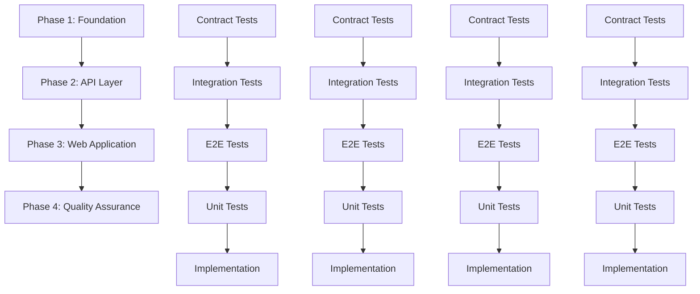
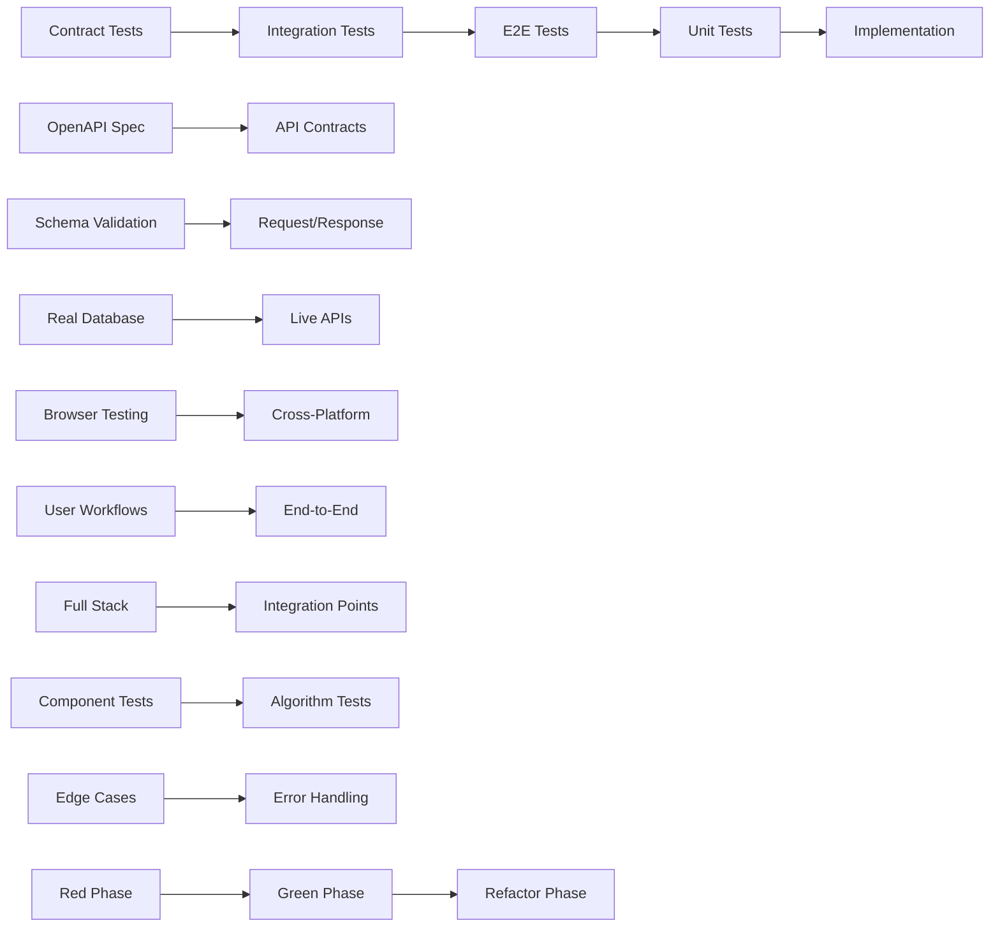
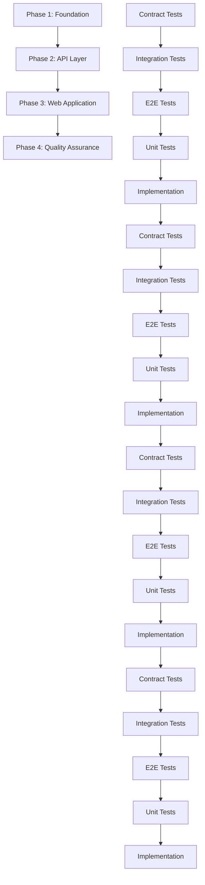
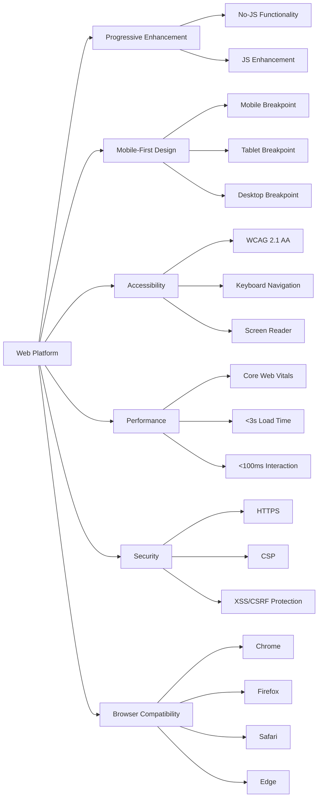
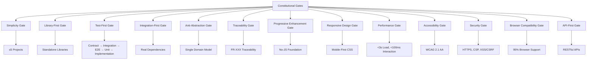

# Development Tasks: Recipe Finder App

## Metadata
- **Feature ID**: recipe-finder-app-1758656243569
- **Feature Name**: Recipe Finder App
- **Feature Branch**: feat/recipe-finder-app-1758656243569
- **Platform**: WEB
- **Created**: 2025-09-23
- **Status**: Draft
- **Include Diagrams**: Yes

## Executive Summary

This task breakdown provides comprehensive development tasks for the Recipe Finder App following SDD methodology with strict TDD ordering (Contract → Integration → E2E → Unit → Implementation). All tasks include constitutional gates validation, platform-specific considerations, and full traceability to functional requirements (FR-001 to FR-007).

## Task Flow Overview

## TDD Order Enforcement

## Phase 1: Foundation & Core Library (Week 1)

### Task 1.1: Core Recipe Search Library - Contract Tests
**Priority**: Critical | **Estimated Time**: 4 hours | **TDD Phase**: Contract Tests

#### Description
Create contract tests for the core recipe search library based on OpenAPI specification and domain models.

#### Tasks
- **T1.1.1**: Generate contract tests from OpenAPI specification for recipe search endpoints
- **T1.1.2**: Define Recipe entity contract with validation rules
- **T1.1.3**: Define Ingredient entity contract with normalization rules
- **T1.1.4**: Define SearchQuery contract with input validation
- **T1.1.5**: Define SearchResult contract with scoring algorithm interface

#### Constitutional Gates Validation
- ✅ **Test-First Gate**: Contract tests created before implementation
- ✅ **Traceability Gate**: Tests trace to FR-002 (recipe search), FR-004 (fuzzy matching)
- ✅ **Library-First Gate**: Core library contracts defined independently

#### Definition of Done
- [ ] Contract tests fail (RED phase)
- [ ] OpenAPI specification validates all contracts
- [ ] Domain model interfaces defined
- [ ] Input/output validation rules specified

---

### Task 1.2: Core Recipe Search Library - Integration Tests
**Priority**: Critical | **Estimated Time**: 6 hours | **TDD Phase**: Integration Tests

#### Description
Create integration tests using real recipe database and actual search algorithms.

#### Tasks
- **T1.2.1**: Set up real recipe database with sample data
- **T1.2.2**: Create integration tests for ingredient matching algorithms
- **T1.2.3**: Test recipe scoring and ranking with real data
- **T1.2.4**: Validate fuzzy search with various ingredient inputs
- **T1.2.5**: Test edge cases with malformed or missing data

#### Constitutional Gates Validation
- ✅ **Integration-First Gate**: Real database used, no mocks
- ✅ **Anti-Abstraction Gate**: Direct data access without Repository pattern
- ✅ **Traceability Gate**: Tests trace to FR-002, FR-004, FR-007

#### Definition of Done
- [ ] Integration tests fail (RED phase)
- [ ] Real recipe database configured
- [ ] All search algorithms tested with real data
- [ ] Edge cases and error scenarios covered

---

### Task 1.3: Core Recipe Search Library - E2E Tests
**Priority**: High | **Estimated Time**: 4 hours | **TDD Phase**: E2E Tests

#### Description
Create end-to-end tests for complete recipe search workflow.

#### Tasks
- **T1.3.1**: Test complete ingredient input to recipe output workflow
- **T1.3.2**: Validate search result quality and relevance
- **T1.3.3**: Test performance with large recipe datasets
- **T1.3.4**: Validate error handling for invalid inputs
- **T1.3.5**: Test concurrent search operations

#### Constitutional Gates Validation
- ✅ **Performance Gate**: E2E tests validate <500ms response time
- ✅ **Traceability Gate**: Tests trace to FR-002, FR-005, FR-006

#### Definition of Done
- [ ] E2E tests fail (RED phase)
- [ ] Complete workflow tested end-to-end
- [ ] Performance benchmarks established
- [ ] Error scenarios validated

---

### Task 1.4: Core Recipe Search Library - Unit Tests
**Priority**: High | **Estimated Time**: 8 hours | **TDD Phase**: Unit Tests

#### Description
Create comprehensive unit tests for individual components and algorithms.

#### Tasks
- **T1.4.1**: Unit tests for ingredient normalization functions
- **T1.4.2**: Unit tests for fuzzy matching algorithms
- **T1.4.3**: Unit tests for recipe scoring calculations
- **T1.4.4**: Unit tests for data validation and sanitization
- **T1.4.5**: Unit tests for edge cases and boundary conditions

#### Constitutional Gates Validation
- ✅ **Test-First Gate**: Unit tests before implementation
- ✅ **Traceability Gate**: Tests trace to FR-004 (fuzzy matching)

#### Definition of Done
- [ ] Unit tests fail (RED phase)
- [ ] 95%+ code coverage for core algorithms
- [ ] All edge cases and boundary conditions tested
- [ ] Performance benchmarks for individual functions

---

### Task 1.5: Core Recipe Search Library - Implementation
**Priority**: Critical | **Estimated Time**: 12 hours | **TDD Phase**: Implementation

#### Description
Implement the core recipe search library to make all tests pass.

#### Tasks
- **T1.5.1**: Implement Recipe entity with validation
- **T1.5.2**: Implement Ingredient entity with normalization
- **T1.5.3**: Implement fuzzy matching algorithm for ingredients
- **T1.5.4**: Implement recipe scoring and ranking system
- **T1.5.5**: Implement SearchQuery and SearchResult classes

#### Constitutional Gates Validation
- ✅ **Library-First Gate**: Standalone library implementation
- ✅ **Anti-Abstraction Gate**: Single domain model approach
- ✅ **Traceability Gate**: Implementation traces to FR-002, FR-004

#### Definition of Done
- [ ] All tests pass (GREEN phase)
- [ ] Core library functions independently
- [ ] Performance requirements met
- [ ] Code refactored for quality (REFACTOR phase)

---

## Phase 2: API Layer Development (Week 2)

### Task 2.1: API Endpoints - Contract Tests
**Priority**: Critical | **Estimated Time**: 3 hours | **TDD Phase**: Contract Tests

#### Description
Create contract tests for all API endpoints based on OpenAPI specification.

#### Tasks
- **T2.1.1**: Contract tests for GET /api/v1/recipes/search endpoint
- **T2.1.2**: Contract tests for GET /api/v1/recipes/{id} endpoint
- **T2.1.3**: Contract tests for GET /api/v1/ingredients/suggestions endpoint
- **T2.1.4**: Contract tests for GET /api/v1/recipes/popular endpoint
- **T2.1.5**: Contract tests for error responses and status codes

#### Constitutional Gates Validation
- ✅ **API-First Gate**: API contracts defined before implementation
- ✅ **Traceability Gate**: Tests trace to FR-001, FR-002, FR-003

#### Definition of Done
- [ ] Contract tests fail (RED phase)
- [ ] OpenAPI specification validates all endpoints
- [ ] Request/response schemas defined
- [ ] Error handling contracts specified

---

### Task 2.2: API Endpoints - Integration Tests
**Priority**: Critical | **Estimated Time**: 6 hours | **TDD Phase**: Integration Tests

#### Description
Create integration tests for API endpoints with real database and HTTP requests.

#### Tasks
- **T2.2.1**: Integration tests for recipe search API with real database
- **T2.2.2**: Integration tests for recipe detail API with real data
- **T2.2.3**: Integration tests for ingredient suggestions API
- **T2.2.4**: Integration tests for popular recipes API
- **T2.2.5**: Integration tests for API error handling and edge cases

#### Constitutional Gates Validation
- ✅ **Integration-First Gate**: Real HTTP requests and database
- ✅ **API-First Gate**: RESTful API design validated
- ✅ **Traceability Gate**: Tests trace to FR-001, FR-002, FR-003

#### Definition of Done
- [ ] Integration tests fail (RED phase)
- [ ] Real API endpoints tested
- [ ] Database integration validated
- [ ] Error scenarios covered

---

### Task 2.3: API Endpoints - E2E Tests
**Priority**: High | **Estimated Time**: 4 hours | **TDD Phase**: E2E Tests

#### Description
Create end-to-end tests for complete API workflows.

#### Tasks
- **T2.3.1**: E2E test for complete recipe search workflow via API
- **T2.3.2**: E2E test for recipe detail retrieval workflow
- **T2.3.3**: E2E test for ingredient autocomplete workflow
- **T2.3.4**: E2E test for API performance under load
- **T2.3.5**: E2E test for API security and validation

#### Constitutional Gates Validation
- ✅ **Performance Gate**: E2E tests validate <500ms API response
- ✅ **Security Gate**: API security testing included
- ✅ **Traceability Gate**: Tests trace to FR-001, FR-002, FR-003

#### Definition of Done
- [ ] E2E tests fail (RED phase)
- [ ] Complete API workflows tested
- [ ] Performance benchmarks established
- [ ] Security validation completed

---

### Task 2.4: API Endpoints - Unit Tests
**Priority**: High | **Estimated Time**: 6 hours | **TDD Phase**: Unit Tests

#### Description
Create unit tests for API endpoint handlers and middleware.

#### Tasks
- **T2.4.1**: Unit tests for request validation middleware
- **T2.4.2**: Unit tests for response formatting functions
- **T2.4.3**: Unit tests for error handling middleware
- **T2.4.4**: Unit tests for API authentication and authorization
- **T2.4.5**: Unit tests for input sanitization and security

#### Constitutional Gates Validation
- ✅ **Security Gate**: Security testing at unit level
- ✅ **Traceability Gate**: Tests trace to FR-001, FR-002, FR-003

#### Definition of Done
- [ ] Unit tests fail (RED phase)
- [ ] 95%+ code coverage for API handlers
- [ ] Security functions tested
- [ ] Error handling validated

---

### Task 2.5: API Endpoints - Implementation
**Priority**: Critical | **Estimated Time**: 10 hours | **TDD Phase**: Implementation

#### Description
Implement API endpoints to make all tests pass.

#### Tasks
- **T2.5.1**: Implement GET /api/v1/recipes/search endpoint
- **T2.5.2**: Implement GET /api/v1/recipes/{id} endpoint
- **T2.5.3**: Implement GET /api/v1/ingredients/suggestions endpoint
- **T2.5.4**: Implement GET /api/v1/recipes/popular endpoint
- **T2.5.5**: Implement error handling and security middleware

#### Constitutional Gates Validation
- ✅ **API-First Gate**: RESTful API implementation
- ✅ **Security Gate**: HTTPS, CSP, XSS/CSRF protection implemented
- ✅ **Traceability Gate**: Implementation traces to FR-001, FR-002, FR-003

#### Definition of Done
- [ ] All tests pass (GREEN phase)
- [ ] API endpoints fully functional
- [ ] Security requirements met
- [ ] Code refactored for quality (REFACTOR phase)

---

## Phase 3: Web Application Development (Week 3)

### Task 3.1: Progressive Enhancement Foundation - Contract Tests
**Priority**: Critical | **Estimated Time**: 3 hours | **TDD Phase**: Contract Tests

#### Description
Create contract tests for progressive enhancement web application.

#### Tasks
- **T3.1.1**: Contract tests for HTML structure and semantic markup
- **T3.1.2**: Contract tests for CSS-only styling and responsive design
- **T3.1.3**: Contract tests for form submission without JavaScript
- **T3.1.4**: Contract tests for accessibility features and ARIA labels
- **T3.1.5**: Contract tests for server-side search fallback

#### Constitutional Gates Validation
- ✅ **Progressive Enhancement Gate**: No-JS functionality contracts defined
- ✅ **Accessibility Gate**: WCAG 2.1 AA compliance contracts
- ✅ **Traceability Gate**: Tests trace to FR-001, FR-003

#### Definition of Done
- [ ] Contract tests fail (RED phase)
- [ ] Progressive enhancement contracts defined
- [ ] Accessibility requirements specified
- [ ] No-JS functionality contracts validated

---

### Task 3.2: Progressive Enhancement Foundation - Integration Tests
**Priority**: Critical | **Estimated Time**: 5 hours | **TDD Phase**: Integration Tests

#### Description
Create integration tests for progressive enhancement with real browser testing.

#### Tasks
- **T3.2.1**: Integration tests for HTML/CSS rendering across browsers
- **T3.2.2**: Integration tests for form submission without JavaScript
- **T3.2.3**: Integration tests for server-side search functionality
- **T3.2.4**: Integration tests for accessibility features with screen readers
- **T3.2.5**: Integration tests for responsive design across devices

#### Constitutional Gates Validation
- ✅ **Browser Compatibility Gate**: Cross-browser testing included
- ✅ **Accessibility Gate**: Screen reader testing included
- ✅ **Responsive Design Gate**: Multi-device testing included
- ✅ **Traceability Gate**: Tests trace to FR-001, FR-003

#### Definition of Done
- [ ] Integration tests fail (RED phase)
- [ ] Cross-browser compatibility validated
- [ ] Accessibility features tested
- [ ] Responsive design verified

---

### Task 3.3: Progressive Enhancement Foundation - E2E Tests
**Priority**: High | **Estimated Time**: 4 hours | **TDD Phase**: E2E Tests

#### Description
Create end-to-end tests for complete user workflows without JavaScript.

#### Tasks
- **T3.3.1**: E2E test for complete recipe search without JavaScript
- **T3.3.2**: E2E test for recipe detail viewing without JavaScript
- **T3.3.3**: E2E test for form validation and error handling
- **T3.3.4**: E2E test for navigation and user experience
- **T3.3.5**: E2E test for performance without JavaScript

#### Constitutional Gates Validation
- ✅ **Progressive Enhancement Gate**: No-JS workflows tested
- ✅ **Performance Gate**: Performance testing without JavaScript
- ✅ **Traceability Gate**: Tests trace to FR-001, FR-003

#### Definition of Done
- [ ] E2E tests fail (RED phase)
- [ ] Complete no-JS workflows tested
- [ ] User experience validated
- [ ] Performance benchmarks established

---

### Task 3.4: Progressive Enhancement Foundation - Unit Tests
**Priority**: High | **Estimated Time**: 6 hours | **TDD Phase**: Unit Tests

#### Description
Create unit tests for HTML/CSS components and server-side functionality.

#### Tasks
- **T3.4.1**: Unit tests for HTML semantic structure validation
- **T3.4.2**: Unit tests for CSS responsive design calculations
- **T3.4.3**: Unit tests for form validation and sanitization
- **T3.4.4**: Unit tests for accessibility feature implementation
- **T3.4.5**: Unit tests for server-side search algorithms

#### Constitutional Gates Validation
- ✅ **Accessibility Gate**: Accessibility unit testing
- ✅ **Traceability Gate**: Tests trace to FR-001, FR-003

#### Definition of Done
- [ ] Unit tests fail (RED phase)
- [ ] HTML/CSS components tested
- [ ] Server-side functions validated
- [ ] Accessibility features verified

---

### Task 3.5: Progressive Enhancement Foundation - Implementation
**Priority**: Critical | **Estimated Time**: 10 hours | **TDD Phase**: Implementation

#### Description
Implement progressive enhancement foundation to make all tests pass.

#### Tasks
- **T3.5.1**: Implement semantic HTML structure with accessibility
- **T3.5.2**: Implement mobile-first CSS with responsive design
- **T3.5.3**: Implement server-side search functionality
- **T3.5.4**: Implement form handling and validation
- **T3.5.5**: Implement accessibility features and ARIA labels

#### Constitutional Gates Validation
- ✅ **Progressive Enhancement Gate**: No-JS functionality implemented
- ✅ **Responsive Design Gate**: Mobile-first design implemented
- ✅ **Accessibility Gate**: WCAG 2.1 AA compliance implemented
- ✅ **Traceability Gate**: Implementation traces to FR-001, FR-003

#### Definition of Done
- [ ] All tests pass (GREEN phase)
- [ ] Progressive enhancement working
- [ ] Accessibility requirements met
- [ ] Code refactored for quality (REFACTOR phase)

---

### Task 3.6: JavaScript Enhancement Layer - Contract Tests
**Priority**: High | **Estimated Time**: 3 hours | **TDD Phase**: Contract Tests

#### Description
Create contract tests for JavaScript enhancement layer.

#### Tasks
- **T3.6.1**: Contract tests for real-time ingredient input functionality
- **T3.6.2**: Contract tests for dynamic recipe result updates
- **T3.6.3**: Contract tests for enhanced user interface interactions
- **T3.6.4**: Contract tests for client-side form validation
- **T3.6.5**: Contract tests for API integration from frontend

#### Constitutional Gates Validation
- ✅ **Progressive Enhancement Gate**: JS enhancement contracts defined
- ✅ **Traceability Gate**: Tests trace to FR-006 (real-time search)

#### Definition of Done
- [ ] Contract tests fail (RED phase)
- [ ] JavaScript enhancement contracts defined
- [ ] Real-time functionality specified
- [ ] API integration contracts validated

---

### Task 3.7: JavaScript Enhancement Layer - Integration Tests
**Priority**: High | **Estimated Time**: 5 hours | **TDD Phase**: Integration Tests

#### Description
Create integration tests for JavaScript enhancement with real API calls.

#### Tasks
- **T3.7.1**: Integration tests for real-time search with API integration
- **T3.7.2**: Integration tests for dynamic UI updates
- **T3.7.3**: Integration tests for client-side form validation
- **T3.7.4**: Integration tests for error handling and user feedback
- **T3.7.5**: Integration tests for performance with JavaScript enabled

#### Constitutional Gates Validation
- ✅ **API-First Gate**: Frontend API integration tested
- ✅ **Performance Gate**: JavaScript performance testing
- ✅ **Traceability Gate**: Tests trace to FR-006

#### Definition of Done
- [ ] Integration tests fail (RED phase)
- [ ] API integration validated
- [ ] Real-time functionality tested
- [ ] Performance benchmarks established

---

### Task 3.8: JavaScript Enhancement Layer - E2E Tests
**Priority**: High | **Estimated Time**: 4 hours | **TDD Phase**: E2E Tests

#### Description
Create end-to-end tests for enhanced JavaScript functionality.

#### Tasks
- **T3.8.1**: E2E test for complete enhanced user workflow
- **T3.8.2**: E2E test for real-time search and result updates
- **T3.8.3**: E2E test for enhanced user interface interactions
- **T3.8.4**: E2E test for error handling and user feedback
- **T3.8.5**: E2E test for performance with JavaScript enabled

#### Constitutional Gates Validation
- ✅ **Performance Gate**: E2E performance testing with JavaScript
- ✅ **Traceability Gate**: Tests trace to FR-006

#### Definition of Done
- [ ] E2E tests fail (RED phase)
- [ ] Enhanced workflows tested
- [ ] Real-time functionality validated
- [ ] Performance requirements met

---

### Task 3.9: JavaScript Enhancement Layer - Unit Tests
**Priority**: High | **Estimated Time**: 6 hours | **TDD Phase**: Unit Tests

#### Description
Create unit tests for JavaScript components and API integration.

#### Tasks
- **T3.9.1**: Unit tests for ingredient input handling
- **T3.9.2**: Unit tests for API client functions
- **T3.9.3**: Unit tests for DOM manipulation and updates
- **T3.9.4**: Unit tests for form validation and error handling
- **T3.9.5**: Unit tests for user interface state management

#### Constitutional Gates Validation
- ✅ **Traceability Gate**: Tests trace to FR-006

#### Definition of Done
- [ ] Unit tests fail (RED phase)
- [ ] JavaScript components tested
- [ ] API client functions validated
- [ ] UI state management verified

---

### Task 3.10: JavaScript Enhancement Layer - Implementation
**Priority**: High | **Estimated Time**: 12 hours | **TDD Phase**: Implementation

#### Description
Implement JavaScript enhancement layer to make all tests pass.

#### Tasks
- **T3.10.1**: Implement real-time ingredient input functionality
- **T3.10.2**: Implement dynamic recipe result updates
- **T3.10.3**: Implement enhanced user interface interactions
- **T3.10.4**: Implement client-side form validation and feedback
- **T3.10.5**: Implement API integration and error handling

#### Constitutional Gates Validation
- ✅ **Progressive Enhancement Gate**: JS enhancement implemented
- ✅ **API-First Gate**: Frontend API integration implemented
- ✅ **Traceability Gate**: Implementation traces to FR-006

#### Definition of Done
- [ ] All tests pass (GREEN phase)
- [ ] JavaScript enhancement working
- [ ] Real-time functionality implemented
- [ ] Code refactored for quality (REFACTOR phase)

---

## Phase 4: Quality Assurance & Optimization (Week 4)

### Task 4.1: Accessibility Implementation - Contract Tests
**Priority**: High | **Estimated Time**: 2 hours | **TDD Phase**: Contract Tests

#### Description
Create contract tests for WCAG 2.1 AA accessibility compliance.

#### Tasks
- **T4.1.1**: Contract tests for keyboard navigation support
- **T4.1.2**: Contract tests for screen reader compatibility
- **T4.1.3**: Contract tests for color contrast compliance (≥4.5:1)
- **T4.1.4**: Contract tests for focus indicators and ARIA labels
- **T4.1.5**: Contract tests for semantic HTML structure

#### Constitutional Gates Validation
- ✅ **Accessibility Gate**: WCAG 2.1 AA compliance contracts
- ✅ **Traceability Gate**: Tests trace to accessibility requirements

#### Definition of Done
- [ ] Contract tests fail (RED phase)
- [ ] Accessibility contracts defined
- [ ] WCAG 2.1 AA requirements specified
- [ ] Screen reader compatibility validated

---

### Task 4.2: Accessibility Implementation - Integration Tests
**Priority**: High | **Estimated Time**: 4 hours | **TDD Phase**: Integration Tests

#### Description
Create integration tests for accessibility features with real assistive technologies.

#### Tasks
- **T4.2.1**: Integration tests with screen readers (NVDA, JAWS, VoiceOver)
- **T4.2.2**: Integration tests for keyboard navigation across browsers
- **T4.2.3**: Integration tests for color contrast validation
- **T4.2.4**: Integration tests for focus management and indicators
- **T4.2.5**: Integration tests for ARIA label functionality

#### Constitutional Gates Validation
- ✅ **Accessibility Gate**: Real assistive technology testing
- ✅ **Browser Compatibility Gate**: Cross-browser accessibility testing

#### Definition of Done
- [ ] Integration tests fail (RED phase)
- [ ] Screen reader compatibility tested
- [ ] Keyboard navigation validated
- [ ] Color contrast verified

---

### Task 4.3: Accessibility Implementation - E2E Tests
**Priority**: High | **Estimated Time**: 3 hours | **TDD Phase**: E2E Tests

#### Description
Create end-to-end tests for complete accessibility workflows.

#### Tasks
- **T4.3.1**: E2E test for complete recipe search using keyboard only
- **T4.3.2**: E2E test for recipe detail viewing with screen reader
- **T4.3.3**: E2E test for form interaction with assistive technologies
- **T4.3.4**: E2E test for navigation and user experience accessibility
- **T4.3.5**: E2E test for error handling and feedback accessibility

#### Constitutional Gates Validation
- ✅ **Accessibility Gate**: Complete accessibility workflows tested
- ✅ **Traceability Gate**: Tests trace to accessibility requirements

#### Definition of Done
- [ ] E2E tests fail (RED phase)
- [ ] Complete accessibility workflows tested
- [ ] Assistive technology compatibility validated
- [ ] User experience accessibility verified

---

### Task 4.4: Accessibility Implementation - Unit Tests
**Priority**: High | **Estimated Time**: 4 hours | **TDD Phase**: Unit Tests

#### Description
Create unit tests for accessibility features and components.

#### Tasks
- **T4.4.1**: Unit tests for ARIA label generation and validation
- **T4.4.2**: Unit tests for focus management functions
- **T4.4.3**: Unit tests for color contrast calculation
- **T4.4.4**: Unit tests for keyboard event handling
- **T4.4.5**: Unit tests for semantic HTML validation

#### Constitutional Gates Validation
- ✅ **Accessibility Gate**: Accessibility unit testing
- ✅ **Traceability Gate**: Tests trace to accessibility requirements

#### Definition of Done
- [ ] Unit tests fail (RED phase)
- [ ] Accessibility components tested
- [ ] ARIA functionality validated
- [ ] Focus management verified

---

### Task 4.5: Accessibility Implementation - Implementation
**Priority**: High | **Estimated Time**: 8 hours | **TDD Phase**: Implementation

#### Description
Implement accessibility features to make all tests pass.

#### Tasks
- **T4.5.1**: Implement keyboard navigation support
- **T4.5.2**: Implement screen reader compatibility and ARIA labels
- **T4.5.3**: Implement color contrast compliance (≥4.5:1)
- **T4.5.4**: Implement focus indicators and management
- **T4.5.5**: Implement semantic HTML structure validation

#### Constitutional Gates Validation
- ✅ **Accessibility Gate**: WCAG 2.1 AA compliance implemented
- ✅ **Traceability Gate**: Implementation traces to accessibility requirements

#### Definition of Done
- [ ] All tests pass (GREEN phase)
- [ ] Accessibility requirements met
- [ ] WCAG 2.1 AA compliance achieved
- [ ] Code refactored for quality (REFACTOR phase)

---

### Task 4.6: Performance Optimization - Contract Tests
**Priority**: High | **Estimated Time**: 2 hours | **TDD Phase**: Contract Tests

#### Description
Create contract tests for web performance requirements and Core Web Vitals.

#### Tasks
- **T4.6.1**: Contract tests for <3 seconds initial page load
- **T4.6.2**: Contract tests for <100ms interaction response time
- **T4.6.3**: Contract tests for Core Web Vitals (LCP <2.5s, FID <100ms, CLS <0.1)
- **T4.6.4**: Contract tests for image optimization and lazy loading
- **T4.6.5**: Contract tests for resource optimization and caching

#### Constitutional Gates Validation
- ✅ **Performance Gate**: Web performance contracts defined
- ✅ **Traceability Gate**: Tests trace to performance requirements

#### Definition of Done
- [ ] Contract tests fail (RED phase)
- [ ] Performance contracts defined
- [ ] Core Web Vitals requirements specified
- [ ] Optimization targets validated

---

### Task 4.7: Performance Optimization - Integration Tests
**Priority**: High | **Estimated Time**: 4 hours | **TDD Phase**: Integration Tests

#### Description
Create integration tests for performance optimization with real browser testing.

#### Tasks
- **T4.7.1**: Integration tests for page load performance across browsers
- **T4.7.2**: Integration tests for interaction response time
- **T4.7.3**: Integration tests for Core Web Vitals measurement
- **T4.7.4**: Integration tests for image optimization and lazy loading
- **T4.7.5**: Integration tests for resource caching and optimization

#### Constitutional Gates Validation
- ✅ **Performance Gate**: Real browser performance testing
- ✅ **Browser Compatibility Gate**: Cross-browser performance testing

#### Definition of Done
- [ ] Integration tests fail (RED phase)
- [ ] Cross-browser performance tested
- [ ] Core Web Vitals measured
- [ ] Optimization strategies validated

---

### Task 4.8: Performance Optimization - E2E Tests
**Priority**: High | **Estimated Time**: 3 hours | **TDD Phase**: E2E Tests

#### Description
Create end-to-end tests for performance optimization workflows.

#### Tasks
- **T4.8.1**: E2E test for complete application performance
- **T4.8.2**: E2E test for search performance with large datasets
- **T4.8.3**: E2E test for image loading and optimization
- **T4.8.4**: E2E test for resource caching and delivery
- **T4.8.5**: E2E test for performance under load

#### Constitutional Gates Validation
- ✅ **Performance Gate**: E2E performance testing
- ✅ **Traceability Gate**: Tests trace to performance requirements

#### Definition of Done
- [ ] E2E tests fail (RED phase)
- [ ] Complete performance workflows tested
- [ ] Load testing completed
- [ ] Optimization effectiveness validated

---

### Task 4.9: Performance Optimization - Unit Tests
**Priority**: High | **Estimated Time**: 4 hours | **TDD Phase**: Unit Tests

#### Description
Create unit tests for performance optimization functions and components.

#### Tasks
- **T4.9.1**: Unit tests for image optimization functions
- **T4.9.2**: Unit tests for lazy loading implementation
- **T4.9.3**: Unit tests for resource caching logic
- **T4.9.4**: Unit tests for performance measurement functions
- **T4.9.5**: Unit tests for optimization algorithm efficiency

#### Constitutional Gates Validation
- ✅ **Performance Gate**: Performance unit testing
- ✅ **Traceability Gate**: Tests trace to performance requirements

#### Definition of Done
- [ ] Unit tests fail (RED phase)
- [ ] Performance functions tested
- [ ] Optimization algorithms validated
- [ ] Efficiency benchmarks established

---

### Task 4.10: Performance Optimization - Implementation
**Priority**: High | **Estimated Time**: 10 hours | **TDD Phase**: Implementation

#### Description
Implement performance optimization features to make all tests pass.

#### Tasks
- **T4.10.1**: Implement image optimization and lazy loading
- **T4.10.2**: Implement resource caching and delivery optimization
- **T4.10.3**: Implement Core Web Vitals optimization
- **T4.10.4**: Implement interaction response time optimization
- **T4.10.5**: Implement page load performance optimization

#### Constitutional Gates Validation
- ✅ **Performance Gate**: Web performance requirements implemented
- ✅ **Traceability Gate**: Implementation traces to performance requirements

#### Definition of Done
- [ ] All tests pass (GREEN phase)
- [ ] Performance requirements met
- [ ] Core Web Vitals targets achieved
- [ ] Code refactored for quality (REFACTOR phase)

---

## Task Dependencies Diagram

## Platform-Specific Tasks Diagram

## Constitutional Gates Validation Diagram

## Parallelization Opportunities [P]

### Phase 1 Parallelization
- **T1.1** (Contract Tests) can run parallel with **T1.2** (Integration Tests) setup
- **T1.3** (E2E Tests) can run parallel with **T1.4** (Unit Tests) for different components
- **T1.5** (Implementation) can be parallelized across different algorithm components

### Phase 2 Parallelization
- **T2.1** (Contract Tests) can run parallel with **T2.2** (Integration Tests) setup
- **T2.3** (E2E Tests) can run parallel with **T2.4** (Unit Tests) for different endpoints
- **T2.5** (Implementation) can be parallelized across different API endpoints

### Phase 3 Parallelization
- **T3.1** (Progressive Enhancement Contract) can run parallel with **T3.6** (JS Enhancement Contract)
- **T3.2** (Progressive Enhancement Integration) can run parallel with **T3.7** (JS Enhancement Integration)
- **T3.5** (Progressive Enhancement Implementation) can run parallel with **T3.10** (JS Enhancement Implementation)

### Phase 4 Parallelization
- **T4.1** (Accessibility Contract) can run parallel with **T4.6** (Performance Contract)
- **T4.2** (Accessibility Integration) can run parallel with **T4.7** (Performance Integration)
- **T4.5** (Accessibility Implementation) can run parallel with **T4.10** (Performance Implementation)

## Success Criteria

### Functional Success
- ✅ All 7 functional requirements (FR-001 to FR-007) implemented and tested
- ✅ Progressive enhancement working without JavaScript
- ✅ Real-time search functionality with ingredient input
- ✅ Responsive design across all device sizes
- ✅ WCAG 2.1 AA accessibility compliance
- ✅ Core Web Vitals performance targets met

### Quality Success
- ✅ 95%+ test coverage across all components
- ✅ All constitutional gates validated and maintained
- ✅ Cross-browser compatibility achieved
- ✅ Security requirements implemented
- ✅ API-first design with OpenAPI compliance

### SDD Compliance Success
- ✅ Library-first architecture with thin UI veneer
- ✅ Test-first development methodology followed throughout
- ✅ Full requirement traceability maintained
- ✅ Integration-first testing with real dependencies
- ✅ Anti-abstraction approach with single domain model

## Next Steps

1. **Implementation**: Use `sdd_implement` to execute tasks following TDD methodology
2. **Status Monitoring**: Use `sdd_status` to track progress and validate gates
3. **Quality Assurance**: Continuous validation of constitutional compliance
4. **Task Execution**: Follow strict TDD ordering (Contract → Integration → E2E → Unit → Implementation)

## SDD Version
- **Version**: SDD-Cursor-1.2
- **Generated**: 2025-09-23
- **Description**: Comprehensive task breakdown following SDD methodology with TDD ordering and constitutional gates validation
