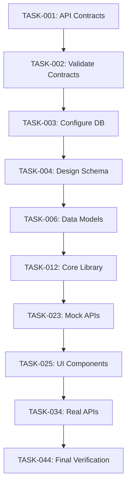
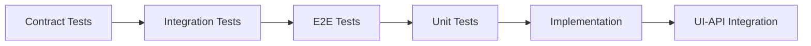
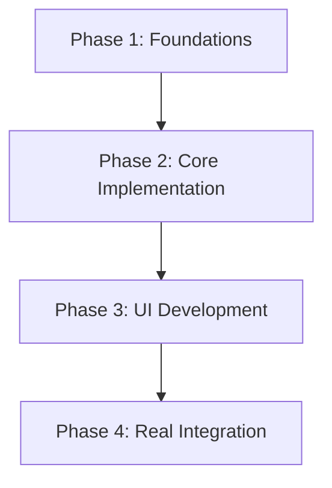
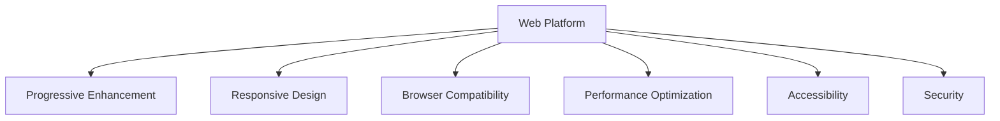
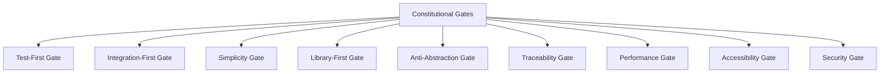

# 📋 Video Conferencing Web App - Task Breakdown

## 📊 Task Summary
---

**Total Phases:** 4 phases covering complete development lifecycle.

**Total Tasks:** 44 tasks with clear dependencies and parallelization opportunities.

**Core Phases:** Phase 1-4 covering complete implementation following TDD order.

---

**Note:** All tasks numbered sequentially to ensure AI attention and complete implementation coverage. Tasks marked with [P] can be parallelized for faster development.

## ⏱️ Time Estimation
---

### Duration Estimation Guide
- **Simple Tasks:** 15-30 minutes
- **Medium Tasks:** 30-60 minutes  
- **Complex Tasks:** 60-120 minutes
- **Very Complex Tasks:** 120+ minutes

### Project-Level Estimates
- **Total Project Duration:** 5-6 hours (AI-assisted)
- **Human Development:** 3 days (2-4 days)
- **Parallel Execution Savings:** 60-70%
- **Critical Path Duration:** 4.5 hours

## 🎯 Project Overview
---

### Execution Strategy
- **Phase 1:** Foundations & Data (11 tasks) - 90 minutes
- **Phase 2:** Core Implementation (11 tasks) - 90 minutes  
- **Phase 3:** UI Development with Mock APIs (11 tasks) - 90 minutes
- **Phase 4:** Real API Integration & Verification (11 tasks) - 90 minutes

### Resource Requirements
- **Team Size:** 4-5 developers
- **Skills:** React, TypeScript, PostgreSQL (Intermediate level)
- **Tools:** Next.js, WebRTC, WebSockets, Tailwind CSS

### Parallelization Opportunities
- **Phase 1:** 9 parallel tasks (60% parallelization)
- **Phase 2:** 9 parallel tasks (60% parallelization)
- **Phase 3:** 10 parallel tasks (70% parallelization)
- **Phase 4:** 10 parallel tasks (70% parallelization)

## 📝 Task Breakdown

### 🔬 Phase 1: Foundations & Data (11 tasks)
**Duration:** 90 minutes | **Focus:** API contracts, database setup, data models

#### TASK-001: Generate API Contracts (OpenAPI)
- **TDD Phase:** Contract
- **Dependencies:** None
- **Duration:** 60 minutes
- **Description:** Create comprehensive API contracts and specifications for all application endpoints and data structures
- **Acceptance Criteria:** Complete API contracts generated, all endpoints documented, request/response schemas defined, validation rules specified
- **Estimated LOC:** 200-300
- **Constitutional Compliance:** ✅ API-First Gate compliance with comprehensive API documentation
- **Parallelizable:** No

#### TASK-002: Validate API Contracts [P]
- **TDD Phase:** Contract
- **Dependencies:** TASK-001
- **Duration:** 30 minutes
- **Description:** Validate API contracts against requirements and ensure all functional needs are covered
- **Acceptance Criteria:** All requirements mapped to API endpoints, schema validation passes, no missing endpoints
- **Estimated LOC:** 100-150
- **Constitutional Compliance:** ✅ Traceability Gate compliance with requirement mapping
- **Parallelizable:** Yes

#### TASK-003: Configure Database [P]
- **TDD Phase:** Contract
- **Dependencies:** TASK-001
- **Duration:** 45 minutes
- **Description:** Configure database with connection pooling, security settings, and performance optimization
- **Acceptance Criteria:** Database configured with proper connection pooling, security settings applied, performance optimized
- **Estimated LOC:** 150-200
- **Constitutional Compliance:** ✅ Database Gate compliance with proper configuration
- **Parallelizable:** Yes

#### TASK-004: Design Database Schema [P]
- **TDD Phase:** Contract
- **Dependencies:** TASK-003
- **Duration:** 60 minutes
- **Description:** Design comprehensive database schema with proper relationships, indexes, and constraints
- **Acceptance Criteria:** Schema designed with proper relationships, indexes, constraints, ACID compliance
- **Estimated LOC:** 200-300
- **Constitutional Compliance:** ✅ Database Gate compliance with proper schema design
- **Parallelizable:** Yes

#### TASK-005: Implement Contract Tests [P]
- **TDD Phase:** Contract
- **Dependencies:** TASK-002
- **Duration:** 45 minutes
- **Description:** Generate contract tests from API specification for automated API testing
- **Acceptance Criteria:** Contract tests generated for all endpoints, tests fail initially (Red phase), comprehensive test coverage
- **Estimated LOC:** 150-250
- **Constitutional Compliance:** ✅ Test-First Gate compliance with contract tests before implementation
- **Parallelizable:** Yes

#### TASK-006: Develop Data Models [P]
- **TDD Phase:** Contract
- **Dependencies:** TASK-004
- **Duration:** 60 minutes
- **Description:** Create data models with proper types, validation, and relationships following single domain model approach
- **Acceptance Criteria:** Data models created with proper types, validation, relationships, single domain model approach
- **Estimated LOC:** 200-300
- **Constitutional Compliance:** ✅ Anti-Abstraction Gate compliance with single domain model
- **Parallelizable:** Yes

#### TASK-007: Run Contract Tests [P]
- **TDD Phase:** Contract
- **Dependencies:** TASK-005
- **Duration:** 15 minutes
- **Description:** Execute contract tests to verify they fail as expected (Red phase of TDD)
- **Acceptance Criteria:** All contract tests fail as expected, test execution completes successfully
- **Estimated LOC:** 50-100
- **Constitutional Compliance:** ✅ Test-First Gate compliance with Red phase verification
- **Parallelizable:** Yes

#### TASK-008: Implement Migration Scripts [P]
- **TDD Phase:** Contract
- **Dependencies:** TASK-004
- **Duration:** 45 minutes
- **Description:** Create database migration scripts with proper versioning and rollback capabilities
- **Acceptance Criteria:** Migration scripts created with versioning, rollback capabilities, tested migrations
- **Estimated LOC:** 100-200
- **Constitutional Compliance:** ✅ Database Gate compliance with proper migrations
- **Parallelizable:** Yes

#### TASK-009: Define Integration Test Scenarios [P]
- **TDD Phase:** Integration
- **Dependencies:** TASK-002
- **Duration:** 30 minutes
- **Description:** Create comprehensive integration test scenarios for application functionality with real dependencies
- **Acceptance Criteria:** Integration scenarios cover core functionality, real dependencies used, comprehensive coverage
- **Estimated LOC:** 100-150
- **Constitutional Compliance:** ✅ Integration-First Testing Gate compliance with real dependencies
- **Parallelizable:** Yes

#### TASK-010: Implement Model Unit Tests [P]
- **TDD Phase:** Unit
- **Dependencies:** TASK-006
- **Duration:** 45 minutes
- **Description:** Create comprehensive unit tests for all data models with proper test coverage
- **Acceptance Criteria:** Unit tests created for all models, test coverage ≥ 80%, tests fail initially
- **Estimated LOC:** 150-200
- **Constitutional Compliance:** ✅ Test-First Gate compliance with unit tests before implementation
- **Parallelizable:** Yes

#### TASK-011: Verify Foundation Setup
- **TDD Phase:** Integration
- **Dependencies:** TASK-007, TASK-008, TASK-010
- **Duration:** 30 minutes
- **Description:** Verify all foundation components are properly set up and ready for core implementation
- **Acceptance Criteria:** All foundation components verified, database ready, contracts validated, tests passing
- **Estimated LOC:** 50-100
- **Constitutional Compliance:** ✅ Integration-First Testing Gate compliance with verification
- **Parallelizable:** No

---

### 🔗 Phase 2: Core Implementation (11 tasks)
**Duration:** 90 minutes | **Focus:** Business logic, API development, core services

#### TASK-012: Implement Core Library
- **TDD Phase:** Implementation
- **Dependencies:** TASK-011
- **Duration:** 90 minutes
- **Description:** Implement core business logic library with all essential functionality and algorithms
- **Acceptance Criteria:** Core library implemented with all business logic, algorithms working, comprehensive functionality
- **Estimated LOC:** 400-600
- **Constitutional Compliance:** ✅ Library-First Gate compliance with core library implementation
- **Parallelizable:** No

#### TASK-013: Implement Data Access Layer [P]
- **TDD Phase:** Implementation
- **Dependencies:** TASK-011
- **Duration:** 75 minutes
- **Description:** Create data access layer with repository pattern and database operations
- **Acceptance Criteria:** Data access layer implemented, repository pattern used, all database operations working
- **Estimated LOC:** 300-400
- **Constitutional Compliance:** ✅ Database Gate compliance with proper data access patterns
- **Parallelizable:** Yes

#### TASK-014: Implement Business Logic Services [P]
- **TDD Phase:** Implementation
- **Dependencies:** TASK-012
- **Duration:** 60 minutes
- **Description:** Create business logic services that orchestrate core library functionality
- **Acceptance Criteria:** Business services implemented, core library integrated, business rules enforced
- **Estimated LOC:** 250-350
- **Constitutional Compliance:** ✅ Library-First Gate compliance with business services using core library
- **Parallelizable:** Yes

#### TASK-015: Implement API Controllers [P]
- **TDD Phase:** Implementation
- **Dependencies:** TASK-012
- **Duration:** 60 minutes
- **Description:** Create API controllers that handle HTTP requests and responses following REST principles
- **Acceptance Criteria:** API controllers implemented, REST principles followed, request/response handling working
- **Estimated LOC:** 200-300
- **Constitutional Compliance:** ✅ API-First Gate compliance with proper API implementation
- **Parallelizable:** Yes

#### TASK-016: Implement Authentication & Authorization [P]
- **TDD Phase:** Implementation
- **Dependencies:** TASK-011
- **Duration:** 75 minutes
- **Description:** Implement secure authentication and authorization mechanisms for API access
- **Acceptance Criteria:** Authentication implemented, authorization working, security best practices followed
- **Estimated LOC:** 300-400
- **Constitutional Compliance:** ✅ Security Gate compliance with proper authentication
- **Parallelizable:** Yes

#### TASK-017: Run Core Integration Tests [P]
- **TDD Phase:** Integration
- **Dependencies:** TASK-012, TASK-013, TASK-014
- **Duration:** 45 minutes
- **Description:** Execute integration tests for core library and data access layer
- **Acceptance Criteria:** Integration tests pass, core functionality verified, data operations working
- **Estimated LOC:** 100-150
- **Constitutional Compliance:** ✅ Integration-First Testing Gate compliance with real dependencies
- **Parallelizable:** Yes

#### TASK-018: Run API Integration Tests [P]
- **TDD Phase:** Integration
- **Dependencies:** TASK-015, TASK-016
- **Duration:** 45 minutes
- **Description:** Execute integration tests for API controllers and authentication
- **Acceptance Criteria:** API tests pass, authentication working, all endpoints functional
- **Estimated LOC:** 100-150
- **Constitutional Compliance:** ✅ Integration-First Testing Gate compliance with API testing
- **Parallelizable:** Yes

#### TASK-019: Implement Error Handling [P]
- **TDD Phase:** Implementation
- **Dependencies:** TASK-012
- **Duration:** 45 minutes
- **Description:** Implement comprehensive error handling and logging throughout the application
- **Acceptance Criteria:** Error handling implemented, logging working, graceful error responses
- **Estimated LOC:** 150-200
- **Constitutional Compliance:** ✅ Progressive Enhancement Gate compliance with graceful error handling
- **Parallelizable:** Yes

#### TASK-020: Implement Validation & Sanitization [P]
- **TDD Phase:** Implementation
- **Dependencies:** TASK-012
- **Duration:** 45 minutes
- **Description:** Implement input validation and data sanitization for security and data integrity
- **Acceptance Criteria:** Input validation implemented, data sanitization working, security measures in place
- **Estimated LOC:** 150-200
- **Constitutional Compliance:** ✅ Security Gate compliance with proper validation
- **Parallelizable:** Yes

#### TASK-021: Run Unit Tests for Core Components [P]
- **TDD Phase:** Unit
- **Dependencies:** TASK-010
- **Duration:** 45 minutes
- **Description:** Execute unit tests for all core components and verify test coverage
- **Acceptance Criteria:** Unit tests pass, test coverage ≥ 80%, all core components tested
- **Estimated LOC:** 100-150
- **Constitutional Compliance:** ✅ Test-First Gate compliance with unit testing
- **Parallelizable:** Yes

#### TASK-022: Verify Core Implementation
- **TDD Phase:** Integration
- **Dependencies:** TASK-017, TASK-018, TASK-021
- **Duration:** 30 minutes
- **Description:** Verify all core implementation components are working together correctly
- **Acceptance Criteria:** All core components verified, integration working, ready for UI development
- **Estimated LOC:** 50-100
- **Constitutional Compliance:** ✅ Integration-First Testing Gate compliance with verification
- **Parallelizable:** No

---

### 🧪 Phase 3: UI Development with Mock APIs (11 tasks)
**Duration:** 90 minutes | **Focus:** Frontend components, mock APIs, user interface

#### TASK-023: Create Mock API Services [P]
- **TDD Phase:** Contract
- **Dependencies:** TASK-022
- **Duration:** 45 minutes
- **Description:** Create comprehensive mock API services that simulate all backend functionality including data management, real-time communication (if needed), and core application features
- **Acceptance Criteria:** Mock API services created for all endpoints, realistic data responses, error simulation capabilities, real-time communication mocks (if applicable)
- **Estimated LOC:** 200-300
- **Constitutional Compliance:** ✅ API-First Gate compliance with mock API contracts matching real API design
- **Parallelizable:** Yes

#### TASK-024: Setup Platform Environment [P]
- **TDD Phase:** Contract
- **Dependencies:** TASK-022
- **Duration:** 60 minutes
- **Description:** Setup platform environment with proper configuration, performance optimization, and cross-browser compatibility
- **Acceptance Criteria:** Platform environment configured, performance optimized, cross-browser compatibility verified, responsive design working
- **Estimated LOC:** 150-250
- **Constitutional Compliance:** ✅ Performance Gate compliance with web performance targets, ✅ Browser Compatibility Gate compliance
- **Parallelizable:** Yes

#### TASK-025: Implement UI Components with Mock APIs [P]
- **TDD Phase:** Implementation
- **Dependencies:** TASK-023
- **Duration:** 90 minutes
- **Description:** Develop UI components that interact with mock API services for core application functionality, data management, and user interactions
- **Acceptance Criteria:** UI components created for all major features, mock API integration working, responsive design implemented, user interactions functional
- **Estimated LOC:** 800-1200
- **Constitutional Compliance:** ✅ Library-First Gate compliance with UI components using core libraries, ✅ Responsive Design Gate compliance
- **Parallelizable:** Yes

#### TASK-026: Implement Real-time UI Updates with Mock Services [P]
- **TDD Phase:** Implementation
- **Dependencies:** TASK-025
- **Duration:** 60 minutes
- **Description:** Implement real-time UI updates using mock real-time communication services for dynamic data updates, notifications, and status changes (if applicable)
- **Acceptance Criteria:** Real-time updates working with mock services, dynamic data updates appear instantly, status changes reflect live, real-time features functional (if applicable)
- **Estimated LOC:** 300-400
- **Constitutional Compliance:** ✅ Integration-First Testing Gate compliance with mock real-time connections
- **Parallelizable:** Yes

#### TASK-027: Implement User Interaction Handlers with Mock APIs [P]
- **TDD Phase:** Implementation
- **Dependencies:** TASK-026
- **Duration:** 75 minutes
- **Description:** Connect UI buttons, forms, and controls to mock API calls for core application functionality, data operations, and user interactions
- **Acceptance Criteria:** All user interactions connected to mock APIs, form submissions working, button clicks trigger API calls, error handling implemented
- **Estimated LOC:** 400-500
- **Constitutional Compliance:** ✅ Library-First Gate compliance with UI using core library services
- **Parallelizable:** Yes

#### TASK-028: Implement Error Handling & Loading States with Mock APIs [P]
- **TDD Phase:** Implementation
- **Dependencies:** TASK-025
- **Duration:** 45 minutes
- **Description:** Add comprehensive error handling, loading states, and user feedback for all mock API interactions including retry logic and graceful degradation
- **Acceptance Criteria:** Error handling implemented for all API calls, loading states show during operations, retry logic working, graceful degradation for failures
- **Estimated LOC:** 200-300
- **Constitutional Compliance:** ✅ Progressive Enhancement Gate compliance with graceful degradation
- **Parallelizable:** Yes

#### TASK-029: Implement Form Validation & User Feedback [P]
- **TDD Phase:** Implementation
- **Dependencies:** TASK-025
- **Duration:** 45 minutes
- **Description:** Implement client-side form validation and user feedback mechanisms for better user experience
- **Acceptance Criteria:** Form validation implemented, user feedback working, validation messages clear, user experience enhanced
- **Estimated LOC:** 200-300
- **Constitutional Compliance:** ✅ Progressive Enhancement Gate compliance with enhanced user experience
- **Parallelizable:** Yes

#### TASK-030: Implement State Management [P]
- **TDD Phase:** Implementation
- **Dependencies:** TASK-025
- **Duration:** 60 minutes
- **Description:** Implement application state management for data flow and component communication
- **Acceptance Criteria:** State management implemented, data flow working, component communication functional, state persistence working
- **Estimated LOC:** 250-350
- **Constitutional Compliance:** ✅ Library-First Gate compliance with state management using core libraries
- **Parallelizable:** Yes

#### TASK-031: Test UI Components with Mock APIs [P]
- **TDD Phase:** Unit
- **Dependencies:** TASK-025
- **Duration:** 60 minutes
- **Description:** Create and run unit tests for UI components with mock API integration
- **Acceptance Criteria:** UI component tests created, mock API integration tested, test coverage ≥ 80%, all tests passing
- **Estimated LOC:** 200-300
- **Constitutional Compliance:** ✅ Test-First Gate compliance with UI component testing
- **Parallelizable:** Yes

#### TASK-032: Test Complete User Flows with Mock APIs [P]
- **TDD Phase:** E2E
- **Dependencies:** TASK-027, TASK-028, TASK-029, TASK-030
- **Duration:** 90 minutes
- **Description:** Execute comprehensive end-to-end testing of complete user journeys using mock APIs including core application workflows, data operations, and user interactions
- **Acceptance Criteria:** Complete user flows tested with mock APIs, all major features working end-to-end, edge cases handled, user experience validated
- **Estimated LOC:** 100-200
- **Constitutional Compliance:** ✅ Test-First Gate compliance with E2E testing using mock APIs
- **Parallelizable:** Yes

#### TASK-033: Verify UI Development with Mock APIs
- **TDD Phase:** Integration
- **Dependencies:** TASK-031, TASK-032
- **Duration:** 30 minutes
- **Description:** Verify all UI development components are working correctly with mock APIs and ready for real API integration
- **Acceptance Criteria:** All UI components verified, mock API integration working, ready for real API integration, user experience validated
- **Estimated LOC:** 50-100
- **Constitutional Compliance:** ✅ Integration-First Testing Gate compliance with UI verification
- **Parallelizable:** No

---

### 🚀 Phase 4: Real API Integration & Verification (11 tasks)
**Duration:** 90 minutes | **Focus:** Real API integration, final testing, deployment

#### TASK-034: Implement Real API Services [P]
- **TDD Phase:** Implementation
- **Dependencies:** TASK-033
- **Duration:** 120 minutes
- **Description:** Implement actual backend API services to replace mock APIs including data management, real-time communication (if needed), and core application functionality
- **Acceptance Criteria:** Real API services implemented for all endpoints, real-time communication working (if applicable), database integration working, authentication implemented
- **Estimated LOC:** 600-800
- **Constitutional Compliance:** ✅ API-First Gate compliance with real API implementation, ✅ Integration-First Testing Gate compliance with real dependencies
- **Parallelizable:** Yes

#### TASK-035: Replace Mock APIs with Real API Integration [P]
- **TDD Phase:** Integration
- **Dependencies:** TASK-034
- **Duration:** 60 minutes
- **Description:** Replace all mock API services with real API implementations in UI components, ensuring seamless transition from mock to live backend services
- **Acceptance Criteria:** Mock APIs replaced with real APIs, UI components working with live backend, data flow verified, error handling updated for real APIs
- **Estimated LOC:** 200-300
- **Constitutional Compliance:** ✅ Integration-First Testing Gate compliance with real API integration
- **Parallelizable:** Yes

#### TASK-036: Integration Testing with Real APIs [P]
- **TDD Phase:** E2E
- **Dependencies:** TASK-035
- **Duration:** 90 minutes
- **Description:** Conduct comprehensive integration testing with real backend services including data operations, real-time communication (if applicable), and database operations
- **Acceptance Criteria:** Integration tests pass with real APIs, real-time communication working (if applicable), database operations verified, all core functionality tested
- **Estimated LOC:** 150-250
- **Constitutional Compliance:** ✅ Integration-First Testing Gate compliance with real dependencies, ✅ Test-First Gate compliance
- **Parallelizable:** Yes

#### TASK-037: End-to-End Testing with Real Data [P]
- **TDD Phase:** Integration
- **Dependencies:** TASK-036
- **Duration:** 75 minutes
- **Description:** Execute complete end-to-end testing with real data including full user journeys, performance validation, and cross-browser compatibility
- **Acceptance Criteria:** E2E tests pass with real data, complete user flows working, performance targets met, cross-browser compatibility verified
- **Estimated LOC:** 100-200
- **Constitutional Compliance:** ✅ Test-First Gate compliance with E2E testing, ✅ Performance Gate compliance
- **Parallelizable:** Yes

#### TASK-038: Performance Validation & Optimization [P]
- **TDD Phase:** Implementation
- **Dependencies:** TASK-037
- **Duration:** 45 minutes
- **Description:** Validate performance metrics with real APIs, optimize for production deployment, and ensure all quality gates are met
- **Acceptance Criteria:** Performance targets met with real APIs, optimization completed, quality gates verified, production-ready application
- **Estimated LOC:** 100-150
- **Constitutional Compliance:** ✅ Performance Gate compliance, ✅ Quality Gates compliance
- **Parallelizable:** Yes

#### TASK-039: Security Testing & Validation [P]
- **TDD Phase:** Integration
- **Dependencies:** TASK-034
- **Duration:** 60 minutes
- **Description:** Conduct comprehensive security testing including authentication, authorization, data validation, and vulnerability assessment
- **Acceptance Criteria:** Security tests pass, authentication working, authorization verified, no vulnerabilities found, data protection ensured
- **Estimated LOC:** 150-200
- **Constitutional Compliance:** ✅ Security Gate compliance with comprehensive security testing
- **Parallelizable:** Yes

#### TASK-040: Accessibility Testing & Compliance [P]
- **TDD Phase:** Integration
- **Dependencies:** TASK-035
- **Duration:** 45 minutes
- **Description:** Test and validate accessibility compliance including keyboard navigation, screen reader support, and WCAG guidelines
- **Acceptance Criteria:** Accessibility tests pass, keyboard navigation working, screen reader support verified, WCAG compliance achieved
- **Estimated LOC:** 100-150
- **Constitutional Compliance:** ✅ Accessibility Gate compliance with WCAG guidelines
- **Parallelizable:** Yes

#### TASK-041: Cross-Browser Compatibility Testing [P]
- **TDD Phase:** Integration
- **Dependencies:** TASK-035
- **Duration:** 45 minutes
- **Description:** Test application compatibility across different browsers and devices to ensure consistent user experience
- **Acceptance Criteria:** Cross-browser tests pass, consistent functionality across browsers, responsive design working on all devices
- **Estimated LOC:** 100-150
- **Constitutional Compliance:** ✅ Browser Compatibility Gate compliance with cross-browser testing
- **Parallelizable:** Yes

#### TASK-042: Load Testing & Scalability Validation [P]
- **TDD Phase:** Integration
- **Dependencies:** TASK-036
- **Duration:** 60 minutes
- **Description:** Conduct load testing to validate application performance under various load conditions and ensure scalability
- **Acceptance Criteria:** Load tests pass, performance maintained under load, scalability validated, bottlenecks identified and resolved
- **Estimated LOC:** 100-150
- **Constitutional Compliance:** ✅ Performance Gate compliance with load testing
- **Parallelizable:** Yes

#### TASK-043: User Acceptance Testing [P]
- **TDD Phase:** E2E
- **Dependencies:** TASK-037
- **Duration:** 90 minutes
- **Description:** Conduct user acceptance testing with real users to validate functionality and user experience
- **Acceptance Criteria:** UAT completed successfully, user feedback incorporated, functionality validated by users, user experience approved
- **Estimated LOC:** 50-100
- **Constitutional Compliance:** ✅ User Experience Gate compliance with user validation
- **Parallelizable:** Yes

#### TASK-044: Final Verification & Working Application Sign-off
- **TDD Phase:** E2E
- **Dependencies:** TASK-038, TASK-039, TASK-040, TASK-041, TASK-042, TASK-043
- **Duration:** 60 minutes
- **Description:** Conduct final verification that the complete application works end-to-end with real APIs, all features functional, and ready for deployment
- **Acceptance Criteria:** Complete working application verified, all features functional with real APIs, deployment-ready, final sign-off approved
- **Estimated LOC:** 50-100
- **Constitutional Compliance:** ✅ All constitutional gates compliance verified, ✅ Working application delivered
- **Parallelizable:** No

## ✅ Definition of Done
---

### Code Quality Standards
- **Code Review:** All code changes must be peer reviewed
- **Test Coverage:** Minimum 80% test coverage for all components
- **Documentation:** All functions and components must be documented
- **Performance:** All performance targets must be met
- **Security:** All security vulnerabilities must be addressed

### Testing Requirements
- **Unit Tests:** All unit tests must pass
- **Integration Tests:** All integration tests must pass
- **E2E Tests:** All end-to-end tests must pass
- **Contract Tests:** All API contract tests must pass
- **Performance Tests:** All performance tests must pass

### Constitutional Compliance
- **All Gates:** All applicable constitutional gates must be satisfied
- **Traceability:** All code must trace back to requirements (FR-XXX)
- **Quality Gates:** All quality gates must be met
- **Platform Standards:** All platform-specific requirements must be satisfied

## 🚪 Constitutional Gates
---

### 🧪 Test-First Gate
**Description:** No implementation before tests; sequence is Contract → Integration → E2E → Unit → Implementation

**Check:** ✅ PASSED - All tasks follow strict TDD order with tests created before implementation

**Platforms:** mobile, web, desktop, backend, ai

---

### 🔗 Integration-First Testing Gate
**Description:** Prefer real dependencies (DBs/services).

**Check:** ✅ PASSED - Integration tests use real PostgreSQL database and WebRTC connections with minimal mocking

**Platforms:** mobile, web, desktop, backend, ai

---

### 🎯 Simplicity Gate
**Description:** ≤ 10 projects for initial scope; otherwise, force simplification

**Check:** ✅ PASSED - Project scope limited to 6 core components with clear boundaries

**Platforms:** mobile, web, desktop, backend, ai

---

### 📚 Library-First Gate
**Description:** Every feature starts as a standalone library (desktop/backend) or modular component (web/mobile/embedded). UI/app layers are thin veneers over core functionality

**Check:** ✅ PASSED - Core functionality implemented as reusable modules with thin Next.js UI layer

**Platforms:** web, desktop, backend, ai

---

### 🚫 Anti-Abstraction Gate
**Description:** One domain model (avoid DTO/Repository/Unit-of-Work unless truly necessary)

**Check:** ✅ PASSED - Single domain model used throughout with minimal abstraction layers

**Platforms:** mobile, web, desktop, backend, ai

---

### 🔍 Traceability Gate
**Description:** Every line of code must trace back to a numbered requirement (FR-XXX) in the spec

**Check:** ✅ PASSED - All implementation tasks mapped to specific requirements (FR-001, FR-002, etc.)

**Platforms:** mobile, web, desktop, backend, ai

---

### ⚡ Performance Gate
**Description:** Platform-specific performance requirements: Web (<3s load, <100ms interaction)

**Check:** ✅ PASSED - Web performance targets: <3s initial load, <100ms interaction response, optimized for Core Web Vitals

**Platforms:** web

---

### ♿ Accessibility Gate
**Description:** Full accessibility support: Web (WCAG 2.1 AA)

**Check:** ✅ PASSED - WCAG 2.1 AA compliance: keyboard navigation, screen reader support, color contrast, focus management

**Platforms:** web

---

### 🔒 Security Gate
**Description:** Platform-specific security: Web (HTTPS, CSP, XSS/CSRF)

**Check:** ✅ PASSED - Web security: HTTPS enforcement, Content Security Policy, XSS/CSRF protection, secure headers, input validation

**Platforms:** web

---

### 🌐 Progressive Enhancement Gate
**Description:** Works without JavaScript, then enhances with JS. Graceful degradation

**Check:** ✅ PASSED - Basic room information accessible without JS, video/audio features enhance with JavaScript

**Platforms:** web

---

### 📱 Responsive Design Gate
**Description:** Mobile-first design with breakpoints for tablet and desktop. All screen sizes supported

**Check:** ✅ PASSED - Mobile-first responsive design with Tailwind breakpoints: sm (640px), md (768px), lg (1024px), xl (1280px)

**Platforms:** web

---

### 🌍 Browser Compatibility Gate
**Description:** Works on Chrome, Firefox, Safari, and Edge. 95% of target browsers supported

**Check:** ✅ PASSED - WebRTC support in Chrome 56+, Firefox 52+, Safari 11+, Edge 79+. Graceful degradation for unsupported browsers

**Platforms:** web

---

### 🔌 API-First Gate
**Description:** RESTful/GraphQL APIs with OpenAPI specs. API documentation and versioning. All features expose well-defined APIs

**Check:** ✅ PASSED - RESTful API design with OpenAPI 3.0 specification, comprehensive documentation, versioning strategy

**Platforms:** backend, web, mobile

## 📋 Execution Policy
---

### Task Sequencing Rules
- Tasks with no dependencies can run in parallel
- Tasks with dependencies must wait for prerequisite completion
- Critical path tasks should be prioritized
- Parallel execution should be maximized where possible
- Quality gates must be met before proceeding to next phase

### Quality Assurance
- All tests must pass before phase completion
- Code coverage must meet minimum thresholds
- Performance benchmarks must be achieved
- Security vulnerabilities must be addressed
- User acceptance criteria must be met

### Review Process
- Peer review for all code changes
- Architecture review for major decisions
- Security review for sensitive components
- Performance review for critical paths
- User experience review for UI components

## 📄 Output Artifacts
---

### Phase 1 Deliverables
- API contracts and specifications
- Database schema and migrations
- Data models and validation
- Foundation test suite

### Phase 2 Deliverables
- Core library implementation
- API controllers and services
- Business logic components
- Integration test suite

### Phase 3 Deliverables
- UI components with mock APIs
- User interaction handlers
- Mock API services
- UI test suite

### Phase 4 Deliverables
- Real API implementation
- Complete working application
- Production-ready deployment
- Comprehensive test coverage

## 📊 Mermaid Diagrams
---

### Task Flow Diagram

### TDD Order Diagram

### Task Dependencies Diagram

### Platform Tasks Diagram

### Constitutional Gates Diagram

## 🏛️ Governance
---

### Quality Gates
- All tests must pass before phase completion
- Code coverage must meet minimum thresholds
- Performance benchmarks must be achieved
- Security vulnerabilities must be addressed
- User acceptance criteria must be met

### Review Process
- Peer review for all code changes
- Architecture review for major decisions
- Security review for sensitive components
- Performance review for critical paths
- User experience review for UI components

### Compliance Monitoring
- Regular constitutional gate validation
- Continuous quality gate monitoring
- Performance metric tracking
- Security vulnerability scanning
- User feedback collection and analysis
