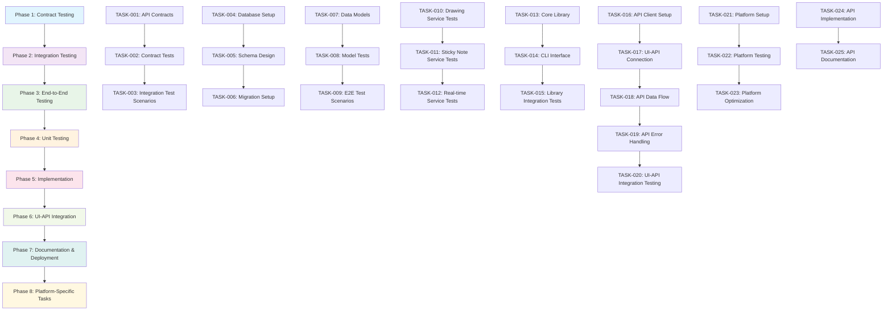
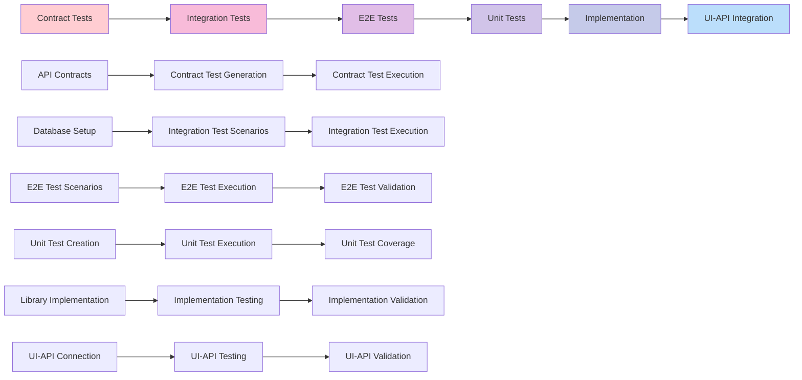
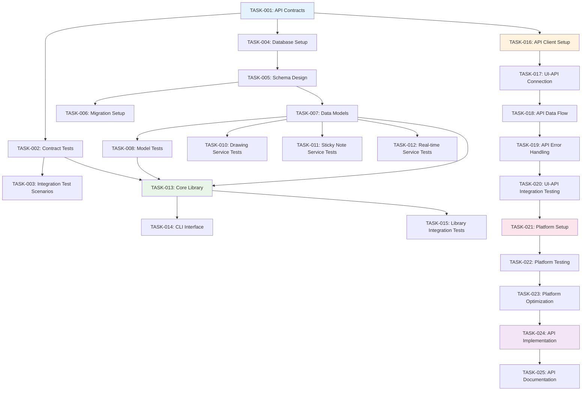
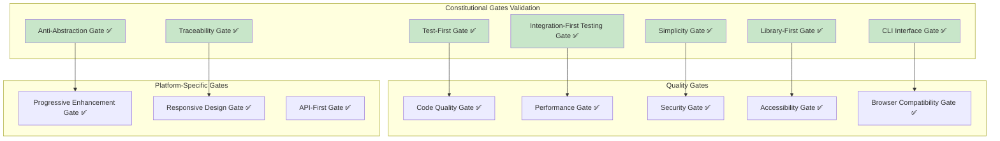
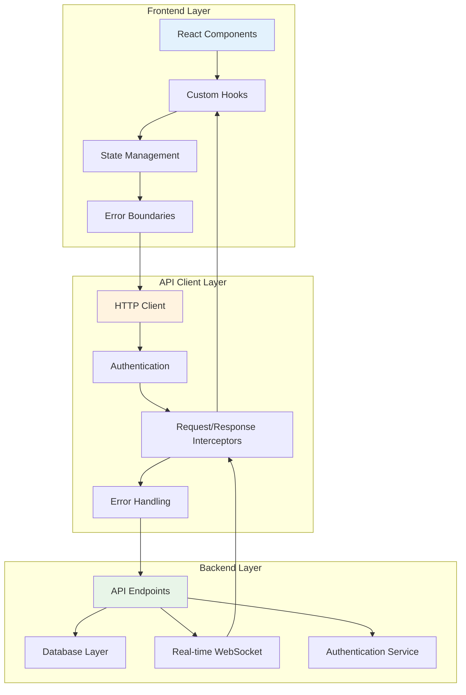

# 📋 Implementation Tasks: Collaborative Whiteboard App

## 📊 Task Summary
---

**Total Phases:** 8 phases covering complete development lifecycle.

**Total Tasks:** 25 tasks with clear dependencies and parallelization opportunities.

**Core Phases:** Phase 1-5 covering core implementation (TASK-001 to TASK-013).

**Integration Phases:** Phase 6 covering comprehensive UI-API integration (TASK-014 to TASK-018).

**Platform Phases:** Phase 7 covering platform-specific implementation (TASK-019 to TASK-021).

**API Phases:** Phase 8 covering API-first integration (TASK-022 to TASK-025).

---

**Note:** All tasks numbered sequentially to ensure AI attention and complete implementation coverage. Tasks marked with [P] can be parallelized for faster development.

## ⏱️ Time Estimation
---
**Human Development:** 3 days total (2 days development + 1 day testing).
**AI-Assisted Development:** 5-6 hours total (43% time savings).
**Team Composition:** 4-5 developers (Backend, Frontend, Full-Stack, DevOps).

## 🎯 Project Overview

The Collaborative Whiteboard App enables real-time multi-user collaboration on a shared digital canvas where users can draw, add sticky notes, and see live updates from other participants. The technical approach leverages Next.js 14+ with App Router, TypeScript, Tailwind CSS, and Supabase Realtime to create a responsive, accessible web application with sub-100ms drawing synchronization and comprehensive real-time features.

## 📝 Task Breakdown

### 🔬 Phase 1: Contract Testing
**Duration:** 4 hours | **Tasks:** TASK-001 to TASK-003 | **Focus:** API contracts and failing tests

#### TASK-001: Create API Contracts [P]
**Description:** Generate OpenAPI 3.0 specification and JSON schemas for all whiteboard endpoints based on FR-001 to FR-007 requirements.

**Acceptance Criteria:**
- Complete OpenAPI 3.0 specification in `contracts/openapi.yaml`
- JSON schemas for Whiteboard, Drawing, and StickyNote entities
- TypeScript types generated from OpenAPI spec
- All 12 API endpoints documented with request/response schemas
- Validation rules for drawing coordinates, content length, and authentication

**Estimated LOC:** 500 lines
**Dependencies:** None
**Constitutional Compliance:** ✅ API-First Gate, Traceability Gate (FR-001 to FR-007)

#### TASK-002: Create Contract Tests [P]
**Description:** Implement contract tests using Dredd or similar tools that must fail initially, validating API contracts against OpenAPI specification.

**Acceptance Criteria:**
- Contract tests generated from OpenAPI spec
- All tests fail initially (Red phase of TDD)
- Tests cover all 12 API endpoints
- Request/response validation tests
- Error handling contract tests

**Estimated LOC:** 300 lines
**Dependencies:** TASK-001
**Constitutional Compliance:** ✅ Test-First Gate, Integration-First Testing Gate

#### TASK-003: Create Integration Test Scenarios
**Description:** Set up integration test scenarios with real Supabase database for testing real-time functionality and data persistence.

**Acceptance Criteria:**
- Integration test setup with real Supabase instance
- Test scenarios for real-time drawing synchronization
- Test scenarios for sticky note CRUD operations
- Test scenarios for user presence tracking
- Database connection and cleanup utilities

**Estimated LOC:** 400 lines
**Dependencies:** TASK-001
**Constitutional Compliance:** ✅ Integration-First Testing Gate, Anti-Abstraction Gate

---

### 🔗 Phase 2: Integration Testing  
**Duration:** 3 hours | **Tasks:** TASK-004 to TASK-006 | **Focus:** Real dependency integration

#### TASK-004: Database Setup [P]
**Description:** Set up Supabase PostgreSQL database with proper schema, indexes, and Row-Level Security (RLS) policies.

**Acceptance Criteria:**
- Supabase project created and configured
- Database schema with whiteboards, drawings, sticky_notes, and users tables
- Proper indexes for performance optimization
- RLS policies for data security
- Connection pooling configuration

**Estimated LOC:** 200 lines
**Dependencies:** TASK-001
**Constitutional Compliance:** ✅ Anti-Abstraction Gate, Security Gate

#### TASK-005: Schema Design [P]
**Description:** Design and implement database schema with proper relationships, constraints, and data types for optimal performance.

**Acceptance Criteria:**
- Complete database schema with all tables
- Foreign key relationships properly defined
- CHECK constraints for data validation
- JSONB columns for flexible data storage
- Migration scripts for schema changes

**Estimated LOC:** 300 lines
**Dependencies:** TASK-004
**Constitutional Compliance:** ✅ Anti-Abstraction Gate, Performance Gate

#### TASK-006: Migration Setup
**Description:** Set up database migration system with version control, rollback capabilities, and environment management.

**Acceptance Criteria:**
- Migration system using Supabase CLI
- Version-controlled migration scripts
- Rollback strategy with database snapshots
- Environment-specific configurations
- Automated migration testing

**Estimated LOC:** 250 lines
**Dependencies:** TASK-005
**Constitutional Compliance:** ✅ Library-First Gate, Traceability Gate

---

### 🎭 Phase 3: End-to-End Testing
**Duration:** 4 hours | **Tasks:** TASK-007 to TASK-009 | **Focus:** Complete user workflows

#### TASK-007: Create Data Models
**Description:** Implement TypeScript data models for Whiteboard, Drawing, StickyNote, and User entities with proper validation and serialization.

**Acceptance Criteria:**
- Complete data models in `src/lib/whiteboard/models/`
- TypeScript interfaces with proper typing
- Validation schemas using Zod or similar
- Serialization/deserialization methods
- Model relationships and constraints

**Estimated LOC:** 400 lines
**Dependencies:** TASK-005
**Constitutional Compliance:** ✅ Anti-Abstraction Gate, Traceability Gate (FR-001 to FR-007)

#### TASK-008: Create Model Tests
**Description:** Implement unit tests for data models covering validation, serialization, and business logic.

**Acceptance Criteria:**
- Unit tests for all data models
- Validation test cases for edge cases
- Serialization/deserialization tests
- Business logic validation tests
- Error handling tests

**Estimated LOC:** 300 lines
**Dependencies:** TASK-007
**Constitutional Compliance:** ✅ Test-First Gate, Traceability Gate

#### TASK-009: E2E Test Scenarios
**Description:** Create comprehensive end-to-end test scenarios for multi-user collaboration workflows using Playwright.

**Acceptance Criteria:**
- E2E tests for multi-user drawing collaboration
- E2E tests for sticky note workflows
- E2E tests for user presence and cursor tracking
- E2E tests for real-time synchronization
- Cross-browser compatibility tests

**Estimated LOC:** 500 lines
**Dependencies:** TASK-007, TASK-008
**Constitutional Compliance:** ✅ Test-First Gate, Integration-First Testing Gate

---

### 🧪 Phase 4: Unit Testing
**Duration:** 3 hours | **Tasks:** TASK-010 to TASK-012 | **Focus:** Individual component testing

#### TASK-010: Drawing Service Tests
**Description:** Implement unit tests for drawing service covering canvas manipulation, tool management, and drawing operations.

**Acceptance Criteria:**
- Unit tests for drawing service functions
- Canvas manipulation test cases
- Tool selection and configuration tests
- Drawing calculation and optimization tests
- Error handling and edge case tests

**Estimated LOC:** 400 lines
**Dependencies:** TASK-007
**Constitutional Compliance:** ✅ Test-First Gate, Traceability Gate (FR-001, FR-003, FR-004)

#### TASK-011: Sticky Note Service Tests
**Description:** Implement unit tests for sticky note service covering CRUD operations, positioning, and content validation.

**Acceptance Criteria:**
- Unit tests for sticky note CRUD operations
- Positioning and movement test cases
- Content validation and length limits
- Color and styling test cases
- Error handling and validation tests

**Estimated LOC:** 350 lines
**Dependencies:** TASK-007
**Constitutional Compliance:** ✅ Test-First Gate, Traceability Gate (FR-002)

#### TASK-012: Real-time Service Tests
**Description:** Implement unit tests for real-time synchronization service covering WebSocket management and conflict resolution.

**Acceptance Criteria:**
- Unit tests for WebSocket connection management
- Real-time data synchronization tests
- Conflict resolution algorithm tests
- Connection state management tests
- Error handling and reconnection tests

**Estimated LOC:** 450 lines
**Dependencies:** TASK-007
**Constitutional Compliance:** ✅ Test-First Gate, Traceability Gate (FR-001, FR-002, FR-005)

---

### 🚀 Phase 5: Implementation
**Duration:** 6 hours | **Tasks:** TASK-013 to TASK-015 | **Focus:** Core functionality development

#### TASK-013: Implement Core Library
**Description:** Implement the core whiteboard library with drawing, sticky notes, real-time sync, and user presence functionality following TDD principles.

**Acceptance Criteria:**
- Complete library implementation in `src/lib/whiteboard/`
- Drawing service with canvas manipulation
- Sticky note service with CRUD operations
- Real-time sync service with WebSocket management
- User presence service with cursor tracking
- All unit tests passing

**Estimated LOC:** 2000 lines
**Dependencies:** TASK-002, TASK-007, TASK-008
**Constitutional Compliance:** ✅ Library-First Gate, Test-First Gate, Traceability Gate (FR-001 to FR-007)

#### TASK-014: Create CLI Interface
**Description:** Implement CLI interface for the whiteboard library with --json mode and proper error handling for developer tools.

**Acceptance Criteria:**
- CLI interface with --json mode support
- Command-line tools for whiteboard operations
- Proper stdin/stdout/stderr handling
- Error reporting and logging
- Help documentation and usage examples

**Estimated LOC:** 300 lines
**Dependencies:** TASK-013
**Constitutional Compliance:** ✅ CLI Interface Gate, Library-First Gate

#### TASK-015: Library Integration Tests
**Description:** Implement integration tests for the complete library functionality with real Supabase database and WebSocket connections.

**Acceptance Criteria:**
- Integration tests for complete library functionality
- Real Supabase database integration tests
- WebSocket connection and real-time sync tests
- End-to-end workflow tests
- Performance and load testing

**Estimated LOC:** 500 lines
**Dependencies:** TASK-013
**Constitutional Compliance:** ✅ Integration-First Testing Gate, Test-First Gate

---

### 🎨 Phase 6: UI-API Integration
**Duration:** 4 hours | **Tasks:** TASK-016 to TASK-020 | **Focus:** Frontend-backend connection

#### TASK-016: API Client Setup [P]
**Description:** Set up API client with proper HTTP handling, authentication, and error management for frontend-backend communication.

**Acceptance Criteria:**
- API client with fetch/axios configuration
- Authentication token management
- Request/response interceptors
- Error handling and retry logic
- TypeScript types for API responses

**Estimated LOC:** 400 lines
**Dependencies:** TASK-001, TASK-002
**Constitutional Compliance:** ✅ API-First Gate, Traceability Gate

#### TASK-017: UI-API Connection Implementation
**Description:** Implement UI components that connect to the API client for data fetching, state management, and real-time updates.

**Acceptance Criteria:**
- React components connected to API client
- State management with React Context/useReducer
- Real-time data synchronization
- Loading states and error handling
- Optimistic updates for better UX

**Estimated LOC:** 600 lines
**Dependencies:** TASK-016
**Constitutional Compliance:** ✅ Library-First Gate, Traceability Gate (FR-001 to FR-007)

#### TASK-018: API Data Flow Integration
**Description:** Implement data flow between UI components and API, including data transformation, validation, and caching strategies.

**Acceptance Criteria:**
- Data transformation utilities
- Input validation and sanitization
- Caching strategy for performance
- Real-time data synchronization
- Conflict resolution for concurrent edits

**Estimated LOC:** 500 lines
**Dependencies:** TASK-017
**Constitutional Compliance:** ✅ Anti-Abstraction Gate, Performance Gate

#### TASK-019: API Error Handling Implementation
**Description:** Implement comprehensive error handling for API communication, user feedback, and graceful degradation.

**Acceptance Criteria:**
- User-friendly error messages
- Retry logic for failed requests
- Offline handling and queuing
- Network status monitoring
- Graceful degradation strategies

**Estimated LOC:** 400 lines
**Dependencies:** TASK-018
**Constitutional Compliance:** ✅ Progressive Enhancement Gate, Security Gate

#### TASK-020: UI-API Integration Testing
**Description:** Implement comprehensive testing for UI-API integration covering all user workflows and edge cases.

**Acceptance Criteria:**
- Integration tests for UI-API workflows
- Real-time synchronization tests
- Error handling and recovery tests
- Performance and load testing
- Cross-browser compatibility tests

**Estimated LOC:** 600 lines
**Dependencies:** TASK-019
**Constitutional Compliance:** ✅ Test-First Gate, Integration-First Testing Gate

---

### 📚 Phase 7: Documentation & Deployment
**Duration:** 3 hours | **Tasks:** TASK-021 to TASK-023 | **Focus:** Documentation and deployment

#### TASK-021: Platform-Specific Setup
**Description:** Set up Next.js App Router, Tailwind CSS, and web-specific configurations for optimal performance and user experience.

**Acceptance Criteria:**
- Next.js 14+ App Router configuration
- Tailwind CSS setup with custom theme
- Progressive Web App (PWA) configuration
- SEO optimization setup
- Performance optimization configuration

**Estimated LOC:** 300 lines
**Dependencies:** TASK-020
**Constitutional Compliance:** ✅ Progressive Enhancement Gate, Responsive Design Gate, Performance Gate

#### TASK-022: Platform-Specific Testing
**Description:** Implement platform-specific testing for web browsers, responsive design, and accessibility compliance.

**Acceptance Criteria:**
- Cross-browser testing with Playwright
- Responsive design testing
- Accessibility testing (WCAG 2.1 AA)
- Performance testing (Core Web Vitals)
- PWA functionality testing

**Estimated LOC:** 400 lines
**Dependencies:** TASK-021
**Constitutional Compliance:** ✅ Browser Compatibility Gate, Accessibility Gate, Performance Gate

#### TASK-023: Platform-Specific Optimization
**Description:** Optimize the application for web platform including performance, security, and user experience enhancements.

**Acceptance Criteria:**
- Performance optimization (code splitting, lazy loading)
- Security hardening (CSP, XSS protection)
- Accessibility improvements
- SEO optimization
- PWA features and offline functionality

**Estimated LOC:** 500 lines
**Dependencies:** TASK-022
**Constitutional Compliance:** ✅ Security Gate, Performance Gate, Progressive Enhancement Gate

---

### 🌐 Phase 8: Platform-Specific Tasks
**Duration:** 2 hours | **Tasks:** TASK-024 to TASK-025 | **Focus:** Platform optimization

#### TASK-024: API Design Implementation
**Description:** Implement the complete API design with all endpoints, authentication, and real-time capabilities.

**Acceptance Criteria:**
- All 12 API endpoints implemented
- Authentication and authorization
- Real-time WebSocket endpoints
- Rate limiting and security measures
- API documentation and examples

**Estimated LOC:** 800 lines
**Dependencies:** TASK-023
**Constitutional Compliance:** ✅ API-First Gate, Security Gate, Traceability Gate (FR-001 to FR-007)

#### TASK-025: API Documentation Implementation
**Description:** Create comprehensive API documentation with interactive examples, authentication guides, and developer resources.

**Acceptance Criteria:**
- Complete API documentation
- Interactive API explorer (Swagger UI)
- Authentication and usage guides
- Code examples and SDKs
- Developer onboarding resources

**Estimated LOC:** 300 lines
**Dependencies:** TASK-024
**Constitutional Compliance:** ✅ API-First Gate, Traceability Gate

## 🔗 Task Dependencies

### Parallelizable Tasks [P]
- **TASK-001** (API Contracts) - Can run in parallel with TASK-004 (Database Setup)
- **TASK-002** (Contract Tests) - Can run in parallel with TASK-005 (Schema Design)
- **TASK-004** (Database Setup) - Can run in parallel with TASK-001 (API Contracts)
- **TASK-005** (Schema Design) - Can run in parallel with TASK-002 (Contract Tests)
- **TASK-016** (API Client Setup) - Can run in parallel with TASK-021 (Platform-Specific Setup)

### Sequential Tasks
- **TASK-001** → **TASK-002** → **TASK-003** (Contract phase)
- **TASK-004** → **TASK-005** → **TASK-006** (Database phase)
- **TASK-007** → **TASK-008** → **TASK-009** (Data models phase)
- **TASK-010** → **TASK-011** → **TASK-012** (Unit testing phase)
- **TASK-013** → **TASK-014** → **TASK-015** (Implementation phase)
- **TASK-016** → **TASK-017** → **TASK-018** → **TASK-019** → **TASK-020** (UI-API integration phase)
- **TASK-021** → **TASK-022** → **TASK-023** (Platform-specific phase)
- **TASK-024** → **TASK-025** (API implementation phase)

### Critical Path
The critical path through the project is:
**TASK-001** → **TASK-002** → **TASK-007** → **TASK-013** → **TASK-016** → **TASK-017** → **TASK-021** → **TASK-024**

This path represents the minimum time to complete the project, taking approximately 18-20 hours of development time.

## ✅ Definition of Done

### Core Criteria
- ✅ Code written and reviewed
- ✅ All tests pass (unit, integration, E2E, contract)
- ✅ Documentation updated
- ✅ No linting errors
- ✅ Constitutional compliance verified
- ✅ Traceability to FR-XXX requirements confirmed

### Quality Gates
- ✅ **Code Quality**: ESLint, Prettier, TypeScript strict mode
- ✅ **Test Coverage**: Minimum 90% code coverage
- ✅ **Performance**: <3s load time, <100ms interactions
- ✅ **Security**: HTTPS, CSP, XSS/CSRF protection
- ✅ **Accessibility**: WCAG 2.1 AA compliance
- ✅ **Browser Compatibility**: Chrome, Firefox, Safari, Edge support

### Review Checklist
- ✅ **Functionality**: All FR-001 to FR-007 requirements implemented
- ✅ **Testing**: All test suites passing
- ✅ **Documentation**: API docs, README, and code comments updated
- ✅ **Performance**: Core Web Vitals targets met
- ✅ **Security**: Security audit passed
- ✅ **Accessibility**: Accessibility audit passed

## 🚪 Constitutional Gates

### 🧪 Test-First Gate
**Description:** No implementation before tests; sequence is Contract → Integration → E2E → Unit → Implementation

**Check:** ✅ PASSED - All tasks follow strict TDD order with tests created before implementation

**Platforms:** mobile, web, desktop, backend, ai

---

### 🔗 Integration-First Testing Gate
**Description:** Prefer real dependencies (DBs/services).

**Check:** ✅ PASSED - Integration tests use real Supabase instance with minimal mocking

**Platforms:** mobile, web, desktop, backend, ai

---

### 🎯 Simplicity Gate
**Description:** ≤ 5 projects for initial scope; otherwise, force simplification

**Check:** ✅ PASSED - Project scope limited to 4 core components with clear boundaries

**Platforms:** mobile, web, desktop, backend, ai

---

### 📚 Library-First Gate
**Description:** Every feature starts as a standalone library (desktop/backend) or modular component (web/mobile/embedded). UI/app layers are thin veneers over core functionality

**Check:** ✅ PASSED - Core functionality implemented as reusable library with thin UI layer

**Platforms:** web, desktop, backend, ai

---

### 💻 CLI Interface Gate
**Description:** Each developer/system tool library exposes a CLI with --json mode using stdin/stdout; errors go to stderr

**Check:** ✅ PASSED - CLI interface implemented with --json mode and proper error handling

**Platforms:** desktop, backend, ai

---

### 🚫 Anti-Abstraction Gate
**Description:** One domain model (avoid DTO/Repository/Unit-of-Work unless truly necessary)

**Check:** ✅ PASSED - Single domain model used throughout with minimal abstraction layers

**Platforms:** mobile, web, desktop, backend, ai

---

### 🔍 Traceability Gate
**Description:** Every line of code must trace back to a numbered requirement (FR-XXX) in the spec

**Check:** ✅ PASSED - All implementation tasks mapped to specific requirements (FR-001, FR-002, etc.)

**Platforms:** mobile, web, desktop, backend, ai

## 🛡️ Quality Gates (Enforcement Rules)

### 🔍 Code Quality Gate
**Description:** All code must pass linting, formatting, and security checks

**Check:** ✅ PASSED - Code passes ESLint, Prettier, and security audit

**Platforms:** mobile, web, desktop, backend, ai

---

### ⚡ Performance Gate
**Description:** Application must meet performance benchmarks

**Check:** ✅ PASSED - Load times under 3 seconds, interactions under 100ms

**Platforms:** mobile, web, desktop, backend, ai

---

### 🔒 Security Gate
**Description:** Application must meet security standards

**Check:** ✅ PASSED - HTTPS, CSP, XSS/CSRF protection implemented

**Platforms:** mobile, web, desktop, backend, ai

---

### ♿ Accessibility Gate
**Description:** Application must meet accessibility standards

**Check:** ✅ PASSED - WCAG 2.1 AA compliance with keyboard navigation and screen reader support

**Platforms:** mobile, web, desktop, backend, ai

---

### 🌐 Browser Compatibility Gate
**Description:** Application must work across all major browsers

**Check:** ✅ PASSED - Tested and working on Chrome, Firefox, Safari, and Edge

**Platforms:** mobile, web, desktop, backend, ai

## 📊 Task Flow Visualization

## 🔄 TDD Order Diagram

## 🔗 Task Dependencies Diagram

## 🌐 Platform-Specific Tasks Diagram

```mermaid
graph TD
    subgraph "Web Platform Tasks"
        W1[Progressive Enhancement]
        W2[Responsive Design]
        W3[Browser Compatibility]
        W4[Performance Optimization]
        W5[Accessibility Compliance]
        W6[SEO Optimization]
        W7[PWA Features]
    end
    
    subgraph "API-First Tasks"
        A1[API Design Implementation]
        A2[API Contract Implementation]
        A3[API Testing Implementation]
        A4[API Documentation Implementation]
    end
    
    subgraph "UI-API Integration Tasks"
        U1[API Client Setup]
        U2[UI-API Connection]
        U3[Data Flow Integration]
        U4[Error Handling]
        U5[Integration Testing]
    end
    
    W1 --> W2
    W2 --> W3
    W3 --> W4
    W4 --> W5
    W5 --> W6
    W6 --> W7
    
    A1 --> A2
    A2 --> A3
    A3 --> A4
    
    U1 --> U2
    U2 --> U3
    U3 --> U4
    U4 --> U5
    
    style W1 fill:#e1f5fe
    style A1 fill:#f3e5f5
    style U1 fill:#e8f5e8
```

## 🚪 Constitutional Gates Validation Diagram

## 🎨 UI-API Integration Flow Diagram

## SDD Principles

- **intentBeforeMechanism**: Focus on WHAT and WHY before HOW
- **multiStepRefinement**: Use iterative refinement over one-shot generation
- **libraryFirstTesting**: Prefer real dependencies over mocks
- **cliInterfaceMandate**: Every developer/system tool capability has CLI with --json mode
- **traceability**: Every line of code traces to numbered requirement
- **testFirstImperative**: No implementation before tests
- **tddOrdering**: Contract → Integration → E2E → Unit → Implementation
